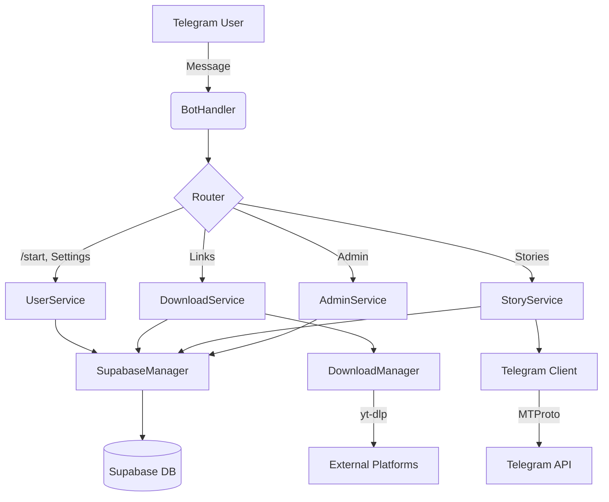

# 🌌 Tanzil - The Cosmic Downloader

<div align="center">
  
</div>

> **The Ultimate Telegram Bot for Downloading Content from Across the Digital Universe.**

[](https://opensource.org/licenses/MIT)
[](https://www.typescriptlang.org/)
[](https://nodejs.org/)
[](https://github.com/yourusername/tanzil-bot)
[](https://github.com/yourusername/tanzil-bot)
[](CONTRIBUTING.md)
[](CODE_OF_CONDUCT.md)

**Tanzil** is not just a bot; it's a high-performance, modular, and aesthetically pleasing engine designed to fetch videos, audio, and stories from over 100+ platforms including YouTube, TikTok, Instagram, and Telegram itself.

---

## ✨ Cosmic Features

### 🚀 Core Capabilities

- **Universal Downloader**: Powered by `yt-dlp` to support virtually any video site.
- **Telegram Stories**: Download stories from public and private channels (via MTProto).
- **Smart Quality Selection**: Auto-selects the best quality or lets you choose (1080p, 720p, Audio).
- **Playlist Support**: Batch download entire playlists with a single click.

### 💎 User Experience

- **Cosmic UI**: A beautiful, emoji-rich interface that feels premium.
- **Smooth Progress**: Real-time, sleek progress bars (`▰▰▰▱▱`).
- **Scheduling**: Schedule downloads for later (e.g., "Download this in 1 hour").
- **Timezone Aware**: Auto-detects user timezone for accurate scheduling.

### 🛡️ Robust & Secure

- **Credit System**: Daily limits to prevent abuse and manage server load.
- **Admin Dashboard**: Full control panel for banning users, broadcasting messages, and viewing stats.
- **Hard Ban System**: Permanent bans for violators.
- **Graceful Shutdown**: Safe process termination ensuring no data loss.

---

## 🏗️ Architecture

Tanzil is built with a modular architecture for scalability and maintainability.



---

## 🚀 Quick Start

### Prerequisites

- **Node.js** 18+
- **yt-dlp** (must be in PATH)
- **FFmpeg** (must be in PATH)
- **Supabase Account** (for database)

### Installation

1.  **Clone the Galaxy:**

    ```bash
    git clone https://github.com/yourusername/tanzil-bot.git
    cd tanzil-bot
    ```

2.  **Install Dependencies:**

    ```bash
    npm install
    ```

3.  **Configure Environment:**

    ```bash
    cp .env.example .env
    # Edit .env with your tokens and keys
    ```

4.  **Generate Session (Optional - For Stories):**

    ```bash
    node generate-session.js
    ```

5.  **Ignition:**
    ```bash
    npm run build
    npm start
    ```

---

## 🛡️ Admin Commands

Admins can manage the bot from the configured admin group:

### User Management

- `/profile <user_id>` - View detailed user profile
- `/block <user_id> <duration>h <reason>` - Temporarily block user
- `/ban <user_id> <reason>` - Permanently ban user
- `/unblock <user_id>` - Unblock a user
- `/isblocked <user_id>` - Check if user is blocked

### Bot Control

- `/stats` - View system statistics and performance
- `/broadcast <message>` - Send message to all users
- `/send <user_id> <message>` - Send direct message to specific user
- `/maintenance` - Toggle maintenance mode
- `/forceclean` - Force cleanup of temp files

### Monitoring

All bot events are logged to designated topics in the admin group:

- **General**: User interactions and commands
- **Control**: Admin actions
- **Logs**: Download events and scheduling
- **Errors**: Error tracking and debugging

See [docs/configuration.md](docs/configuration.md) for admin group setup.

---

## 📚 Documentation

- [Configuration Guide](docs/configuration.md) - Complete environment setup
- [Database Setup](docs/database-setup.md) - Supabase configuration
- [Deployment Guide](docs/RENDER_DEPLOYMENT.md) - Deploy to Render (Arabic)
- [Contributing Guidelines](CONTRIBUTING.md) - How to contribute
- [Code of Conduct](CODE_OF_CONDUCT.md) - Community guidelines
- [Security Policy](SECURITY.md) - Report vulnerabilities

---

## 🧪 Testing

Tanzil Bot has comprehensive test coverage including unit tests and property-based tests.

```bash
# Run all tests
npm test

# Run with coverage
npm test -- --coverage

# Run specific test file
npm test -- blockService.test.ts
```

**Test Coverage:**

- Unit Tests: 60+ tests
- Property-Based Tests: 38 properties
- Coverage: 70%+ (statements, branches, functions, lines)

---

## 🤝 Contributing

We welcome fellow space travelers to contribute! 🚀

**Quick Start:**

1. Fork the repository
2. Create your feature branch (`git checkout -b feature/AmazingFeature`)
3. Commit your changes (`git commit -m 'Add some AmazingFeature'`)
4. Push to the branch (`git push origin feature/AmazingFeature`)
5. Open a Pull Request

**Before Contributing:**

- Read [CONTRIBUTING.md](CONTRIBUTING.md) for detailed guidelines
- Follow our [Code of Conduct](CODE_OF_CONDUCT.md)
- Check existing issues and PRs
- Write tests for new features
- Update documentation as needed

**Good First Issues:**
Look for issues labeled `good first issue` or `help wanted` to get started!

---

## 🔒 Security

Security is a top priority. If you discover a security vulnerability, please follow our [Security Policy](SECURITY.md) for responsible disclosure.

**Do not report security vulnerabilities through public GitHub issues.**

---

## 📜 License

Distributed under the MIT License. See [LICENSE](LICENSE) for more information.

---

## 🙏 Acknowledgments

- [yt-dlp](https://github.com/yt-dlp/yt-dlp) - Universal video downloader
- [node-telegram-bot-api](https://github.com/yagop/node-telegram-bot-api) - Telegram Bot API
- [Supabase](https://supabase.com) - Database and authentication
- All our amazing [contributors](https://github.com/yourusername/tanzil-bot/graphs/contributors)

---

## 📊 Project Status

- **Status**: Active Development
- **Version**: 1.0.0
- **Last Updated**: December 2025
- **Maintained**: Yes ✅

---

## 📞 Support

- **Issues**: [GitHub Issues](https://github.com/yourusername/tanzil-bot/issues)
- **Discussions**: [GitHub Discussions](https://github.com/yourusername/tanzil-bot/discussions)
- **Security**: See [SECURITY.md](SECURITY.md)

---

<div align="center">
  <sub>Built with ❤️ and ☕ by Abed Mohamed</sub>
  <br>
  <sub>⭐ Star us on GitHub if you find this project useful!</sub>
</div>
