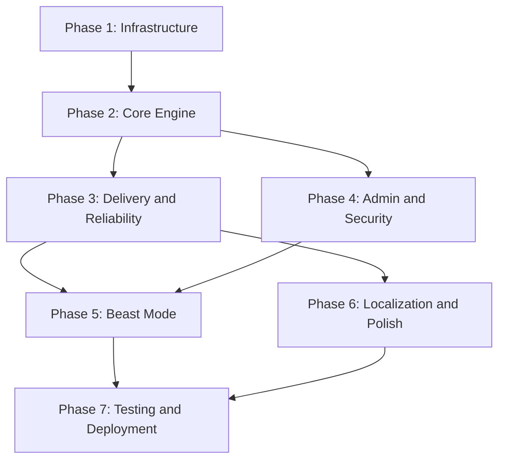

| TANZIL — Master Implementation Plan v1.0 | Derived from PRD v15.0 | Confidential · Engineering Use Only |
| --- | --- | --- |

---

> **Governing Constraint:** Every task in this plan is bound by the **10 Project Iron Laws** (IL-01 through IL-10). Any task output that violates an Iron Law is automatically rejected. Key constraints: **$0 total cost**, **zero routine maintenance**, **Python 3.11+ only**, **Telegram-only interface**, **PostgreSQL as sole source of truth**.

---

# ⚡ Execution Philosophy

> **Slice by Slice, NOT System at Once.**

This plan is a complete map — but execution follows a **vertical slice** discipline:

| Principle | Rule |
| --- | --- |
| **One sub-phase at a time** | Complete Sub-Phase 1.1 before starting 1.2. Never parallelize sub-phases. |
| **Prove before proceeding** | Each sub-phase must have its Definition of Done verified before moving forward. |
| **Fail fast on assumptions** | Critical infrastructure tests (pooler compatibility, `FOR UPDATE SKIP LOCKED`) are front-loaded to Phase 1. |
| **No premature optimization** | Build the minimum correct implementation first, harden later. |

---

# 🔒 Code Quality & Merge Protocol

> **Nothing merges to `main` without passing this gate.** AI-generated code works — but "works" ≠ "elegant, performant, and production-safe." Every task output is guilty until proven innocent.

## Git Workflow

```
main (protected)
 └── feat/{task-id}-{short-name}     ← one branch per task
      ├── implement
      ├── self-review (diff audit)
      ├── test (unit + integration)
      ├── inspect (performance + correctness)
      └── merge (squash into main)
```

**Rules:**
- `main` is **always deployable**. No broken code, no partial features.
- Every task gets its **own feature branch** (`feat/1.1.1-project-structure`).
- Merge via **squash merge** to keep history clean.
- Branch deleted after merge.

## Pre-Merge Checklist (Mandatory for EVERY task)

Every task must pass **ALL 6 gates** before merge:

### Gate 1: Code Diff Audit
- [ ] Read the full `git diff main..feat/branch` line by line
- [ ] No hardcoded secrets, paths, or test artifacts
- [ ] No `TODO`, `FIXME`, or `HACK` left unresolved
- [ ] No commented-out code blocks
- [ ] Import order clean (stdlib → third-party → local)

### Gate 2: SQL & Schema Review (for DB tasks)
- [ ] Every query uses parameterized bindings (`$1`, not f-strings)
- [ ] `EXPLAIN ANALYZE` run on complex queries (joins, CTEs, `FOR UPDATE`)
- [ ] Indexes cover all `WHERE` clause columns used in hot paths
- [ ] No `SELECT *` — explicit column lists only
- [ ] CHECK constraints and ENUMs match PRD §5.2 exactly
- [ ] Foreign key `ON DELETE` behavior explicitly chosen and documented
- [ ] Migration is idempotent and reversible

### Gate 3: Business Logic Validation
- [ ] State machine transitions match PRD §7.1 exactly (no extra/missing edges)
- [ ] Error classification follows §13.3 taxonomy (`user_error`, `retryable_dependency_error`, etc.)
- [ ] All user-facing strings use localization keys, no hardcoded text
- [ ] Edge cases from PRD explicitly tested (not just happy path)

### Gate 4: Test Coverage
- [ ] Unit tests exist for all pure functions
- [ ] Integration tests run against real PostgreSQL (not mocks for DB logic)
- [ ] Edge cases and error paths tested (not just success cases)
- [ ] `uv run pytest` passes with 0 failures, 0 warnings

### Gate 5: Performance & Resource Safety
- [ ] No unbounded loops or unbounded memory allocations
- [ ] Database connections acquired and released properly (no leaks)
- [ ] Async context managers used for all I/O resources
- [ ] Temp files registered in `worker_temp_files` and cleanup guaranteed
- [ ] No blocking I/O in async code paths

### Gate 6: Documentation
- [ ] Function docstrings on all public functions
- [ ] Complex SQL queries have inline comments explaining logic
- [ ] PRD section reference in module-level docstring

## High-Risk Task Categories (Extra Scrutiny Required)

| Task Type | Extra Review Step |
| --- | --- |
| **Schema/Migration** (1.2.2) | Run `alembic upgrade head` + `alembic downgrade base` + `alembic upgrade head` (round-trip test) |
| **Atomic SQL** (2.5.2, 2.4.1) | `EXPLAIN ANALYZE` under concurrent load; verify `FOR UPDATE SKIP LOCKED` produces 0 duplicate claims |
| **State Machine** (2.5.3, 3.2.2) | Enumerate ALL reachable states and verify against PRD §7.1 diagram; no orphaned states |
| **Telegram API** (3.1.1, 3.1.2) | Test against real Telegram API (not mocks) for send method routing and error handling |
| **Janitor/Scheduler** (3.5.5) | Run with accelerated time to verify all 16 tasks fire at correct intervals |

---

**Current Execution Target:** `Phase 1 → Sub-Phase 1.1` (Project Skeleton & Configuration only).

---

# Plan Structure

```
Phase (7 total)
 └── Sub-Phase (3-5 per phase)
      └── Task (granular, testable units)
           ├── Definition of Done
           ├── Dependencies
           ├── PRD Reference
           ├── Priority (P0/P1/P2)
           └── Effort Estimate
```

**Execution Legend:**

| Symbol | Meaning |
| --- | --- |
| 🔴 P0 | Critical path — blocks all downstream work |
| 🟡 P1 | High priority — required for MVP functionality |
| 🟢 P2 | Enhancement — enriches user experience |
| `→` | Sequential dependency |
| `‖` | Can run in parallel |
| `⊕` | Soft dependency (benefits from, not blocked by) |

---

# ═══════════════════════════════════════════════
# PHASE 1: INFRASTRUCTURE FOUNDATION
# ═══════════════════════════════════════════════

> **Goal:** Establish the immutable bedrock — database, project skeleton, configuration, and CI/CD pipeline. Nothing else starts until this phase is green.

**Phase Entry Criteria:** PRD v15.0 approved and frozen.
**Phase Exit Criteria:** All 23 tables created, migrations reproducible, project skeleton builds, health endpoint responds, CI pipeline green.

---

## Phase 1.1 — Project Skeleton & Configuration

### Task 1.1.1 — Initialize Python Project Structure 🔴 P0
**Description:** Create the monorepo project structure with proper packaging, dependency management, and module layout. **Package manager: `uv`** (Astral) — 10-100x faster than pip, critical for free CI time budgets.

```
tanzil/
├── pyproject.toml          # Project metadata + dependencies (PEP 621)
├── uv.lock                 # Deterministic lockfile (uv)
├── .python-version         # Python 3.11+ pinning
├── Dockerfile              # Container baseline (§17.3)
├── docker-compose.yml      # Local dev topology
├── alembic/                # DB migration framework
│   └── versions/
├── src/tanzil/
│   ├── __init__.py
│   ├── main.py             # Entrypoint with APP_ROLE dispatch
│   ├── config.py           # Environment variable loader
│   ├── control_plane/      # CP modules
│   ├── worker/             # Worker modules
│   ├── shared/             # Shared models, DB, utils
│   │   ├── db.py
│   │   ├── models.py
│   │   ├── enums.py
│   │   └── exceptions.py
│   ├── localization/       # i18n catalog
│   └── admin/              # Admin panel modules
├── tests/
│   ├── unit/
│   ├── integration/
│   └── e2e/
└── scripts/
    └── bootstrap.sh
```

| Attribute | Value |
| --- | --- |
| **Dependencies** | None (first task) |
| **PRD Reference** | §17.2, §17.3, IL-10 |
| **Effort** | 4 hours |
| **Definition of Done** | `uv sync` succeeds; `uv run python -m tanzil.main --help` prints usage; `ruff check` passes; `uv run pytest` discovers test directories; `uv.lock` committed to VCS |

---

### Task 1.1.2 — Environment Configuration Module 🔴 P0
**Description:** Implement `config.py` with Pydantic Settings model. Load all env vars from §17.2. Validate required vs optional. Fail-fast on missing critical vars. Never log secret values.

| Attribute | Value |
| --- | --- |
| **Dependencies** | → 1.1.1 |
| **PRD Reference** | §17.2, IL-04 |
| **Effort** | 3 hours |
| **Definition of Done** | All 20 env vars from PRD §17.2 parsed correctly; missing `BOT_TOKEN` / `DATABASE_URL` raises clear error; secrets are masked in `__repr__`; unit tests cover all validation paths |

---

### Task 1.1.3 — Dockerfile & Container Hardening 🔴 P0
**Description:** Build the production Dockerfile per §17.3: `python:3.11-slim`, non-root user, ffmpeg, pinned dependencies, health check. No `.env` baked in.

| Attribute | Value |
| --- | --- |
| **Dependencies** | → 1.1.1 |
| **PRD Reference** | §17.3, IL-04 |
| **Effort** | 3 hours |
| **Definition of Done** | `docker build` succeeds; container runs as non-root; `HEALTHCHECK` works; no secrets in image layers; image size < 500MB |

---

### Task 1.1.4 — Dependency Pinning & Lockfile 🔴 P0
**Description:** Pin all dependencies with exact versions using `uv lock`: `aiogram`, `pyrogram`, `yt-dlp`, `aiohttp`, `asyncpg`/`psycopg`, `redis`, `pydantic`. The `uv.lock` file provides deterministic, cross-platform resolution.

| Attribute | Value |
| --- | --- |
| **Dependencies** | → 1.1.1 |
| **PRD Reference** | §11.1, IL-02, IL-10 |
| **Effort** | 2 hours |
| **Definition of Done** | `uv.lock` exists with exact versions; `uv sync --frozen` is reproducible; `yt-dlp` version frozen; `uv pip compile` produces identical output on clean environment |

---

## Phase 1.2 — Database Foundation

### Task 1.2.1 — PostgreSQL Connection Pool Module 🔴 P0
**Description:** Implement async connection pool (`asyncpg` or `psycopg` async) with transaction-mode pooling awareness. Max 2 direct connections for free-tier. Connection health checks on startup.

| Attribute | Value |
| --- | --- |
| **Dependencies** | → 1.1.2 |
| **PRD Reference** | §3.15, §25.6, IL-03 |
| **Effort** | 4 hours |
| **Definition of Done** | Pool connects to PostgreSQL; respects `DATABASE_POOL_SIZE`; health check query succeeds; connection errors are caught and logged; pool gracefully drains on shutdown |

---

### Task 1.2.2 — Schema Migration Framework (Alembic) 🔴 P0
**Description:** Configure Alembic for migration management. Create initial migration with all 23 tables from PRD §5.2. Include all CHECK constraints, indexes, and foreign keys.

**Tables (23 total):**
1. `users` (§5.2.1)
2. `user_settings` (§5.2.2)
3. `request_sessions` (§5.2.3)
4. `workers` (§5.2.5)
5. `media_jobs` (§5.2.6)
6. `job_subscribers` (§5.2.7)
7. `job_deliveries` (§5.2.8)
8. `worker_temp_files` (§5.2.9)
9. `blocked_hashes` (§5.2.10)
10. `platform_circuit_breakers` (§5.2.11)
11. `approved_proxies` (§5.2.12)
12. `job_events` (§5.2.13)
13. `job_retry_log` (§5.2.14)
14. `file_id_cache` (§5.2.15)
15. `referral_log` (§5.2.16)
16. `processed_updates` (§5.2.17)
17. `admin_audit_log` (§5.2.18)
18. `user_abuse_log` (§5.2.19)
19. `system_flags` (§5.2.20)
20. `runtime_cursors` (§5.2.20)
21. `rate_limit_windows` (§5.2.20)
22. `alerts_log` (§5.2.21)
23. `deletion_requests` (§5.2.22)
24. `schema_migrations` (§5.2.23)

| Attribute | Value |
| --- | --- |
| **Dependencies** | → 1.2.1 |
| **PRD Reference** | §5.2 (all subsections), §17.7 |
| **Effort** | 8 hours |
| **Definition of Done** | `alembic upgrade head` creates all 23+ tables; `alembic downgrade base` reverts cleanly; all CHECK constraints enforced; all indexes created; FK ordering correct; schema version tracked in `schema_migrations` |

---

### Task 1.2.3 — Typed Data Models (Pydantic / Dataclasses) 🔴 P0
**Description:** Create Python typed models for every database entity. Use Pydantic or strict dataclasses per §13.3. Include all enums (`JobStatus`, `DeliveryStatus`, `SessionStatus`, `WorkerStatus`, etc.).

| Attribute | Value |
| --- | --- |
| **Dependencies** | → 1.2.2 |
| **PRD Reference** | §7.1, §7.1.1, §7.1.2, §7.1.3, §13.3 |
| **Effort** | 6 hours |
| **Definition of Done** | Every state enum from PRD matched; models validate with strict typing; invalid state values rejected; models serialize to/from DB rows; unit tests cover edge cases |

---

### Task 1.2.4 — DB Access Layer (Repository Pattern) 🔴 P0
**Description:** Implement repository/DAO layer for core tables: `users`, `user_settings`, `media_jobs`, `request_sessions`, `job_subscribers`, `job_deliveries`, `workers`. Use explicit SQL — no heavy ORM per IL-10.

| Attribute | Value |
| --- | --- |
| **Dependencies** | → 1.2.3 |
| **PRD Reference** | §5.1, §13.3, IL-10 |
| **Effort** | 12 hours |
| **Definition of Done** | CRUD operations for all core tables; explicit SQL queries (no ORM magic); all queries use parameterized queries; integration tests against real PostgreSQL |

---

### Task 1.2.5 — Pooler Compatibility Smoke Test (Early Fail-Fast) 🔴 P0
**Description:** **CRITICAL GATE.** Verify that `FOR UPDATE SKIP LOCKED` works correctly through the chosen free-tier PostgreSQL pooler (Supavisor/PgBouncer in Transaction mode). This is the single most critical architectural assumption — if it fails, the entire worker claim model collapses. Run this against the actual free-tier provider (Supabase Free) before writing any worker code.

**Test script:**
1. Open 2 concurrent connections through the Supabase pooler.
2. Connection A: `BEGIN; SELECT id FROM test_jobs WHERE status = 'queued' FOR UPDATE SKIP LOCKED LIMIT 1;`
3. Connection B (simultaneously): `BEGIN; SELECT id FROM test_jobs WHERE status = 'queued' FOR UPDATE SKIP LOCKED LIMIT 1;`
4. Verify: Connection B skips the row locked by Connection A (returns different row or empty set).
5. Both connections: `COMMIT;`.
6. Verify: No deadlocks, no duplicate claims, no pooler-induced anomalies.

| Attribute | Value |
| --- | --- |
| **Dependencies** | → 1.2.1, → 1.2.2 |
| **PRD Reference** | §7.5, §3.15, §18.5, §25.6 |
| **Effort** | 3 hours |
| **Definition of Done** | `FOR UPDATE SKIP LOCKED` works through Supavisor transaction-mode pooling; 2 concurrent claimers produce 0 duplicate claims; test runs against actual free-tier Supabase; results documented with connection strings and pooler mode; if this test FAILS → escalate immediately and redesign claim model before proceeding |

> ⚠️ **BLOCKING GATE:** If Task 1.2.5 fails, STOP all Phase 2+ work. The entire architecture depends on this primitive.

---

## Phase 1.3 — CI/CD & DevOps Pipeline

### Task 1.3.1 — GitHub Actions CI Pipeline 🟡 P1
**Description:** Set up CI: lint (ruff/flake8), type check (mypy), unit tests, integration tests with PostgreSQL service container, Docker build verification.

| Attribute | Value |
| --- | --- |
| **Dependencies** | → 1.2.4 |
| **PRD Reference** | §17.7, §3.4 |
| **Effort** | 4 hours |
| **Definition of Done** | Push triggers CI; lint + type check + unit tests + integration tests all pass in CI; Docker build succeeds in CI |

---

### Task 1.3.2 — Health Endpoint Server 🔴 P0
**Description:** Implement lightweight `aiohttp` server on port 7860 with `/health` (deep health JSON) and `/metrics` (Prometheus-compatible text). Per IL-10, no heavy frameworks.

| Attribute | Value |
| --- | --- |
| **Dependencies** | → 1.2.1 |
| **PRD Reference** | §13.1, §3.13, IL-10 |
| **Effort** | 4 hours |
| **Definition of Done** | `/health` returns JSON with `status`, `db_ok`, `redis_ok`, `active_workers`, `queue_depth`, `degraded_mode`, `credential_health`; `/metrics` returns Prometheus text; health endpoint doubles as keep-alive target |

---

### Task 1.3.3 — System Flags & Runtime Cursors Bootstrap 🔴 P0
**Description:** Implement `system_flags` and `runtime_cursors` management module. Seed initial flags: `enable_mtproto_uploads=false`, `max_global_active_jobs=2`, `rate_limiter_backend=db_local_hybrid`, etc.

| Attribute | Value |
| --- | --- |
| **Dependencies** | → 1.2.4 |
| **PRD Reference** | §5.2.20, §17.5 |
| **Effort** | 3 hours |
| **Definition of Done** | All kill-switch flags from §17.5 seeded; `runtime_cursors` stores long-poll offset; typed accessor functions work; flags reload without restart |

---

**Phase 1 Summary:**

```mermaid
gantt
    title Phase 1 — Infrastructure Foundation
    dateFormat X
    axisFormat %s

    section 1.1 Skeleton (START HERE)
    1.1.1 Project Structure (uv)  :a1, 0, 4
    1.1.2 Config Module           :a2, after a1, 3
    1.1.3 Dockerfile              :a3, after a1, 3
    1.1.4 Dependency Pinning (uv) :a4, after a1, 2

    section 1.2 Database
    1.2.1 DB Connection Pool      :b1, after a2, 4
    1.2.2 Schema Migrations       :b2, after b1, 8
    1.2.3 Typed Models            :b3, after b2, 6
    1.2.4 DB Access Layer         :b4, after b3, 12
    1.2.5 Pooler Smoke Test       :b5, after b2, 3

    section 1.3 DevOps
    1.3.1 CI Pipeline             :c1, after b4, 4
    1.3.2 Health Endpoint         :c2, after b1, 4
    1.3.3 System Flags            :c3, after b4, 3
```



---

# ═══════════════════════════════════════════════
# PHASE 2: CORE ENGINE
# ═══════════════════════════════════════════════

> **Goal:** Build the complete request lifecycle — from Telegram update ingestion through URL classification, quality resolution, job creation, and worker claim. This is the brain of Tanzil.

**Phase Entry Criteria:** Phase 1 fully green.
**Phase Exit Criteria:** A URL sent to the bot is correctly classified, quality resolved, job created, and claimed by a worker. Idempotency verified.

---

## Phase 2.1 — Telegram Integration Layer

### Task 2.1.1 — aiogram Long-Polling Bootstrap 🔴 P0
**Description:** Initialize aiogram dispatcher with long-polling. Persist offset in `runtime_cursors`. Handle graceful startup/shutdown. Resume from stored offset on restart. Rate-limit backlog replay to 10 updates/sec.

| Attribute | Value |
| --- | --- |
| **Dependencies** | → Phase 1 complete, → 1.3.3 |
| **PRD Reference** | §3.3, §3.5 step 1, §8.1, IL-09 |
| **Effort** | 6 hours |
| **Definition of Done** | Bot connects via long-polling; offset persisted after each batch; restart resumes from stored offset; backlog rate-limited; `SIGTERM` handled cleanly; no webhooks |

---

### Task 2.1.2 — Update Idempotency Guard 🔴 P0
**Description:** Implement `processed_updates` insertion before any side effects. Duplicate updates silently ignored (E013). Batch insert with conflict detection.

| Attribute | Value |
| --- | --- |
| **Dependencies** | → 2.1.1 |
| **PRD Reference** | §8.1, §5.2.17 |
| **Effort** | 3 hours |
| **Definition of Done** | Every update checked against `processed_updates`; duplicates produce zero side effects; offset stored atomically after insert; integration test proves duplicate suppression |

---

### Task 2.1.3 — Command Router & Dispatcher 🔴 P0
**Description:** Register all commands from §2.4: `/start`, `/help`, `/settings`, `/cancel`, `/status`, `/delete_my_data`, `/admin`, `/ban`, `/unban`, `/workers`, `/metrics`, `/purge_hash`. Route admin commands through authorization checks.

| Attribute | Value |
| --- | --- |
| **Dependencies** | → 2.1.2 |
| **PRD Reference** | §2.4, §12.1 |
| **Effort** | 6 hours |
| **Definition of Done** | All 12 commands registered; unknown commands return `error.unknown_command`; admin commands check `ADMIN_USER_IDS`; group/channel context handled correctly; malformed admin args return usage message |

---

### Task 2.1.4 — User Registration & Lifecycle 🔴 P0
**Description:** Implement user creation on first `/start`, returning user detection, ban/deletion status checks, and re-registration after deletion (§12.7.2).

| Attribute | Value |
| --- | --- |
| **Dependencies** | → 2.1.3, → 1.2.4 |
| **PRD Reference** | §2.8, §12.7.2, §10.3 |
| **Effort** | 5 hours |
| **Definition of Done** | New user gets `onboarding.welcome`; returning user gets `onboarding.returning`; deleted user re-registers with clean state; banned user gets `error.E006`; temp ban auto-expires after `banned_until` |

---

## Phase 2.2 — URL Processing Pipeline

### Task 2.2.1 — URL Extractor (Regex) 🔴 P0
**Description:** Implement aggressive regex to extract first valid URL from any text. Handle mixed conversational text, trailing punctuation, edge cases. Per §2.5.1.

| Attribute | Value |
| --- | --- |
| **Dependencies** | ‖ (can start with Phase 1 complete) |
| **PRD Reference** | §2.5.1, §4.1 |
| **Effort** | 4 hours |
| **Definition of Done** | Extracts URLs from mixed text; strips trailing punctuation; handles `youtu.be`, `bit.ly`, `tinyurl`; unit tests for 20+ edge cases; returns `None` for non-URL messages |

---

### Task 2.2.2 — URL Unshortener (SSRF-Safe) 🔴 P0
**Description:** Implement HTTP HEAD-based URL expansion for known shorteners. 3-second timeout, max 5 redirects, SSRF protection (block private IPs, enforce `http`/`https` only).

| Attribute | Value |
| --- | --- |
| **Dependencies** | → 2.2.1 |
| **PRD Reference** | §2.5.1, IL-08 |
| **Effort** | 4 hours |
| **Definition of Done** | Shortener URLs expanded correctly; private IPs blocked; timeout enforced; max redirects enforced; unit tests for SSRF vectors |

---

### Task 2.2.3 — URL Normalizer & Hasher 🔴 P0
**Description:** Implement normalization per §4.2: lowercase scheme/host, strip UTM params, remove fragments, expand `youtu.be`, preserve media-identifying params. SHA-256 hash of normalized URL.

| Attribute | Value |
| --- | --- |
| **Dependencies** | → 2.2.2 |
| **PRD Reference** | §4.2 |
| **Effort** | 4 hours |
| **Definition of Done** | `normalize_url()` returns `NormalizedUrlResult`; same media URL always produces same `url_hash`; UTM stripped; fragments stripped; `youtu.be` expanded; unit tests for all rules |

---

### Task 2.2.4 — Platform Classifier & Tier Assignment 🔴 P0
**Description:** Deterministic pattern matching to derive `platform` and `support_tier` (1/2/3/4) from normalized URL. Check platform against `blocked_hashes` and `platform_circuit_breakers`.

| Attribute | Value |
| --- | --- |
| **Dependencies** | → 2.2.3 |
| **PRD Reference** | §1.5, §3.1, §5.2.11 |
| **Effort** | 5 hours |
| **Definition of Done** | All 16 platforms from `media_jobs.platform` CHECK matched; tiers correctly classified; circuit breaker check integrated; blocked hash check integrated; classification stored per §3.1.4 |

---

### Task 2.2.5 — Request Classification Engine 🔴 P0
**Description:** Implement the full 10-step deterministic evaluation order from §3.1.1. Output one of 10 classification states. Map classifications to user-facing error messages per §3.1.8.

| Attribute | Value |
| --- | --- |
| **Dependencies** | → 2.2.4 |
| **PRD Reference** | §3.1 (all subsections) |
| **Effort** | 6 hours |
| **Definition of Done** | All 10 classification states producable; internal invariant rules from §3.1.7 enforced; safe rejection principle applied; unit tests for each classification path |

---

## Phase 2.3 — Quality Resolution & Request Sessions

### Task 2.3.1 — Quality Resolution Logic 🔴 P0
**Description:** Determine quality before job creation: explicit choice → saved preference → quality selection session. Create `request_sessions` row with `callback_token` (CHAR 6) for interactive resolution.

| Attribute | Value |
| --- | --- |
| **Dependencies** | → 2.2.5, → 1.2.4 |
| **PRD Reference** | §2.6.1 steps 5-6, §2.6.3, §5.2.3 |
| **Effort** | 6 hours |
| **Definition of Done** | Quality resolved from 3 sources; `request_sessions` created when needed; `callback_token` generated (6 chars, unique); only one active session per user; superseding session cancels previous |

---

### Task 2.3.2 — Callback Query Handler (Quality Selection) 🔴 P0
**Description:** Handle quality selection callbacks. Format: `q:{callback_token}:{quality_code}`. Validate ownership, expiry, duplicate clicks (2-sec dedup). All payloads ≤ 64 bytes.

| Attribute | Value |
| --- | --- |
| **Dependencies** | → 2.3.1 |
| **PRD Reference** | §2.6.3, §2.6.4 |
| **Effort** | 5 hours |
| **Definition of Done** | Valid callback consumed and session marked `consumed`; expired callback returns `Selection expired`; wrong user returns `Not your request`; rapid duplicates suppressed; unit test asserts all payloads ≤ 64 bytes |

---

### Task 2.3.3 — Request Session Timeout Sweep 🔴 P0
**Description:** Scheduler-driven sweep every 10 seconds. Find sessions with `status='awaiting_quality' AND expires_at <= NOW()`. Mark `timed_out_defaulted`, apply platform default quality, continue flow.

| Attribute | Value |
| --- | --- |
| **Dependencies** | → 2.3.1 |
| **PRD Reference** | §2.6.3, §16.4 |
| **Effort** | 4 hours |
| **Definition of Done** | Sweep runs every 10s; timed-out sessions get platform defaults (YouTube→720p, Instagram→max, TikTok→max); flow continues after default applied; survives CP restart; HIGH alert if backlog > 2 min |

---

## Phase 2.4 — Job Creation & Usage Control

### Task 2.4.1 — Atomic Usage Admission (Daily Limit) 🔴 P0
**Description:** Implement atomic admission control per §6.1. Lock user row, check/reset daily counter, increment. Reject with E005 if limit reached. Integrate day boundary reset logic.

| Attribute | Value |
| --- | --- |
| **Dependencies** | → 2.3.1 |
| **PRD Reference** | §6.1, §6.4, §14.1, §14.2 |
| **Effort** | 5 hours |
| **Definition of Done** | `FOR UPDATE` lock on user; atomic check + increment; day boundary auto-resets; E005 on limit; integration test with concurrent requests proves no race |

---

### Task 2.4.2 — Usage Reversion (Refund) 🔴 P0
**Description:** Implement idempotent usage reversion for failed/cancelled jobs per §6.2. Decrement `daily_usage_count` (floor at 0). Derive idempotency key from `(job_uuid, user_id, reason)`.

| Attribute | Value |
| --- | --- |
| **Dependencies** | → 2.4.1 |
| **PRD Reference** | §6.2, §23.4 |
| **Effort** | 3 hours |
| **Definition of Done** | Reversion decrements count; double-reversion is idempotent (no double-decrement); works for both original requester and shared subscribers; integration test proves idempotency |

---

### Task 2.4.3 — Job Creation (`create_job`) 🔴 P0
**Description:** Implement `create_job()` per §13.3. Validate per-user job limit (max 3). Insert `media_jobs` in `queued`. Set `hard_deadline_at`. Auto-insert requester into `job_subscribers` and `job_deliveries`.

| Attribute | Value |
| --- | --- |
| **Dependencies** | → 2.4.1 |
| **PRD Reference** | §13.3 `create_job`, §2.6.1 step 9 |
| **Effort** | 5 hours |
| **Definition of Done** | Job row created with all required fields; `short_id` generated (8 hex chars, collision handled); subscriber + delivery rows auto-created; per-user limit enforced; `hard_deadline_at` set to NOW() + 8h |

---

### Task 2.4.4 — Cache Lookup & Duplicate Detection 🔴 P0
**Description:** After quality resolution, check: (1) `file_id_cache` by `platform + url_hash + quality`, (2) active shared job by `url_hash + quality`, (3) per-user duplicate in last 10 min. Follow ordering from §3.1.5.

| Attribute | Value |
| --- | --- |
| **Dependencies** | → 2.4.3 |
| **PRD Reference** | §2.6.1 step 6, §3.1.5, §8.2, §8.3 |
| **Effort** | 5 hours |
| **Definition of Done** | Cache hit returns file ID without creating job; duplicate returns existing job; shared job attachment triggered correctly; ordering rules from §3.1.5 enforced |

---

## Phase 2.5 — Worker Engine

### Task 2.5.1 — Worker Registration & Heartbeat 🔴 P0
**Description:** On startup, upsert into `workers` table. Heartbeat every 20 seconds updating `last_heartbeat`, `active_jobs`, `status`. Upload Worker reports MTProto health. Graceful deregistration on shutdown.

| Attribute | Value |
| --- | --- |
| **Dependencies** | → Phase 1, → 1.2.4 |
| **PRD Reference** | §3.9 |
| **Effort** | 5 hours |
| **Definition of Done** | Worker appears in `workers` table on startup; heartbeat updates every 20s; `SIGTERM` triggers `draining` → `offline`; stale detection at 90s verified |

---

### Task 2.5.2 — Atomic Job Claim (`FOR UPDATE SKIP LOCKED`) 🔴 P0
**Description:** Implement the exact atomic claim SQL from §7.5. Worker polls every 3s (5s degraded). Validate eligibility (status, capacity, platform flags, global cap). Generate `claim_token`. Single-transaction with no separate SELECT.

| Attribute | Value |
| --- | --- |
| **Dependencies** | → 2.5.1, → 2.4.3 |
| **PRD Reference** | §7.5, §3.6, §3.15 |
| **Effort** | 8 hours |
| **Definition of Done** | Claim is one atomic CTE; `claim_token` generated and stored; global cap enforced via subquery; disabled platforms excluded via `system_flags`; MTProto routing correct; integration test with 2 concurrent claimers proves no duplicate claims |

---

### Task 2.5.3 — Metadata Probe (`yt-dlp` info extraction) 🔴 P0
**Description:** Run `yt-dlp` with `--dump-json` / extract_info mode. Extract title, duration, estimated size. Validate claim token before mutation. Reject oversized media (E004). Reject inaccessible (E009/E015).

| Attribute | Value |
| --- | --- |
| **Dependencies** | → 2.5.2 |
| **PRD Reference** | §4.3, §13.3 `probe_job`, §2.6.1 steps 12-13 |
| **Effort** | 6 hours |
| **Definition of Done** | `probe_job()` returns `ProbeResult` with typed fields; claim token validated; oversized → E004; private → E009; auth needed → E015; 2-minute timeout; probe failure → `failed` state |

---

### Task 2.5.4 — Job Progress Heartbeat 🔴 P0
**Description:** Implement `touch_job_progress()` per §13.3. Refresh `last_progress_at` every ≤30s during active work. Validate `worker_node` + `claim_token` ownership before update.

| Attribute | Value |
| --- | --- |
| **Dependencies** | → 2.5.2 |
| **PRD Reference** | §3.6, §13.3 `touch_job_progress` |
| **Effort** | 3 hours |
| **Definition of Done** | Progress heartbeat updates DB; returns `false` if ownership lost; stale worker cannot update after token rotation; integration test proves ownership validation |

---

### Task 2.5.5 — Download & Processing Engine 🔴 P0
**Description:** Execute `yt-dlp` download using baseline config from §11.1. Output to `/tmp/tanzil/{node_id}/`. Handle transcoding (webm → mp4 via ffmpeg). Register temp files in `worker_temp_files`.

| Attribute | Value |
| --- | --- |
| **Dependencies** | → 2.5.3 |
| **PRD Reference** | §11.1, §3.10 |
| **Effort** | 10 hours |
| **Definition of Done** | YouTube, TikTok, Instagram downloads succeed; webm auto-transcoded to mp4; temp files tracked in DB; disk space checked pre-download (E016 if < 200MB free); files cleaned up after terminal state |

---

---

# ═══════════════════════════════════════════════
# PHASE 3: DELIVERY & RELIABILITY
# ═══════════════════════════════════════════════

> **Goal:** Deliver downloaded media to Telegram users with full reliability — cache, shared jobs, fan-out, retries, and cleanup.

**Phase Entry Criteria:** Phase 2 core path working (URL → classify → job → claim → download).
**Phase Exit Criteria:** End-to-end: URL → download → Telegram delivery → cache storage → second request served from cache. Shared job delivery verified.

---

## Phase 3.1 — Telegram Media Delivery

### Task 3.1.1 — Telegram Send Contract Implementation 🔴 P0
**Description:** Implement the full Telegram media send contract from §10.5. Route by content type: `send_video`, `send_document`, `send_audio`, `send_animation`. Generate thumbnails. Format captions.

| Attribute | Value |
| --- | --- |
| **Dependencies** | → 2.5.5 |
| **PRD Reference** | §10.5 |
| **Effort** | 8 hours |
| **Definition of Done** | Correct send method chosen per content type matrix; thumbnails attached for video/audio; captions formatted `{title} • {platform} • {duration}`; `force_document=true` for borderline cases; `send_video` with `supports_streaming=true` for qualifying MP4 |

---

### Task 3.1.2 — Telegram Error Handler 🔴 P0
**Description:** Handle all Telegram send errors: retry without thumbnail on `400 BAD_REQUEST`; fallback from `send_video` → `send_document` on `VIDEO_FILE_TOO_LARGE`; honor `429`/`FloodWait` with server-provided duration. Catch `MessageNotFound`, `MessageNotModified`.

| Attribute | Value |
| --- | --- |
| **Dependencies** | → 3.1.1 |
| **PRD Reference** | §10.5, §2.11, §3.16 |
| **Effort** | 5 hours |
| **Definition of Done** | Thumbnail retry works; video → document fallback works; `FloodWait` honored; `MessageNotFound` safely caught; `MessageNotModified` suppressed; no unhandled Telegram exceptions crash the process |

---

### Task 3.1.3 — File ID Cache Storage & Retrieval 🔴 P0
**Description:** After successful Telegram upload, store `telegram_file_id` in `file_id_cache` with `send_method`, metadata, and 60-day TTL. On cache hit, attempt reuse with same send method.

| Attribute | Value |
| --- | --- |
| **Dependencies** | → 3.1.1 |
| **PRD Reference** | §5.2.15, §2.6.2 |
| **Effort** | 4 hours |
| **Definition of Done** | File ID stored after upload; cache queried before download; stale cache invalidated on send failure and falls through to fresh download; cache hit counter incremented |

---

## Phase 3.2 — Fan-Out Delivery System

### Task 3.2.1 — Delivery Cohort Freeze & Fan-Out Lease 🔴 P0
**Description:** When job enters `delivering`: set `delivery_cohort_closed_at`, acquire fan-out lease. Only lease owner processes `job_deliveries`. Lease expires after 120s. New worker can acquire expired lease.

| Attribute | Value |
| --- | --- |
| **Dependencies** | → 3.1.1 |
| **PRD Reference** | §3.8, §13.3 `acquire_fanout_lease` |
| **Effort** | 6 hours |
| **Definition of Done** | Cohort frozen — no new subscribers after `delivering`; lease acquired atomically; expired lease re-acquirable; integration test with worker failover proves lease handoff |

---

### Task 3.2.2 — Batch Delivery Row Processing 🔴 P0
**Description:** Claim delivery rows in batches using `FOR UPDATE SKIP LOCKED`. Move through states: `pending` → `leased` → `sending` → `sent`/`failed_permanent`/`retryable`/`failed_terminal`. Per-row lease expiry at 90s.

| Attribute | Value |
| --- | --- |
| **Dependencies** | → 3.2.1 |
| **PRD Reference** | §3.8, §13.3 `claim_delivery_batch` |
| **Effort** | 8 hours |
| **Definition of Done** | All 8 delivery states reachable and correctly transitioned; `send_token` set before Telegram call; successful sends record `sent_at` and `sent_telegram_msg_id`; permanent failures (bot blocked, chat not found) correctly terminalized; retry with backoff for retryable |

---

### Task 3.2.3 — Delivery Completion Predicate 🔴 P0
**Description:** Job transitions `delivering` → `completed` only when ALL delivery rows in frozen cohort are terminal. Transaction verifies zero non-terminal rows. Per §7.2.2.

| Attribute | Value |
| --- | --- |
| **Dependencies** | → 3.2.2 |
| **PRD Reference** | §7.2.2 |
| **Effort** | 3 hours |
| **Definition of Done** | Cannot complete with pending deliveries; one `failed_permanent` subscriber doesn't block completion; transactional check prevents race; integration test with partial delivery proves correctness |

---

## Phase 3.3 — Shared Job System

### Task 3.3.1 — Phase-Aware Shared Job Attachment 🟡 P1
**Description:** Implement all 4 attachment cases from §2.6.5: Case A (pre-probe), Case B (processing/uploading), Case C (delivering — no attach), Case D (completed — use cache). Max 20 subscribers cap.

| Attribute | Value |
| --- | --- |
| **Dependencies** | → 3.2.2, → 2.4.4 |
| **PRD Reference** | §2.6.5 |
| **Effort** | 8 hours |
| **Definition of Done** | All 4 cases tested; subscriber cap enforced; late attach during `delivering` rejected; subscriber + delivery rows created atomically; charge timing correct per phase |

---

### Task 3.3.2 — Subscriber-Scoped Cancellation 🟡 P1
**Description:** Cancellation is per-subscriber, not per-job. Job cancelled only when all subscribers cancelled. Delivery rows for cancelled subscriber set to `cancelled`. Usage reverted for cancelled subscriber.

| Attribute | Value |
| --- | --- |
| **Dependencies** | → 3.3.1 |
| **PRD Reference** | §2.6.4, §7.2 |
| **Effort** | 5 hours |
| **Definition of Done** | Subscriber cancel doesn't kill shared job if others remain; zero subscribers → job cancelled; usage reverted for cancelled subscriber only; already-sent deliveries not revoked |

---

## Phase 3.4 — Progress & State Communication

### Task 3.4.1 — Progress Message Lifecycle 🟡 P1
**Description:** Implement progress message per §2.11. Reuse same message ID for entire job lifecycle. States: checking → probing → downloading → uploading → delivering → complete/fail/cancel. Max 1 edit per 5s. Handle deleted message.

| Attribute | Value |
| --- | --- |
| **Dependencies** | → 2.5.3, → 3.1.2 |
| **PRD Reference** | §2.11 |
| **Effort** | 6 hours |
| **Definition of Done** | Progress message created on request; edits rate-limited to 1/5s; deleted message detected and flagged; final terminal summary always sent (even if progress message gone); `keep_progress_msg` setting honored |

---

### Task 3.4.2 — `/cancel` and `/status` Commands 🟡 P1
**Description:** `/cancel`: single job → instant cancel; multiple → inline selector with `c:{job_short_id}` callbacks. `/status`: list up to 3 active jobs with role marker.

| Attribute | Value |
| --- | --- |
| **Dependencies** | → 2.1.3, → 3.3.2 |
| **PRD Reference** | §2.6.4, §2.12.2, §2.12.3 |
| **Effort** | 5 hours |
| **Definition of Done** | `/cancel` with 0 jobs → "nothing cancellable"; 1 job → instant cancel; N jobs → inline list; `/status` shows job_id, platform, quality, state, age, cancellable flag, role marker |

---

## Phase 3.5 — Failure Recovery & Janitor

### Task 3.5.1 — Stale Worker Detection & Job Re-queue 🔴 P0
**Description:** Scheduler marks workers `offline` if heartbeat > 90s. Re-queue their non-terminal jobs with new `next_attempt_after`. Clear stale `claim_token`. Implement re-queue SQL from §7.6.

| Attribute | Value |
| --- | --- |
| **Dependencies** | → 2.5.2 |
| **PRD Reference** | §3.9, §3.12, §7.6 |
| **Effort** | 6 hours |
| **Definition of Done** | Stale worker detected at 90s; jobs re-queued with backoff; claim token cleared; `delivering` jobs get lease cleared (not re-queued); max_attempts respected; stale worker write rejected after token rotation |

---

### Task 3.5.2 — Hard Deadline Enforcement 🔴 P0
**Description:** Janitor sweep every 60s. Any non-terminal job past `hard_deadline_at` → force terminal. Uncharged → `expired`; charged → failure/refund path. CRITICAL alert if overdue jobs remain.

| Attribute | Value |
| --- | --- |
| **Dependencies** | → 3.5.1, → 2.4.2 |
| **PRD Reference** | §7.4, §7.6 hard deadline |
| **Effort** | 5 hours |
| **Definition of Done** | Jobs past 8h terminalized; subscribers refunded if charged; CRITICAL alert emitted; no job lingers forever; integration test with expired job proves cleanup |

---

### Task 3.5.3 — Delivery Lease Repair 🟡 P1
**Description:** Sweep every 30s. Expired `leased`/`sending` delivery rows → `retryable`. Never reset terminal rows. Alert if repair spike.

| Attribute | Value |
| --- | --- |
| **Dependencies** | → 3.2.2 |
| **PRD Reference** | §7.6, §16.4 |
| **Effort** | 3 hours |
| **Definition of Done** | Expired leases repaired; terminal rows untouched; HIGH alert on spike; integration test with killed worker during fan-out proves repair |

---

### Task 3.5.4 — Temporary File Cleanup 🔴 P0
**Description:** Clean `/tmp/tanzil/{node_id}/` after terminal state. Janitor cleans orphaned files > 1 hour. Track in `worker_temp_files`. E016 if disk < 200MB.

| Attribute | Value |
| --- | --- |
| **Dependencies** | → 2.5.5 |
| **PRD Reference** | §16.3, §3.10 |
| **Effort** | 4 hours |
| **Definition of Done** | Files deleted after completed/failed/cancelled; orphaned files cleaned by janitor; disk space checked before claim; E016 raised when low |

---

### Task 3.5.5 — Full Janitor Scheduler 🔴 P0
**Description:** Implement all 16 scheduled tasks from §16.4 in the Control Plane's internal scheduler with correct intervals.

| Attribute | Value |
| --- | --- |
| **Dependencies** | → 3.5.1, → 3.5.2, → 3.5.3, → 3.5.4 |
| **PRD Reference** | §16.4 (full table) |
| **Effort** | 8 hours |
| **Definition of Done** | All 16 janitor tasks scheduled and running; each task has failure behavior (alert on failure); processed_updates pruned at 30 days; cache expiry cleaned; daily usage reset at 00:00 UTC; backup export at 02:00 UTC |

---

---

# ═══════════════════════════════════════════════
# PHASE 4: ADMIN, SECURITY & GOVERNANCE
# ═══════════════════════════════════════════════

> **Goal:** Build the admin panel, alerting system, audit logging, abuse prevention, and security hardening.

**Phase Entry Criteria:** Phase 3 delivery path working.
**Phase Exit Criteria:** Admin can inspect jobs/workers/alerts, ban/unban users, toggle kill switches. Alerts fire to admin Telegram.

---

## Phase 4.1 — Admin Panel

### Task 4.1.1 — Admin Panel Home & Navigation 🟡 P1
**Description:** `/admin` opens inline keyboard in private chat only. 10 buttons per §12.3. Each button navigates to a subpanel. Callback ownership and authorization enforced.

| Attribute | Value |
| --- | --- |
| **Dependencies** | → 2.1.3 |
| **PRD Reference** | §12.3 |
| **Effort** | 6 hours |
| **Definition of Done** | Admin home shows all 10 buttons; non-admins get rejection; group chats get private-only reminder; callback ownership validated; expired callbacks show `callback.expired` |

---

### Task 4.1.2 — Overview Dashboard Screen 🟡 P1
**Description:** Show: active jobs by state, queued count, completed/failed in 24h, cache hit ratio, workers by status/kind, credential health, DB/Redis status, current system flags.

| Attribute | Value |
| --- | --- |
| **Dependencies** | → 4.1.1 |
| **PRD Reference** | §12.3 Overview |
| **Effort** | 5 hours |
| **Definition of Done** | All overview metrics displayed; data fetched from DB aggregation queries; refresh button works; formatted for readability |

---

### Task 4.1.3 — User Lookup & Management 🟡 P1
**Description:** Admin enters user ID → see usage, ban/mute status, active jobs, abuse events. Buttons: Ban, Unban, Adjust Limit, Recent Jobs.

| Attribute | Value |
| --- | --- |
| **Dependencies** | → 4.1.1 |
| **PRD Reference** | §12.3 User Lookup |
| **Effort** | 5 hours |
| **Definition of Done** | User lookup by Telegram ID; all fields displayed; ban/unban flows work with confirmation; audit logged |

---

### Task 4.1.4 — Workers, Queue, Cache, Jobs, Credentials, Alerts, Flags Screens 🟡 P1
**Description:** Implement remaining 7 admin subpanels per §12.3 specifications.

| Attribute | Value |
| --- | --- |
| **Dependencies** | → 4.1.1 |
| **PRD Reference** | §12.3 (Workers through Flags) |
| **Effort** | 15 hours |
| **Definition of Done** | All 7 screens navigable; worker disable/enable works; queue reset with confirmation; cache flush with confirmation; job lookup by UUID/short_id/user_id; credentials reload; alert list with acknowledge; flags edit with confirmation + audit |

---

## Phase 4.2 — Alerting & Audit

### Task 4.2.1 — Alert Engine (Telegram-Native) 🔴 P0
**Description:** Implement alert system per §16.2. All alerts sent to admin Telegram via `ADMIN_GROUP_ID`. Severity levels: INFO, WARN, HIGH, CRITICAL. De-duplicate repeated alerts. Log to `alerts_log`.

| Attribute | Value |
| --- | --- |
| **Dependencies** | → 2.1.1 |
| **PRD Reference** | §16.2, §5.2.21, IL-03 |
| **Effort** | 5 hours |
| **Definition of Done** | All alert conditions from §16.2 table fire correctly; alerts stored in `alerts_log`; CRITICAL alerts repeat every 5 min; de-duplication prevents spam; no external monitoring services used |

---

### Task 4.2.2 — Admin Audit Logging 🟡 P1
**Description:** Every admin action logged to `admin_audit_log` with actor, target, action, before/after context. High-risk actions require confirmation callback per §12.2.

| Attribute | Value |
| --- | --- |
| **Dependencies** | → 4.1.3 |
| **PRD Reference** | §12.2, §5.2.18 |
| **Effort** | 4 hours |
| **Definition of Done** | All 12 high-risk actions from §12.2 require confirmation; audit log row created for each; actor and target recorded; details_json includes before/after state |

---

### Task 4.2.3 — Job Events Timeline 🟡 P1
**Description:** Write `job_events` row on every state transition. Include `event_type`, `from_status`, `to_status`, `actor_type`, `error_code`, `details_json`.

| Attribute | Value |
| --- | --- |
| **Dependencies** | → 2.5.2 |
| **PRD Reference** | §5.2.13 |
| **Effort** | 4 hours |
| **Definition of Done** | Every state machine transition emits an event; events queryable by job UUID; actor types correctly assigned; admin panel job lookup shows event timeline |

---

## Phase 4.3 — Rate Limiting & Abuse Prevention

### Task 4.3.1 — Multi-Backend Rate Limiter 🔴 P0
**Description:** Implement the 3-mode rate limiter from §10.2.1: `redis`, `db_local_hybrid`, `local_degraded`. Global cap 30 msg/sec, per-chat ~1 msg/sec. Circuit breaker after 5 consecutive backend failures. Budget allocation per §10.6.

| Attribute | Value |
| --- | --- |
| **Dependencies** | → 1.3.3 |
| **PRD Reference** | §10.2, §10.6, §10.2.1 |
| **Effort** | 10 hours |
| **Definition of Done** | `redis` mode works with Lua script; `db_local_hybrid` works without Redis; `local_degraded` falls back safely; circuit breaker opens after 5 failures; CP + Worker budget allocation enforced; integration test with no Redis proves system works |

---

### Task 4.3.2 — Abuse Detection & Ban System 🟡 P1
**Description:** Implement abuse rules from §10.3: >10 msgs in 30s → 60s mute; 3rd offense in 24h → 1h temp ban. Record in `user_abuse_log`. Auto-expire temp bans. Ban cascade per §12.2.1.

| Attribute | Value |
| --- | --- |
| **Dependencies** | → 4.3.1, → 2.1.4 |
| **PRD Reference** | §10.3, §12.2.1 |
| **Effort** | 6 hours |
| **Definition of Done** | Mute detected and enforced; temp ban escalation works; `user_abuse_log` records offenses; ban cascade cancels active sessions and detaches subscribers; auto-expire verified |

---

## Phase 4.4 — Privacy & Deletion

### Task 4.4.1 — Data Deletion Flow 🟡 P1
**Description:** Implement `/delete_my_data` per §12.7.1. Confirmation callback. Pseudonymize profile. Redact URLs/titles in `media_jobs`. Set `is_deleted = TRUE`. Automated processing sweep per §16.4.

| Attribute | Value |
| --- | --- |
| **Dependencies** | → 2.1.3, → 1.2.4 |
| **PRD Reference** | §12.7.1, §12.7.2, §13.3 `process_pending_deletions` |
| **Effort** | 5 hours |
| **Definition of Done** | Deletion flow with inline confirmation; profile nullified; URLs redacted to `[REDACTED]`; `is_deleted = TRUE`; automated processing sweep runs hourly; re-registration after deletion works per §12.7.2 |

---

---

# ═══════════════════════════════════════════════
# PHASE 5: BEAST MODE FEATURES
# ═══════════════════════════════════════════════

> **Goal:** Implement the advanced "quality-of-life" features that differentiate Tanzil from standard bots per §2.14.

**Phase Entry Criteria:** Phases 1-4 functional.
**Phase Exit Criteria:** All 8 Beast Mode features operational and tested.

---

## Phase 5.1 — Media Enhancement Features

### Task 5.1.1 — SponsorBlock Integration 🟢 P2
**Description:** Enable `--sponsorblock-remove all` in yt-dlp config for YouTube. Automatically cut sponsored segments, intros, outros, and interaction reminders.

| Attribute | Value |
| --- | --- |
| **Dependencies** | → 2.5.5 |
| **PRD Reference** | §2.14.1 |
| **Effort** | 3 hours |
| **Definition of Done** | SponsorBlock segments removed from YouTube downloads; works with both video and audio-only; graceful fallback if SponsorBlock API unavailable |

---

### Task 5.1.2 — Audio-Only Extraction (MP3/M4A) 🟢 P2
**Description:** Implement audio extraction via `/dl audio <url>` or UI button. Use yt-dlp `--extract-audio --audio-format mp3`. Preserve metadata and album art. Deliver via `send_audio` with thumbnail.

| Attribute | Value |
| --- | --- |
| **Dependencies** | → 3.1.1 |
| **PRD Reference** | §2.14.2 |
| **Effort** | 5 hours |
| **Definition of Done** | Audio extraction produces MP3/M4A; metadata preserved (title, performer); album art attached as thumbnail to `send_audio`; plays natively in Telegram music player |

---

### Task 5.1.3 — Subtitle Embedding 🟢 P2
**Description:** Auto-download subtitles (Arabic preferred, then English) via yt-dlp. Embed as soft-subs in MP4 container.

| Attribute | Value |
| --- | --- |
| **Dependencies** | → 2.5.5 |
| **PRD Reference** | §2.14.3 |
| **Effort** | 4 hours |
| **Definition of Done** | Subtitles embedded in MP4 when available; Arabic prioritized; soft-subs toggleable in Telegram player; no crash if subtitles unavailable |

---

### Task 5.1.4 — Native Thumbnails & Smart Captions 🟡 P1
**Description:** Extract highest-resolution thumbnail and attach to `send_video`. Format caption: `{Title} • {Uploader} • {original_url}`. Normalize to 320px JPEG. Graceful fallback if thumbnail fails.

| Attribute | Value |
| --- | --- |
| **Dependencies** | → 3.1.1 |
| **PRD Reference** | §2.14.4, §2.14.6, §10.5 thumbnail/caption policy |
| **Effort** | 4 hours |
| **Definition of Done** | Thumbnails attached to all video sends; no "blank black frame" issue; captions formatted with title + uploader + URL; truncated to 1024 chars with `…`; emoji stripped when disabled |

---

### Task 5.1.5 — Guaranteed MP4 Transcoding 🟡 P1
**Description:** Auto-transcode `.webm` and `.mkv` to `.mp4` using ffmpeg. Ensure iOS Telegram compatibility. Conservative ffmpeg thread settings (1 thread on free tier).

| Attribute | Value |
| --- | --- |
| **Dependencies** | → 2.5.5 |
| **PRD Reference** | §2.14.5, §11.1 |
| **Effort** | 3 hours |
| **Definition of Done** | All non-MP4 outputs transcoded; ffmpeg threads = 1 on free tier; output plays on iOS Telegram; file not corrupted by transcoding |

---

## Phase 5.2 — Advanced Delivery Features

### Task 5.2.1 — YouTube Playlist Download 🟢 P2
**Description:** Implement playlist handling per §2.6.6. Parse playlist metadata (flat extract). Interactive UI for full/selective download. Max 20 videos per operation. Each video → separate `media_jobs` row.

| Attribute | Value |
| --- | --- |
| **Dependencies** | → 2.4.3, → 3.4.1 |
| **PRD Reference** | §2.6.6 |
| **Effort** | 8 hours |
| **Definition of Done** | Playlist URL detected; metadata extracted (count, titles); UI shows download options; 20-video limit enforced; selected videos queued as individual jobs; `/status` shows batch progress; daily limit checked pre-batch |

---

### Task 5.2.2 — Silent Graceful Multi-Link Queuing 🟢 P2
**Description:** When user dumps multiple links rapidly, queue them silently without spamming error messages. Process sequentially. Return results one by one per §2.14.7.

| Attribute | Value |
| --- | --- |
| **Dependencies** | → 2.4.3, → 4.3.1 |
| **PRD Reference** | §2.14.7 |
| **Effort** | 4 hours |
| **Definition of Done** | 15 rapid links don't crash; no 15 error messages; links queued; processed sequentially; results returned one by one; E007 for graceful queuing message |

---

### Task 5.2.3 — MTProto Upload Worker (2GB Limit Breaker) 🟢 P2
**Description:** Implement singleton Upload Worker with Pyrogram MTProto session. Advisory lock singleton guard. Session health check on startup and periodic loop. 3 auth failures → auto-disable. Files 50MB-1GB supported.

| Attribute | Value |
| --- | --- |
| **Dependencies** | → 3.1.1, → 2.5.1 |
| **PRD Reference** | §2.14.8, §9.1-§9.5, §3.9 |
| **Effort** | 12 hours |
| **Definition of Done** | Upload Worker registers with `worker_kind='upload'`; singleton guard via advisory lock; MTProto session validated on startup; 50MB-1GB files uploaded successfully; 3 auth failures → `enable_mtproto_uploads=false` + CRITICAL alert; disabled by default |

---

## Phase 5.3 — Platform-Specific Features

### Task 5.3.1 — Instagram Cookie/Auth Path 🟡 P1
**Description:** Implement Instagram credential handling per §11.3. Load cookies from `INSTAGRAM_COOKIES_BASE64`. Periodic health check (every 30 min). Auto-disable on invalid cookies. Admin can reload via panel.

| Attribute | Value |
| --- | --- |
| **Dependencies** | → 2.5.5 |
| **PRD Reference** | §11.3, §12.5 |
| **Effort** | 5 hours |
| **Definition of Done** | Cookies loaded from env var; health check runs; invalid cookies → auto-disable Instagram auth path; admin reload works; no cookies in logs |

---

### Task 5.3.2 — Platform Circuit Breaker System 🔴 P0
**Description:** Implement circuit breaker per §5.2.11: closed → open (5 failures in 10 min) → half_open (after cooldown) → closed (3 successes) or re-open (doubled cooldown, max 3600s). Check at classification and claim time.

| Attribute | Value |
| --- | --- |
| **Dependencies** | → 2.2.5 |
| **PRD Reference** | §5.2.11 |
| **Effort** | 6 hours |
| **Definition of Done** | Circuit opens after 5 failures; platform auto-disabled; half_open allows probe; 3 successes re-close; doubled cooldown on re-open; janitor resets stale half_open entries; integration test simulates full cycle |

---

### Task 5.3.3 — Group & Channel Support 🟡 P1
**Description:** Implement group/supergroup and channel behavior per §2.10. Bot responds to `/dl <url>` or mentions in groups. Usage attributed to invoking user. Admins can configure reply behavior.

| Attribute | Value |
| --- | --- |
| **Dependencies** | → 2.1.3, → 2.2.1 |
| **PRD Reference** | §2.10 |
| **Effort** | 5 hours |
| **Definition of Done** | Bot processes commands in groups; silent on unaddressed messages; usage counted against invoking user; channel admin support works; privacy-respecting |

---

---

# ═══════════════════════════════════════════════
# PHASE 6: LOCALIZATION, SETTINGS & POLISH
# ═══════════════════════════════════════════════

> **Goal:** Complete bilingual support, settings UI, input handling edge cases, and UX polish.

**Phase Entry Criteria:** Core functionality from Phases 1-5 operational.
**Phase Exit Criteria:** Full Arabic + English experience; RTL verified; settings persistent; all edge-case inputs handled gracefully.

---

## Phase 6.1 — Localization

### Task 6.1.1 — i18n Engine 🔴 P0
**Description:** Implement localization catalog system. Support `ar` and `en` keys. Language detection: (1) manual override, (2) Telegram `language_code`, (3) default `en`. Support pluralization and dynamic parameters.

| Attribute | Value |
| --- | --- |
| **Dependencies** | → 2.1.4 |
| **PRD Reference** | §2.3, §22.1, IL-07 |
| **Effort** | 5 hours |
| **Definition of Done** | Catalog loaded from structured files; `get_text(key, locale, **params)` works; all 40+ messages from §22.2 present in both locales; no hardcoded strings in business logic |

---

### Task 6.1.2 — Full Message Catalog 🟡 P1
**Description:** Populate all message keys from §22.2 minimum catalog. Verify dynamic parameters ({title}, {size_mb}, {max_mb}, {limit}) render correctly in both locales.

| Attribute | Value |
| --- | --- |
| **Dependencies** | → 6.1.1 |
| **PRD Reference** | §22.2 |
| **Effort** | 4 hours |
| **Definition of Done** | All message keys from PRD present; parameters interpolated correctly; Arabic messages natural and professional; no missing keys at runtime |

---

### Task 6.1.3 — RTL Layout Verification 🟡 P1
**Description:** Test all inline keyboards in RTL Arabic. Verify mixed Arabic/English strings (YouTube, 720p). Emoji optional toggle. Punctuation correct.

| Attribute | Value |
| --- | --- |
| **Dependencies** | → 6.1.2 |
| **PRD Reference** | §2.13, IL-07 |
| **Effort** | 4 hours |
| **Definition of Done** | All keyboards readable in RTL; mixed text renders correctly; emoji toggle works; number interpolation correct in Arabic |

---

## Phase 6.2 — Settings & User Preferences

### Task 6.2.1 — `/settings` Inline Keyboard UI 🟡 P1
**Description:** Implement settings panel per §2.12.1. Options: Language, YouTube quality (360p/480p/720p/1080p), emoji toggle, keep_progress_msg toggle. Instagram/TikTok quality read-only. Persist immediately.

| Attribute | Value |
| --- | --- |
| **Dependencies** | → 6.1.1, → 2.1.3 |
| **PRD Reference** | §2.12.1, §27 |
| **Effort** | 5 hours |
| **Definition of Done** | Inline keyboard matches wireframe from §27; changes persist to `user_settings` immediately; callback ownership enforced; expired callbacks handled; no retroactive effect on running jobs |

---

### Task 6.2.2 — `/help` Command 🟡 P1
**Description:** Implement `/help` per §2.12.3. Include: supported platforms, daily limits, command list, group/channel note, support handle, multi-link note.

| Attribute | Value |
| --- | --- |
| **Dependencies** | → 6.1.1 |
| **PRD Reference** | §2.12.3 |
| **Effort** | 2 hours |
| **Definition of Done** | Help message complete; includes all required sections; localized in AR/EN; support handle from `SUPPORT_HANDLE` env var |

---

## Phase 6.3 — Input Handling Edge Cases

### Task 6.3.1 — Edge Case Input Router 🟡 P1
**Description:** Handle all input types per §2.5: plain text without URL → helper; unsupported media → helper with 60s suppression; multiple URLs → first only with note; unknown commands → `/help` hint.

| Attribute | Value |
| --- | --- |
| **Dependencies** | → 2.2.1 |
| **PRD Reference** | §2.5.2, §2.5.3, §2.5.4, §2.4 |
| **Effort** | 4 hours |
| **Definition of Done** | All input types produce correct response; hint suppression at 60s for repeated unsupported input; multiple URLs processes first with note; no unhandled input type crashes system |

---

---

# ═══════════════════════════════════════════════
# PHASE 7: TESTING, HARDENING & DEPLOYMENT
# ═══════════════════════════════════════════════

> **Goal:** Comprehensive testing, production hardening, backup strategy, and final deployment to free-tier infrastructure.

**Phase Entry Criteria:** All features from Phases 1-6 implemented.
**Phase Exit Criteria:** All acceptance criteria from §18 met. Deployment readiness criteria from §17.1 satisfied. System running on free-tier infrastructure.

---

## Phase 7.1 — Comprehensive Test Suite

### Task 7.1.1 — Unit Test Coverage 🔴 P0
**Description:** Write unit tests for all items listed in §18.1: URL extraction/normalization, platform matching, session timeout logic, callback payload validation, admission/reversion, cache fallback, claim-token ownership, state machine transitions, rate limiter circuit breaker.

| Attribute | Value |
| --- | --- |
| **Dependencies** | → All Phase 2-5 tasks |
| **PRD Reference** | §18.1 |
| **Effort** | 15 hours |
| **Definition of Done** | All 14 unit test categories from §18.1 covered; callback payload ≤ 64 bytes asserted for every emitted callback; ≥90% branch coverage on core business logic |

---

### Task 7.1.2 — Integration Test Suite 🔴 P0
**Description:** Write integration tests per §18.2: concurrent claim, session expiry sweep race, stale progress repair, stale-worker rejection, Redis/no-Redis paths, ban cascade, delivery cohort freeze, delivery lease repair.

| Attribute | Value |
| --- | --- |
| **Dependencies** | → 7.1.1 |
| **PRD Reference** | §18.2 |
| **Effort** | 15 hours |
| **Definition of Done** | All 15 integration test categories from §18.2 covered; tests run against real PostgreSQL in CI; concurrent claim test proves zero duplicates |

---

### Task 7.1.3 — End-to-End Test Suite 🔴 P0
**Description:** Write E2E tests per §18.3: full download flow, cache hit, stale cache fallback, shared job paths (pre-probe, post-probe, during-delivering), cancellation, progress-deleted fallback, bot-blocked reversion, credential reload.

| Attribute | Value |
| --- | --- |
| **Dependencies** | → 7.1.2 |
| **PRD Reference** | §18.3 |
| **Effort** | 12 hours |
| **Definition of Done** | All 13 E2E scenarios from §18.3 passing; test against real yt-dlp for Tier 1 platforms |

---

### Task 7.1.4 — Free-Tier Infrastructure Tests 🔴 P0
**Description:** Write infrastructure tests per §18.5: ≤2 DB connections, compute-hour budget, DB sleep/wake, transaction pooler compatibility, container restart, host sleep/wake, bandwidth, storage growth, backup cycle, re-registration, circuit breaker, multi-process rate limiting.

| Attribute | Value |
| --- | --- |
| **Dependencies** | → 7.1.3 |
| **PRD Reference** | §18.5 |
| **Effort** | 10 hours |
| **Definition of Done** | All 12 infrastructure tests from §18.5 passing; system operates within Supabase Free limits; `pg_database_size()` after 30-day simulation ≤ 200MB; no Telegram `429` under normal load; cold-start to first update ≤ 30s |

---

### Task 7.1.4a — Database Growth Simulator Script 🔴 P0
**Description:** Create a Python script using `Faker` that simulates 30 days of production data in a test database. This eliminates the need to wait 30 real days to validate storage projections from §25.6.

**Simulation parameters (matching §25.6 estimates):**
- 30 DAU, 40 downloads/day = ~1,200 jobs/month
- ~5 job_events per job = ~6,000 events/month
- ~1.25 deliveries per job = ~1,500 deliveries/month
- ~2.5 ledger entries per job = ~3,000 ledger rows/month
- ~50,000 processed_updates/month
- Realistic distribution: peak hours, weekend dips, variable platforms

**Script outputs:**
1. `pg_database_size()` after 30-day simulation
2. Per-table size breakdown (`pg_total_relation_size()`)
3. Index size vs data size ratio
4. Projection to 6-month and 12-month marks
5. Warning if any projection exceeds 400MB (80% of Supabase 500MB limit)

| Attribute | Value |
| --- | --- |
| **Dependencies** | → 1.2.2 (needs schema to populate) |
| **PRD Reference** | §25.6, §18.5 |
| **Effort** | 4 hours |
| **Definition of Done** | Script runs in < 60s; generates 30 days of realistic data; reports `pg_database_size()` ≤ 200MB; per-table breakdown matches §25.6 estimates within 20% margin; script is idempotent (can truncate and re-run); committed to `scripts/simulate_db_growth.py` |

---

### Task 7.1.5 — Load Tests 🟡 P1
**Description:** Per §18.4: 100 concurrent `/start`, 10 concurrent claimers, global cap enforcement, singleton enforcement, quota degradation, 10-subscriber fan-out, free-tier chaos.

| Attribute | Value |
| --- | --- |
| **Dependencies** | → 7.1.3 |
| **PRD Reference** | §18.4 |
| **Effort** | 8 hours |
| **Definition of Done** | All acceptance criteria from §18.4: 0 duplicate claims, 0 duplicate charges, all callbacks ≤ 64 bytes, no orphaned deliveries, no heartbeat gap > 90s |

---

## Phase 7.2 — Production Hardening

### Task 7.2.1 — Graceful Shutdown (SIGTERM/SIGINT) 🔴 P0
**Description:** Implement shutdown flow from §3.11 for all components: stop claims, mark `draining`, finish/re-queue current work, flush DB, close connections, exit within 30s.

| Attribute | Value |
| --- | --- |
| **Dependencies** | → 2.5.1, → 2.1.1 |
| **PRD Reference** | §3.11 |
| **Effort** | 4 hours |
| **Definition of Done** | `SIGTERM` triggers clean shutdown; workers mark `draining`; in-progress jobs re-queued or finished; DB connections drained; process exits within 30s |

---

### Task 7.2.2 — Structured Logging 🟡 P1
**Description:** Implement structured JSON logging per §16.1. Every event includes: ts, level, component, event, job_uuid, user_id, platform, duration_ms, worker. Never log secrets.

| Attribute | Value |
| --- | --- |
| **Dependencies** | ‖ (can start anytime) |
| **PRD Reference** | §16.1, IL-04 |
| **Effort** | 4 hours |
| **Definition of Done** | All log lines are structured JSON; log levels used correctly; secrets never appear in logs; component field identifies CP/worker/janitor |

---

### Task 7.2.3 — Retry Policy Implementation 🔴 P0
**Description:** Implement retry policy from §11.4: 3 attempts with 10s/30s/90s backoff. Honor server-provided `retry_after`. Short-circuit poison-job patterns. Platform circuit breaker integration.

| Attribute | Value |
| --- | --- |
| **Dependencies** | → 2.5.5, → 5.3.2 |
| **PRD Reference** | §11.4, §11.5 |
| **Effort** | 5 hours |
| **Definition of Done** | 3 attempts with correct backoff; `next_attempt_after` persisted; server `retry_after` overrides generic backoff; poison-job detection (repeated invariant error) short-circuits and alerts; retryability matrix from §11.5 enforced |

---

### Task 7.2.4 — Quota Degradation Playbook 🟡 P1
**Description:** Implement the 8-step degradation order from §15.4: disable progress edits → open rate limiter circuit → reduce polling → lower global jobs → reject E011 → cache-only → pause workers → disable MTProto.

| Attribute | Value |
| --- | --- |
| **Dependencies** | → 3.5.5, → 4.3.1 |
| **PRD Reference** | §15.4 |
| **Effort** | 5 hours |
| **Definition of Done** | Each degradation step implemented and triggerable via system flags; degradation order correct; system can operate in fully degraded mode (cache-only); undegradation path works |

---

## Phase 7.3 — Backup & Disaster Recovery

### Task 7.3.1 — Automated Backup System 🔴 P0
**Description:** Implement daily `pg_dump` at 02:00 UTC per §16.6. Send to approved destinations: GitHub private repo OR Telegram admin `send_document`. Backup verification protocol: check `schema_migrations`, sample queries.

| Attribute | Value |
| --- | --- |
| **Dependencies** | → 3.5.5 |
| **PRD Reference** | §16.6, IL-01, IL-02 |
| **Effort** | 6 hours |
| **Definition of Done** | Daily backup runs automatically; verification checks pass; CRITICAL alert on failure; backup ≤ 60s for ≤ 200MB DB; restore procedure documented |

---

### Task 7.3.2 — Data Retention & Pruning 🟡 P1
**Description:** Implement retention policy from §16.5: sessions 7 days, jobs/events/deliveries 30 days, audit log 180 days, abuse log 90 days, alerts 90 days. Batch deletion to avoid long locks.

| Attribute | Value |
| --- | --- |
| **Dependencies** | → 3.5.5 |
| **PRD Reference** | §16.5 |
| **Effort** | 5 hours |
| **Definition of Done** | All retention periods enforced; pruning runs as scheduled janitor tasks; batch deletion prevents lock contention; DB size stays within free-tier limits |

---

## Phase 7.4 — Final Deployment

### Task 7.4.1 — Deployment Readiness Validation 🔴 P0
**Description:** Verify all 17 deployment readiness criteria from §17.1.

| Attribute | Value |
| --- | --- |
| **Dependencies** | → All tasks complete |
| **PRD Reference** | §17.1 |
| **Effort** | 8 hours |
| **Definition of Done** | All 17 criteria checked and passed: E2E download for each Tier 1 platform, shared job verified, delivery cohort freeze verified, stale-worker rejection verified, reversion flow verified, backup smoke test verified, admin panel verified, alert delivery verified, all P0/P1 bugs closed |

---

### Task 7.4.2 — Free-Tier Infrastructure Provisioning 🔴 P0
**Description:** Provision production environment: Supabase Free PostgreSQL, Hugging Face Spaces (or equivalent) for CP and Worker. Configure secrets. Set up UptimeRobot free for keep-alive.

| Attribute | Value |
| --- | --- |
| **Dependencies** | → 7.4.1 |
| **PRD Reference** | §25.1, §25.2, §3.13, IL-01 |
| **Effort** | 4 hours |
| **Definition of Done** | PostgreSQL provisioned (free, no card); CP deployed on free host; Worker deployed on free host; UptimeRobot pinging `/health`; all secrets configured; $0 total cost |

---

### Task 7.4.3 — Staged Rollout Execution 🔴 P0
**Description:** Execute the 6-stage rollout from §17.5: (1) migrations, (2) CP only → verify, (3) General Worker → verify, (4) shared jobs → verify, (5) MTProto if applicable, (6) 24h monitoring.

| Attribute | Value |
| --- | --- |
| **Dependencies** | → 7.4.2 |
| **PRD Reference** | §17.5 |
| **Effort** | 8 hours |
| **Definition of Done** | All 6 stages executed successfully; 24h monitoring shows no CRITICAL alerts; SLOs from §16.8 met; system confirmed as "build once and leave it" per IL-02 |

---

### Task 7.4.4 — Analytics & Metrics Verification 🟡 P1
**Description:** Verify all required analytics events from §13.4 are emitted. Verify `/metrics` endpoint returns all required Prometheus metrics. Verify dashboard view per §16.9.

| Attribute | Value |
| --- | --- |
| **Dependencies** | → 7.4.3 |
| **PRD Reference** | §13.4, §16.9 |
| **Effort** | 4 hours |
| **Definition of Done** | All 11 analytics events emitting; all 11 dimensions captured; weekly report data queryable; dashboard metrics accessible via admin panel and `/metrics` endpoint |

---

---

# MASTER DEPENDENCY GRAPH



---

# EXECUTION SUMMARY

| Phase | Sub-Phases | Tasks | P0 Tasks | P1 Tasks | P2 Tasks | Est. Hours |
| --- | --- | --- | --- | --- | --- | --- |
| **1. Infrastructure Foundation** | 3 | 12 | 10 | 1 | 0 | ~61h |
| **2. Core Engine** | 5 | 17 | 17 | 0 | 0 | ~85h |
| **3. Delivery & Reliability** | 5 | 14 | 10 | 4 | 0 | ~76h |
| **4. Admin, Security & Governance** | 4 | 10 | 3 | 7 | 0 | ~55h |
| **5. Beast Mode Features** | 3 | 11 | 1 | 4 | 6 | ~59h |
| **6. Localization & Polish** | 3 | 6 | 1 | 5 | 0 | ~24h |
| **7. Testing & Deployment** | 4 | 14 | 9 | 5 | 0 | ~115h |
| **TOTAL** | **27** | **84** | **51** | **26** | **6** | **~475h** |

---

# DEFINITION OF DONE — GLOBAL

The entire project is considered **DONE** when:

- [ ] All 51 P0 tasks are completed and verified
- [ ] All 26 P1 tasks are completed
- [ ] All 6 P2 tasks are completed (or explicitly deferred with documented reason)
- [ ] All 17 deployment readiness criteria from §17.1 are satisfied
- [ ] All acceptance criteria from §18.4 are met: 0 duplicate claims, 0 duplicate charges, all callbacks ≤ 64 bytes
- [ ] Free-tier acceptance criteria from §18.5 met: operates within Supabase Free limits, no Telegram `429` under normal load
- [ ] All 10 Iron Laws verified:
  - [ ] IL-01: $0 total cost confirmed
  - [ ] IL-02: Zero routine maintenance — all automated
  - [ ] IL-03: Free infrastructure robust
  - [ ] IL-04: Secrets in env vars only
  - [ ] IL-05: Robustness over features
  - [ ] IL-06: Personal use model confirmed
  - [ ] IL-07: Full AR/EN bilingual support
  - [ ] IL-08: Security defaults enforced
  - [ ] IL-09: Telegram-only architecture
  - [ ] IL-10: Python-only stack
- [ ] System deployed and operational for 24+ hours with no CRITICAL alerts
- [ ] Backup system verified with successful export + verification cycle

---

> **This plan is the single source of execution truth. Any task not in this plan does not exist. Any task that violates Iron Laws is rejected. Execute in order. Ship with confidence.**

---

© 2026 Tanzil Engineering · Confidential
