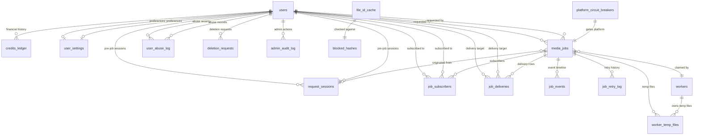
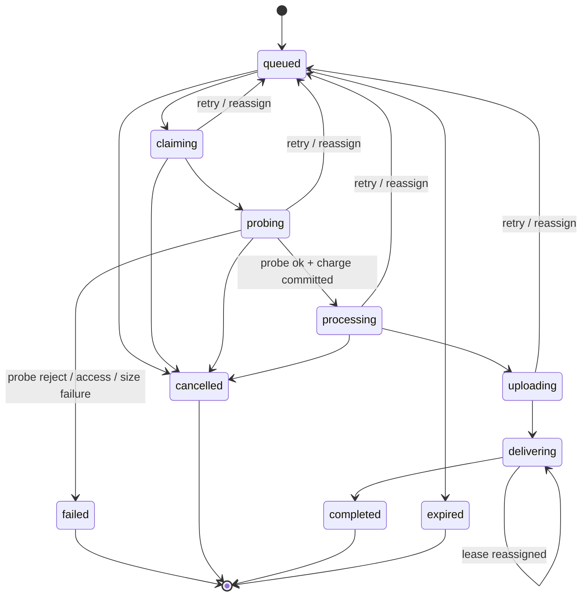
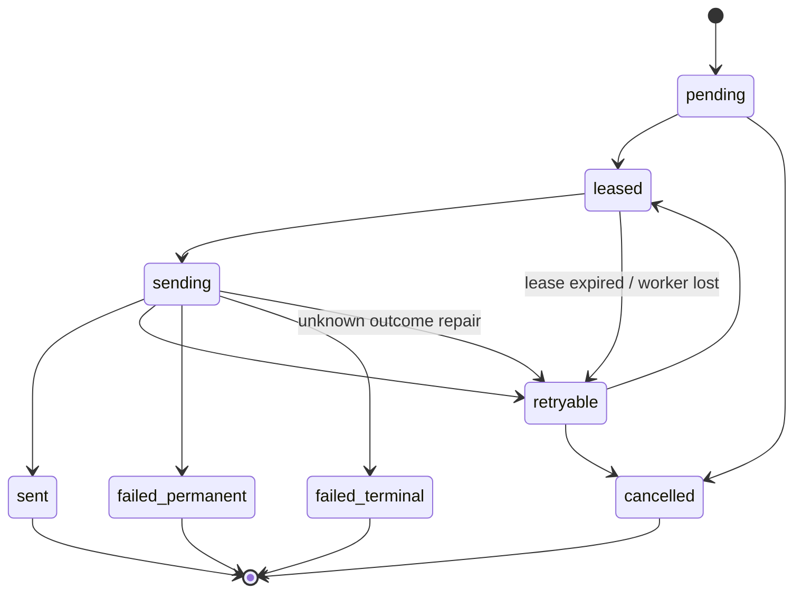
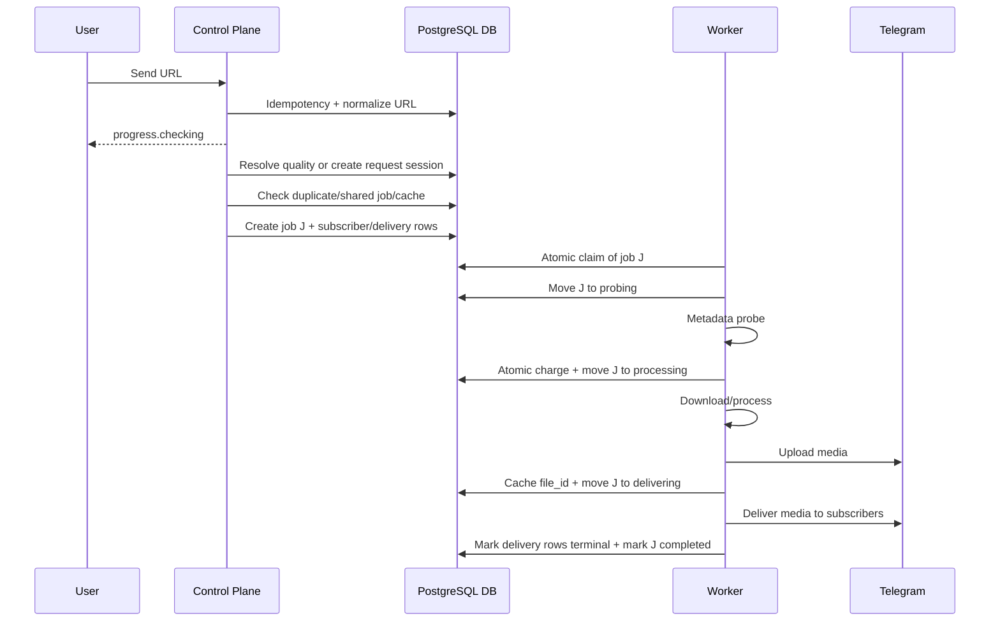
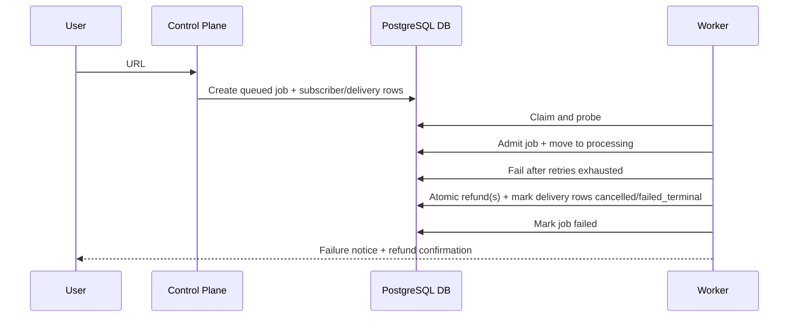

| TANZIL - Product Requirements Document v15.2 | Confidential · Global Service Edition |
| --- | --- |

---

# 🔒 PROJECT IRON LAWS (Global Service Update)

## IL-09: Universal Service Architecture (The "Tanzil Engine")

- **The Engine is Sovereign:** The core logic (extraction, processing, DB management) is built as a standalone **Universal Media Engine**. It must be 100% decoupled from the Telegram delivery logic.
- **Unified Internal API:** The Engine must expose an internal, high-performance interface (Service Layer) that serves multiple frontends.
- **Client Agnostic:** The architecture must natively support:
    - **Telegram Bot Client** (Current priority)
    - **Telegram Mini-App (TMA)** (Rich UI)
    - **Web PWA** (Future expansion)
    - **Native Mobile Clients** (Future expansion)
- **Zero-Latency Ingress:** Links are processed via the Engine's asynchronous pipeline to ensure the "Universal Engine" is ready for real-time web requests.

---

> **⚠️ These laws are not suggestions. They are non-negotiable architectural constraints. Any section of this document — including subsequent sections — that conflicts with any clause here is overridden by what is written in this section.**

---

TANZIL
Product Requirements Document
Version 15.0 - Final Zero-Cost Production Specification

| Status | Build Candidate - Iron Laws Enforcement & Zero-Cost Compliance |
| --- | --- |
| Version | 15.0 |
| Date | 2026-04-09 |
| Authors | Engineering Team |
| Scope | Telegram Media Downloader Bot (Tanzil) |

## Changelog

| Version | Date | Summary |
| --- | --- | --- |
| 15.0 | 2026-04-09 | **Forensic audit completion pass:** Resolved IL-02 wording contradiction with §3.14 operational lifespan (renamed to "Zero Routine Maintenance", added lifecycle redeployment as acknowledged exception #5); fixed `users` DDL (added missing `last_name`, `is_deleted` columns); unified document version to 15.0; fixed `callback_token` size inconsistency (CHAR(8) → CHAR(6)); renumbered §5.2.8b/c → §5.2.9/10 and cascaded; added §3.15 Internal Service Communication Protocol; added §3.16 Telegram API Compatibility; added §10.6 Multi-Process Rate Limiting Coordination; added §5.2.21 Platform Circuit Breakers table; added §12.7.2 Re-registration After Deletion flow; expanded §16.6 Backup Strategy with concrete free-tier tooling; added §25.6 Free-Tier Resource Budget Estimation; enhanced error messages E004/E005/E007 with dynamic parameters; added `platform_circuit_breakers` and `approved_proxies` schema; added missing CHECK constraints and indexes; fixed `processed_updates` retention wording; added §18.5 Free-Tier Infrastructure Tests; added mermaid ER diagram in §5.3; expanded glossary and RACI; added temporarily-banned user behavior rules in §10.3. |
| 14.5 | 2026-04-09 | **Iron Laws enforcement pass:** Rewrote all 10 Iron Laws in English; eliminated the dual deployment profile (persistent reference + free-tier) and unified to a single free-tier zero-cost profile per IL-01; removed all references to paid fallback, paid VM, paid Redis, and paid monitoring; replaced all "operator intervention" dependencies with automated self-healing per IL-02; converted SLA/support to zero-maintenance model; updated E015/MTProto/Instagram credential flows to auto-disable instead of waiting for human action; replaced cost model with $0 targets; updated SLO table, hosting table, glossary, and error taxonomy for full compliance. |
| 14.4 | 2026-04-09 | **Iron Laws insertion:** Added the non-negotiable Project Iron Laws at the top of the document, codifying: absolute zero-cost mandate, write-once/run-forever constraint, free infrastructure requirements, financial integrity rules, bilingual mandate, security-by-default, Telegram-only architecture, and Python tech stack lock. These laws supersede all other sections. |
| 14.3 | 2026-04-09 | **Forensic audit fix pass:** Fixed broken SQL block in §5.2.4; added `blocked_hashes` check to evaluation order; added `other` to platform CHECK and merged `twitter`/`x`; removed advisory lock from claim SQL; fixed wireframe pricing contradiction (4 credits → uniform); added SSRF protection to URL unshortening; added E016/E013 messages; added `/purge_hash` command; added bootstrapping guide and data deletion flow; added `send_method` CHECK constraint; added per-user job limit enforcement; added shared-job subscriber cap; fixed DDL ordering for `worker_temp_files` and `blocked_hashes`. |
| 14.2 | 2026-04-09 | Engineering Audit revisions: Addressed "Perfect User Fallacy" with regex URL extraction & HEAD unshortening; enforced Direct-to-Telegram streaming for Free-Tier to fix the 20GB persistent disk fallacy; added proactive E016 Disk Full limits; eliminated `user_balance_cache` entirely; added CSAM hashing policies, UI wireframes, referral fraud checks, and RACI matrices. |
| 14.1 | 2026-04-09 | Final stack and execution-hardening pass: approved a persistent single-host gold deployment shape for unattended operation; formalized `claim_token` ownership validation, optional `user_balance_cache`, and the `credits_ledger -> media_jobs` FK ordering fix; tightened rollout/readiness/testing for stale-worker rejection; and clarified that third-party no-card free hosts remain best-effort rather than the final forever target. |
| 14.0 | 2026-04-09 | Free-tier realism and operational hardening pass: split the document into a persistent reference profile and a stricter no-card free-tier best-effort profile; made Redis optional rather than foundational; froze shared-job delivery cohorts at `delivering`; added `hard_deadline_at` and `last_progress_at` recovery contracts; tightened worker RAM/disk and yt-dlp defaults for bounded hosts; clarified provider/TOS constraints for approved worker hosts; strengthened janitor redundancy, degraded-mode behavior, and quota handling; and expanded testing to cover no-Redis, stale-progress, hard-deadline, and free-tier chaos scenarios. |
| 13.2 | 2026-04-09 | Appendix completion pass: added a full error taxonomy and recovery matrix, practical operator runbooks for the highest-impact incidents, and a reference cost/hosting appendix with bounded deployment profiles and monthly estimate ranges. |
| 13.1 | 2026-04-09 | Refinement pass after external audit: added compact callback tokens and callback-length guarantees; defined cancel callback contract; added progress-message-deleted terminal-summary behavior; clarified safe `send_document` preference, audio thumbnails, and `retry_after` handling; strengthened yt-dlp release discipline, platform circuit breakers, poison-job handling, upload non-resume rules, upload-worker singleton guard, ban cascade behavior, credential-generation reload flow, container hardening requirements, deletion anonymization details, and expanded test coverage. |
| 13.0 | 2026-04-09 | Major architecture revision: replaced the ambiguous Turso/SQLite worker-claim model with PostgreSQL as the authoritative store and queue using `FOR UPDATE SKIP LOCKED`; separated the Control Plane from job workers; removed in-memory request-session timeout handling; introduced lease-based delivery fan-out with explicit `job_deliveries` states; made the credits ledger authoritative; removed split uploads and `>1 GB` experimental mode; defined a singleton MTProto Upload Worker; added credential health/rotation procedures; clarified janitor executors; and completed user/admin message and deployment contracts. |
| 12.0 | 2026-04-07 | Forensic revision: fixed shared-job charging contradictions, introduced pre-job request sessions, added delivery-phase semantics, clarified cancel/status/settings flows, expanded schemas (`request_sessions`, `job_events`, `job_deliveries`, `system_flags`, `alerts_log`, `deletion_requests`), defined worker claim eligibility, added failure classification, stale-cache fallback, deletion/privacy policy, admin/operator controls, mixed-version rollout rules, richer localization catalog, and removed false-ready/ambiguous language. |
| 11.0 | 2026-04-07 | Full audit pass: resolved flow/state-machine contradictions, added job claim atomicity, defined subscriber notification mechanism, added internal concurrency model, added onboarding/admin-panel/progress/callback/group-chat/janitor/analytics/message-catalog/SLO/capacity sections, expanded schemas (users, media_jobs, job_subscribers, user_abuse_log), removed "Gateway" alias, fixed sequence diagrams, decided referral cap, added worker registration protocol, and added reconciliation/idempotency-safety notes. |
| 10.0 | 2026-04-07 | Metadata probe before charge, long-polling default, state machine with probing state, URL Pattern Matcher replaces NLP term, graceful shutdown. |
| 9.0 | - | Previous baseline (credits deducted before size validation - fixed in v10). |

---

# 1. The Tanzil Swarm Vision (v17.0 Pipeline Edition)

## 1.1 Product Philosophy: The "Automated Production Factory"
Tanzil is no longer just a media engine; it is a **Standardized Software Ecosystem**. By leveraging the **GitHub Spec-Kit** and a **Phase-Gated Pipeline**, we ensure the highest level of engineering quality with zero human maintenance.

### The "Spec-Standard" Goal:
- **Global Compliance:** Using GitHub Spec-Kit to define API contracts that follow international standards.
- **Automated Lifecycle:** From code writing to PR review, testing, and deployment, the entire process is an automated pipeline.
- **Component-Driven (Bit-Kit Architecture):** The system is built as a series of isolated, reusable components (Engines, Clients, APIs) that can be swapped or updated independently.

## 1.2 The Production Pipeline (The Software Factory)
- **Phase-Gate Logic:** Every phase in the development plan must pass an automated "Gate" (Linting, Testing, SDK Review) before merging.
- **Auto-Documentation:** The system automatically generates and updates GitHub Pages documentation for every API change.
- **Continuous Swarm Deployment:** The pipeline automatically deploys to multiple free-tier providers to maintain the "Swarm" integrity.

## 1.4 Final Product Scope
The final scope of Tanzil includes:
- **Tanzil Core Engine:** A standalone service for media extraction, metadata probing, and transcoding.
- **Internal API:** A clean interface for clients (Bot/Web) to interact with the Engine.
- **Telegram Pro Client:** An advanced bot interface using the latest aiogram/Telegram API features (Inline Queries, Web Apps, Dynamic Keyboards).
- **Processing Suite:** SponsorBlock, Audio-Only, Subtitles, 8K/HDR support, and iOS-optimized MP4 transcoding.
- **Admin & Observability:** A comprehensive dashboard to monitor the "Engine" and its clients.

This is the **final product scope**, not a first phase.

## 1.5 Final Platform Support Model
Tanzil does not use the phrase "all platforms" in an undefined absolute sense. Instead it supports **all policy-allowed, extractor-compatible public media platforms** within one final release, with explicit support tiers.

### Tier 1 - Guaranteed Platforms
Platforms that are explicitly tested and form the main reliability surface:
- YouTube (including fully supported playlist downloads)
- TikTok
- Instagram
- Facebook Video
- X / Twitter Video
- Reddit Video

### Tier 2 - Best-Effort Platforms
Public extractor-compatible platforms allowed by policy but not guaranteed to the same standard as Tier 1. Examples include:
- Vimeo
- Dailymotion
- Pinterest
- Streamable
- Loom
- Bilibili
- VK
- SoundCloud
- Threads
- and similar public media sources supported by the extractor at runtime.

### Tier 3 - Auth-Dependent Platforms or Cases
Platforms or URLs that require valid cookies, sessions, or other configured access secrets for some or all content.

### Tier 4 - Permanently Unsupported Cases
- DRM-protected media
- livestreams
- policy-blocked or legally/operationally disallowed protected services
- private-only resources without legitimate configured access
- user-provided proxy flows
- media sources requiring unstable or prohibited browser-automation-heavy workarounds

## 1.6 Permanent Non-Goals
- No livestream downloading.
- No DRM-protected media.
- No user-provided proxies.
- No browser frontend.
- No payments, subscriptions, or ads.
- No claim of infinite scaling.
- No split-upload delivery in the final release.
- No design dependence on public-proxy rotation, provider-specific IP tricks, cloud relay abuse, or other anti-ban evasion schemes.
- No production reliance on scale-to-zero or preemptible-only worker hosts for long-running media jobs.
- No assumption of future product phases to complete core behavior.

## 1.7 Bounded Operational Constraints
This document assumes a bounded, **fully automated** deployment rather than mass-scale infrastructure. Per IL-02, no manual operation is assumed post-deployment.

Per IL-01 (Zero-Cost Mandate), this project has a **single deployment profile**: the **free-tier zero-cost profile**. All hosting, databases, and infrastructure must be completely free with no credit card. The system is designed to operate robustly within these constraints.

| Metric | Target |
| --- | --- |
| DAU | ≤ 30 users |
| Downloads per day | ≤ 40 |
| Concurrent active jobs | ≤ 2 total |
| Peak update ingestion | ≤ 5 updates/second |
| Cache hit ratio goal | ≥ 30% after warm-up |
| Active MTProto upload owners | 0 by default; 1 only if a stable free Upload Worker is proven |

Reference topology (free-tier only, per IL-01):
- 1 Control Plane on the most stable free always-on host available (e.g., Hugging Face Spaces, Koyeb Free)
- 1 **General Worker** running one job at a time
- Upload Worker disabled by default
- Aggressive degraded-mode use when quotas or host instability appear

Operational guardrails:
- `max_global_active_jobs` is enforced centrally and defaults to `2` (per IL-01 free-tier constraints).
- The Control Plane runs on a free always-on host. If the host sleeps after idleness, the system must handle backlog replay on wake-up with a secondary janitor trigger. Per IL-02, this is fully automated.
- General Workers run on free-tier compute. The system must tolerate ephemeral disks and cold restarts gracefully (per IL-02 and IL-05).
- Per IL-01, hosts whose free plan requires payment-card verification are not approved.
- If the Upload Worker is unavailable, requests that require MTProto are rejected or held out of admission before charge; they are not silently accepted into an unwinnable queue.
- MTProto uploads are disabled by default. Requests `> 50 MB` should normally be rejected before charge.

## 1.8 Request Classification Rule
A request is considered acceptable only after deterministic URL extraction, normalization, platform identification, policy validation, support-tier classification, auth evaluation where applicable, and size/access feasibility checks. Any request that cannot be safely classified must be rejected rather than tentatively processed.

---

# 2. Product Experience (Ultra-UX Standards)

## 2.1 UI/UX Philosophy: The "Invisible Assistant"
The product must feel like a premium, integrated part of the operating system. Interactions should be:
- **Zero-Typing:** Buttons and menus should handle 90% of user needs.
- **Instant Visual Feedback:** Use progress bars, status emojis, and dynamic captions.
- **Context-Aware:** The UI changes based on the platform (e.g., specific options for YouTube vs. TikTok).
- **Smooth & Professional:** Avoid bot-like "clunky" text; use professional, clear, and localized copy.

## 2.2 Global Aesthetic
- Use clear spacing and alignment.
- Implement RTL-optimized layouts for Arabic.
- Use high-quality thumbnails as visual anchors for every request.
- Ensure all captions are neatly formatted with a consistent style.

## 2.3 Key UI Features
- **Dynamic Status Messages:** Instead of simple text, use a structured summary (Title, Channel, Duration, Quality, Size).
- **Inline Multi-Choice:** Quality selection buttons should show the expected file size (e.g., `[ 720p (HD) ~ 45MB ]`).
- **Interactive Progress:** A visual bar (e.g., `█████▒▒▒▒▒ 50%`) that updates with the download percentage (where available).
- **One-Click Actions:** Quick buttons for `Audio-Only`, `Re-download (different quality)`, and `Cancel`.

## 2.3 Supported Languages
- Arabic (`ar`) - default if Telegram client is Arabic
- English (`en`)

Language detection priority:
1. Manual override in settings
2. Telegram `language_code`
3. Default to `en`

All user-facing text must come from localization keys. No hardcoded user-facing strings in business logic.

## 2.4 Commands

| Command | Access | Behavior |
| --- | --- | --- |
| /start | All users | Register user if needed, apply valid referral if present, send onboarding or returning summary |
| /help | All users | Explain supported links, usage policy, settings, and support handle |
| /settings | All users | Open settings UI for language, default quality per platform, emoji toggle, and keep-progress-message toggle |
| /cancel | All users | If one active cancellable job exists, cancel it; if multiple exist, show an inline selector; if none exist, explain that there is nothing cancellable |
| /status | All users | Show up to 3 active jobs where the user is requester or subscriber, with short ID, platform, quality, state, age, and whether each can be cancelled |
| /purge_hash `<hash>` | Admin only | Immediately block a URL hash and invalidate cached files (CSAM/Abuse policy) |
| /admin | Admin only | Open admin panel in private chat only |
| /ban `<id>` | Admin only | Open confirmation flow to ban target user |
| /unban `<id>` | Admin only | Open confirmation flow to unban target user |
| /workers | Admin only | Show worker status summary |
| /metrics | Admin only | Show key service metrics summary |
| /delete_my_data | All users | Request full account data deletion with confirmation flow (§12.7.1) |

### Command Semantics Rules
- Unknown slash commands return a localized helper message plus `/help` hint.
- Commands in group/supergroup and channel environments are fully supported, but admin-only commands remain restricted.
- Admin commands with malformed arguments return a localized usage message and perform no side effects.
- Slash commands remain in English in both locales; descriptions and responses are localized.

## 2.5 Input Handling Rules
### 2.5.1 Text Containing a URL
If a message contains text alongside a URL, the system must not fail. It must apply an aggressive regex substring pattern to extract the **first sequence of characters that matches a valid URL structure**, ignoring prefix conversational text, and stripping trailing punctuation.
If the URL relies on a known shortener (e.g., `bit.ly`, `tinyurl.com`), the system must perform a fast HTTP `HEAD` request to expand the URL before classifying it. This request must enforce a strict timeout (e.g., 3s), limit redirects (max 5), restrict allowed schemes to `http`/`https`, and block private IP ranges to prevent SSRF.
Only after a URL is cleanly extracted and expanded does the **request-resolution flow** begin.

### 2.5.2 Plain Text Without URL
Reply with a short helper message:
- Arabic: "أرسل رابط YouTube أو Instagram أو TikTok."
- English: "Send a YouTube, Instagram, or TikTok link."

### 2.5.3 Unsupported Media/Input Types
For stickers, photos, files, voice notes, or unsupported text, reply once with a helper message, then suppress repeated hints for 60 seconds to avoid spam.

### 2.5.4 Multiple URLs in One Message
- Only the first supported URL is processed in the final release.
- If more than one supported URL is present, the helper note may state that only the first supported link was used.

## 2.6 Primary User Flow
### 2.6.1 Request Resolution Flow (Pre-Job Phase)
1. User sends supported URL.
2. Bot replies immediately with `progress.checking` and stores the progress message ID.
3. Control Plane performs idempotency check, URL extraction, normalization, and platform derivation.
4. If unsupported or invalid → return E001/E003 and stop.
5. Control Plane resolves quality **before** cache lookup and duplicate/shared-job lookup:
   - explicit user choice in message or callback,
   - saved user preference,
   - or a 30-second quality-selection request session if choice is required.
6. Only after quality is resolved does the system check:
   - stale per-user duplicate request,
   - active shared job by `url_hash + quality`,
   - cache by `platform + url_hash + quality`.
7. If cache hit → follow cache-hit flow (§2.6.2).
8. If active shared job exists → follow shared-job attachment flow (§2.6.5).
9. Otherwise Control Plane creates a new `media_jobs` row in `queued` and auto-inserts the original requester into subscribers with `charge_status = 'pending'`.
10. Worker claims the job atomically.
12. If probe fails or media is oversized → fail request.
13. If probe succeeds → transition to `processing`.
14. Worker downloads/processes media.
15. Worker uploads to Telegram and stores the resulting `telegram_file_id`.
16. Worker enters `delivering` to fan out the result to all subscribers.
17. After all subscriber delivery attempts are recorded, worker marks the job `completed`.
18. Temporary files are deleted.

Concurrency and progress message rules:
- Only **one** active `request_session` may exist per user. If a new supported URL arrives while a session is `awaiting_quality`, the earlier session is auto-cancelled with a timeout message and the same progress message ID is reused.
- The progress message created at request-session time is reused for the entire job lifecycle; no second progress message is created when the job is queued. If the user deletes it manually, later edits are safely suppressed (by catching `MessageNotFound`). However, upon final termination (success, failure, or cancellation), a **brand new summary message** is sent to the chat to ensure the user is not left in silent ambiguity.

> **Key rule:** No new job is created until quality is known.

### 2.6.2 Cache Hit Flow
- Cached delivery is instantly fulfilled without executing a new download cycle.
- If cached send succeeds, the user receives the media and `cache.hit`.
- If cached send fails because the stored `telegram_file_id` is invalid, stale, or send-method incompatible:
  1. invalidate the cache row immediately;
  2. continue the same user request through the fresh-download path;
  3. run the normal metadata probe before downloading.

> **Efficiency invariant:** Failed cached delivery transparently falls back to fresh download without impacting user limits until successful.

### 2.6.3 Quality Selection Flow (Callback Query Handling)
Triggered if:
- platform supports multiple choices, and
- user has no saved preference, and
- no quality was inferred from the request.

Rules:
- A temporary `request_sessions` row is created with status `awaiting_quality`.
- Timeout: **30 seconds**.
- Default fallback if timeout:
  - YouTube → `720p`
  - Instagram → `max`
  - TikTok → `max`
- Timeout enforcement is **database/scheduler driven**, not in-memory. The Control Plane sweeps expired sessions every 10 seconds, marks them `timed_out_defaulted`, applies the platform default quality, and continues the normal request-resolution flow as though the default had been chosen by the user.
- A request session is **not** a queued media job.
- Request-session correctness must survive Control Plane restart. Restart may delay timeout handling slightly, but it must not lose the session or its eventual defaulting behavior.

#### Callback Query Contract
- **Callback data format:** `q:{callback_token}:{quality_code}` (example: `q:03F9K2:720`).
- `callback_token` is a compact opaque token stored on `request_sessions.callback_token`; it must be short enough to keep the full callback payload comfortably below Telegram's 64-byte limit.
- `quality_code` must be a compact server-defined code such as `360`, `480`, `720`, `1080`, or `max`; verbose free-form strings are forbidden in callback payloads.
- A unit test suite must assert that **every** emitted callback payload is `<= 64` bytes.
- On callback received: answer the callback query immediately (`answerCallbackQuery`), then process.
- On expired callback (session already timed out/defaulted, consumed, cancelled, or superseded): answer with alert text `Selection expired` and take no further action.
- On rapid duplicate clicks: the first callback is processed; subsequent identical callbacks within 2 seconds are acknowledged silently with no side effects.
- On callback for a session owned by a different user: answer with alert text `Not your request` and ignore.
- When a valid quality is selected, the request session is marked `consumed` and the main request-resolution flow continues.

### 2.6.4 Cancellation Rules
#### User-facing `/cancel`
- If the user has exactly one active cancellable job (`queued`, `claiming`, `probing`, `processing`), `/cancel` cancels that job.
- If the user has multiple active jobs, `/cancel` returns an inline list of active jobs using short IDs, title/URL host, state, and cancelability.
- If the user clicks cancel on a job that has become non-cancellable in the meantime, the bot returns the current state and performs no side effects.
- Request sessions awaiting quality may also be cancelled; this closes the session and removes pending keyboards.

#### Cancel callback contract
- **Callback data format:** `c:{job_short_id}`.
- The callback must be answered immediately.
- If the job is no longer cancellable, the bot returns the current state and performs no side effects.
- If the callback belongs to a different user, return `callback.not_owner` and ignore.
- Expired or already-processed cancel callbacks must be acknowledged idempotently.

#### Job-state cancellation rules
- `queued`: cancellable, no refund needed because original requester is not yet charged.
- `claiming`: cancellable if the claim has not advanced to probe completion; no refund unless a charge already exists.
- `probing`: cancellable; no refund for original requester because charge has not happened yet.
- `processing`: cancellable; cancellation is strictly subscriber-scoped. The system marks only the invoking user's `job_subscribers` and `job_deliveries` rows as `cancelled` and refunds them. The job itself is only marked `cancelled` and stopped if the active subscriber count reaches zero.
- `delivering`: not cancellable.
- `uploading`: not cancellable.
- Terminal states: no action.

### 2.6.5 Shared Job Attachment Rules
When a user requests a `url_hash + quality` combination that already has an active non-terminal job, attachment behavior depends on the original job phase.

#### Case A - Active job in `queued`, `claiming`, or `probing`
1. Control Plane checks current subscriber count. If it exceeds `max_subscribers` (e.g. 20), do not attach; create a new job instead.
2. Control Plane creates or updates `job_subscribers` for the new user with `charge_status = 'pending'`.
3. Control Plane creates or updates the corresponding `job_deliveries` row with `delivery_status = 'pending'`.
4. User sees `shared.attached_pending` copy indicating the media is already being inspected.
5. If the original job later passes probe, pending subscribers remain attached.
6. If the original job fails, pending subscribers are closed out and their undelivered rows are terminalized as `cancelled`.

#### Case B - Active job in `processing` or `uploading`
1. Control Plane checks user limits (if any) and records a subscriber row.
2. User sees `shared.attached_charged` copy indicating another download is already in progress and they will receive the result when ready.
3. A `job_deliveries` row is created or preserved for that subscriber.
4. If a race causes the job to enter `delivering` before this attachment commits, abort the late attach and route the requester through Case C instead.

#### Case C - Matching job already in `delivering`
- Do **not** attach a new subscriber to the in-flight delivery cohort.
- Route the user to the cache path if the result is already reusable, or create a new job if not.

#### Case D - Delivery already fully completed but cache present
- Do **not** attach to an already completed job.
- Serve from the cache path instead.

> **Key rules:** shared attachment is keyed by `url_hash + quality`; late subscribers may attach only up to the start of `delivering`; no subscriber may be charged twice for the same job; delivery finality is per subscriber, not a single job-wide boolean.

## 2.6.6 YouTube Playlist Handling (Multi-File Delivery)
When a user sends a valid YouTube playlist URL, the system invokes a special request-resolution flow for multiple files:
1. **Playlist Parsing:** The bot extracts the playlist metadata (total video count, titles) using `yt-dlp` (extract-flat).
2. **User Journey & Options:**
   - The bot replies with an interactive UI summarizing the playlist (e.g., "YouTube Playlist: [Title] - [N] videos").
   - Options provided: 
     - "Download Full Playlist"
     - "Select Videos" (Yes/No list mode or numerical range)
3. **Usage Calculation:** 
   - Before executing the downloads, the bot checks if the total required videos exceed the user's daily protective limits (e.g., max 100).
   - If the request violates the limit, the bot rejects the operation with E005 (Daily Limit).
4. **Job Queuing:**
   - Once confirmed, the bot queues each selected video as a distinct, standard `media_jobs` row, ensuring failures in one video do not halt the rest.
   - The original single progress message updates collectively or points the user to their discrete jobs via `/status`.
5. **Limits & Defaults:**
   - To prevent system abuse or quota exhaustion on zero-cost infrastructure, a hard limit of **20 videos** per playlist operation is enforced for the free tier. Users with playlists larger than 20 videos will be prompted to select their top 20 or process the list in batches conditionally.

## 2.7 Error States

| Code | Trigger | User Message Summary | Rate Limit Action |
| --- | --- | --- | --- |
| E001 | Invalid / no usable URL | Send valid supported link | Not counted |
| E002 | Retry budget exhausted | Download failed after retries | Reverted from limits |
| E003 | Unsupported platform | Platform not supported | Not counted |
| E004 | File too large before download or after safe verification | File too large, choose lower quality | Not counted |
| E005 | Daily limit reached | Show fair-use daily limit info | Blocked |
| E006 | User banned | Account restricted | Blocked |
| E007 | Excessive queue flooding | Extreme rate limit hit | Silently throttled / Queued |
| E008 | Telegram upload failure | Upload failed, retrying | Ignored |
| E009 | Private / age-gated / inaccessible media | Cannot access content | Not counted |
| E010 | Worker timeout | Job timed out and is being reassigned | Ignored |
| E011 | Global queue full | Service is busy, try again later | Ignored |
| E012 | Internal dependency failure | Temporary service issue | Not counted |
| E013 | Duplicate update/idempotency replay | Silently ignored | No action |
| E014 | Metadata probe failed | Could not inspect media | Not counted |
| E015 | Authentication required but unavailable | Cannot access protected media | Not counted |
| E016 | Disk space exhausted | Temporarily cannot process large files, try again later | Not counted |

### 2.7.1 Error Classification Rules
- `E001`, `E003`, `E004`, `E005`, `E006`, `E007`, `E009`, `E014`, `E015`, `E016` are **user-visible terminal** errors for the current request.
- `E008`, `E010`, `E012` are **operational/retry-aware** errors and may first appear as transient internal states before a terminal user message is sent.
- `E013` is internal idempotency suppression and is normally silent.
- Every error occurrence must write `last_error_code`, `last_error_msg`, and a `job_events` row when a job exists.
- Every error code must map to one of: `retryable_dependency_error`, `permanent_dependency_error`, `user_error`, `internal_invariant_error`.
- `E008` is a transient delivery/upload state; if retry budget exhausts, the terminal user-facing code is `E002` (or `E012` for dependency failure).

## 2.8 Onboarding Flow

### First-time `/start`
```
👋 Welcome to Tanzil!

Send any YouTube, Instagram, or TikTok link and I'll download it for you.

✨ The bot is completely free for personal use.
Just enjoy the seamless experience!

Type /help for commands.
```

### Returning user `/start`
```
Welcome back! Send a link to get started.
```

### Arabic equivalents
All onboarding messages must exist in the localization catalog under keys `onboarding.welcome` and `onboarding.returning`.

## 2.10 Group and Channel Behavior
Tanzil supports downloading media within Telegram groups, supergroups, and channels.
- In groups and supergroups, the bot responds to specific commands (e.g., `/dl <url>`) or direct mentions to prevent spamming the chat for every link.
- In channels, if the bot is added as an administrator, it can automatically process links posted in the channel or respond to commands sent by other admins.
- Privacy and permissions: Group admins can restrict the bot, but by default it serves all members who invoke it.
- Usage models: Usage in groups and channels follows the same protective rate limiting models as private chats. The user who invoked the command is the one whose daily limit is adjusted.
- Direct replies to the bot's messages or progress updates are correctly associated with the respective user's job.
- Group administrators can configure whether the bot replies directly or sends the final file in the chat.

## 2.11 Progress Updates
Only the **original requester** receives a live progress message in the final release. Shared subscribers do not receive step-by-step edits; they receive an attach acknowledgement and then a final terminal message.

| State | Original Requester Message |
| --- | --- |
| request session created / `queued` / `claiming` | `progress.checking` |
| `probing` | `progress.probing` |
| `processing` | `progress.downloading` |
| `uploading` | `progress.uploading` |
| `delivering` | `progress.delivering` |
| `completed` | delete progress message by default, then send media |
| `failed` | edit progress message to localized terminal error |
| `cancelled` | edit progress message to localized cancellation confirmation |

**Settings interaction:**
- If `user_settings.keep_progress_msg = TRUE`, the final progress message is not deleted; instead it is edited to a short terminal summary.
- This setting affects only the original requester, not subscribers.

**Rate-limit rules for message edits:**
- Maximum 1 edit per 5 seconds per message.
- If Telegram returns 429, skip the edit and wait for the next state change.
- Progress percentage is not shown. Only state-level updates are displayed.
- If the progress message was manually deleted by the user, job execution continues. The worker must record `progress_message_missing = true`, stop further edit attempts for that message, and still send one final short terminal summary message on completion/failure/cancellation so the user is not left in silent ambiguity. The worker must safely catch and ignore `MessageToDeleteNotFound` and `MessageNotModified` Telegram SDK exceptions. `FloodWait` exceptions must trigger an async sleep and retry.

## 2.12 Settings, Status, and Help Flows
### 2.12.1 `/settings`
`/settings` opens an inline keyboard in private chat only.

Options:
- Language: `Arabic`, `English`
- Default quality: **YouTube only** selector (`360p/480p/720p/1080p`). Instagram/TikTok/other platforms are fixed to "Best available" and shown as non-interactive text to avoid misleading choices.
- `Enable emoji`: on/off
- `Keep progress message`: on/off

Rules:
- Every settings change persists immediately.
- Callback ownership is enforced.
- Expired settings callbacks show `callback.expired`.
- Settings changes have no retroactive effect on already-running jobs.

### 2.12.2 `/status`
If the user has no active jobs, return `status.none`.

If active jobs exist, list each active job where the user appears in `job_subscribers`, regardless of whether the user is the original requester or a shared subscriber.

Each entry must include:
- short job ID,
- platform,
- quality,
- state,
- elapsed time or queued age,
- whether it is cancellable for this user,
- and role marker: `requested_by_you` or `shared_subscriber`.

If queue position cannot be estimated reliably, the bot must not invent one.

### 2.12.3 `/help`
`/help` must include:
- supported platforms,
- usage policy and daily limits,
- command list,
- note that the bot works in private chats, groups, and channels,
- support handle,
- note that only the first supported URL in a multi-link message is processed.

## 2.13 Accessibility and RTL
- Arabic must be treated as first-class, not as translated afterthought text.
- Inline keyboard labels must be tested in RTL.
- Mixed Arabic/English strings such as `YouTube` and `720p` must remain readable.
- Emoji must be optional through settings and not carry core meaning alone.

## 2.14 Advanced Personal Experience (Beast Mode Features)
Since Tanzil is designed as an open and limitless tool for a close circle of users rather than a mass-market restricted bot, it implements several highly advanced "quality-of-life" features uncommonly found in public bots:

1. **SponsorBlock Integration:** 
   - Uses `yt-dlp` native SponsorBlock capabilities (`--sponsorblock-remove all`).
   - Automatically cuts out sponsored segments, intro/outro animations, and "subscribe" interaction reminders from YouTube videos before sending them to the user.
2. **Audio-Only Extraction (MP3/M4A):** 
   - A dedicated UI button or command argument (e.g., `/dl audio <url>`) to extract only the audio track.
   - Preserves high-quality audio metadata and album art for native playback inside Telegram music players.
3. **Subtitles & Captions:** 
   - Automatically downloads available subtitles (Arabic preferred, then English) and embeds them as soft-subs into the MP4 file, allowing the Telegram video player to toggle subtitles natively.
4. **Native Telegram Thumbnails:** 
   - Always extracts the highest-resolution thumbnail alongside the video and attaches it to the Telegram `send_video` API payload. This prevents the "blank black frame" issue common in scraping bots.
5. **Guaranteed MP4 Transcoding (iOS Compatibility):** 
   - Uses `ffmpeg` to automatically transcode `.webm` or `.mkv` files (which Telegram's iOS client struggles to play) into heavily optimized `.mp4` payloads on-the-fly, ensuring universal playback across all Telegram clients.
6. **Smart Metadata Captioning:** 
   - Instead of sending a blank video, the bot extracts the original media's Title, Author/Uploader, and original URL, formatting them into a neat Telegram caption attached to the downloaded media.
7. **Silent Graceful Queuing (No Spam Limits):** 
   - If a user forwards a massive dump of 15 links from TikTok/Reels at once, the bot doesn't crash or send 15 error messages. It silently queues them and processes them sequentially in the background, reliably returning them to the user one by one.
8. **2GB MTProto Limit Breaker:**
   - Instead of breaking at the standard Bot API 50MB limit, Tanzania utilizes a customized MTProto background worker, allowing the downloading of podcasts or documentaries up to Telegram's maximum 2GB file size limit flawlessly.

---

# 3. Tanzil Engine Architecture: API-First Design

## 3.1 Architecture Philosophy: Service-Oriented (SOA)
To ensure future expansion into PWA/App, Tanzil is built as a **Media Extraction Service**.

### The Tanzil Core Engine:
- **Standalone Responsibility:** Handles all URL classification, metadata extraction, download coordination, and transcoding.
- **RESTful Internal API:** Provides a clean interface for any client to query URL metadata, create jobs, and get status updates.
- **Worker Coordination:** Manages a pool of workers via the database as a task queue.
- **Transcoding Layer:** Highly optimized ffmpeg pipelines for 8K/HDR/iOS compatibility.

## 3.2 Component Roles: Service vs. Client

| Component | Responsibility | Future Expansion Role |
| --- | --- | --- |
| Tanzil Core Engine | Logic, Extraction, Transcoding, Database management | **Central Backend** for PWA/App |
| Internal Service API | Interface for Clients (Bot/Web/App) | **Public API Layer** (optional) |
| Telegram Client (Bot) | Input parsing, User session management, Delivery via Telegram API | **Telegram Client** (one of many) |
| Web Client (PWA) | Future web interface | **Web Client** (coming soon) |
| General Workers | Execution of extraction and transcoding tasks | **Infrastructure Layer** |

## 3.3 Universal Service API Contract
The Engine must provide a clean internal API with the following capabilities:
1. `POST /api/v1/probe`: Extract metadata from any URL (Title, Thumb, Qualities, Sizes).
2. `POST /api/v1/jobs`: Initiate a download job with specific parameters (Quality, Format, Enhancements).
3. `GET /api/v1/jobs/{id}`: Get real-time status and progress updates.
4. `GET /api/v1/cache/{hash}`: Fast lookup for previously processed content.

### Performance Standard (Hyper-Speed):
- **Metadata Probe:** < 3 seconds (Tier 1).
- **Quality Choice Response:** < 1 second.
- **Instant Job Start:** Job is claimed by worker within 2 seconds of creation.
- **Parallel Tasks:** Simultaneous extraction and transcoding where possible.

### 3.1.1 Deterministic evaluation order
Every incoming request must pass the following stages in order:
1. URL extraction
2. URL normalization
3. platform/source identification
4. policy validation
5. blocked-hash check against `blocked_hashes`
6. support-tier classification
7. auth requirement evaluation
8. initial extractor feasibility check
9. size/access feasibility check where possible
10. accept/reject decision

### 3.1.2 Acceptance rules
A request may be accepted only if all are true:
- a usable URL was extracted,
- the URL could be normalized into a stable identity,
- the source is policy-allowed,
- the platform can be classified into a support tier,
- auth requirements are either not needed or satisfied,
- and the media is not known to violate size or delivery constraints.

### 3.1.3 Rejection rules
A request must be rejected if any of the following are true:
- no valid usable URL exists,
- the source is unsupported or policy-blocked,
- required auth is unavailable,
- the content is inaccessible,
- extractor feasibility fails before safe job admission,
- or the file is known to exceed the permitted limit.

### 3.1.4 Classification storage requirement
The system must persist or emit enough classification context for logs, metrics, and admin diagnostics, including:
- `classification`
- `platform`
- `support_tier`
- `auth_required`
- `auth_available`
- `normalized_url`
- `url_hash`
- `rejection_reason` when applicable

### 3.1.5 Cache and shared-job ordering rule
Cache lookup and shared-job attachment are allowed only after:
- normalization,
- support-tier classification,
- and quality resolution.
A rejected request may never hit cache, attach to a shared job, or enter queueing.

### 3.1.6 Safe rejection principle
If the system cannot classify a request safely, it must reject it rather than tentatively processing it.

### 3.1.7 Internal invariant rule
The following states are forbidden:
- a `rejected_*` request with an active download job,
- an accepted request without a `platform` or `support_tier`,
- an auth-dependent request without recorded auth evaluation,
- a request known to be oversized that was still admitted to a charge-bearing path.

### 3.1.8 User messaging rule
Classification must map to explicit user-facing outcomes:
- invalid → valid-link guidance
- unsupported/policy-blocked → explicit unsupported message
- auth unavailable → explicit access-unavailable message
- inaccessible → cannot-access-content message
- oversized → explicit size rejection
- internal dependency issue → temporary service issue message

### 3.1.9 Operational truthfulness rule
Tier 1, Tier 2, Tier 3, and Tier 4 are operationally different classes. Logs, analytics, support diagnostics, and user-facing behavior must not blur them into one generic "supported" state.

## 3.2 Architectural Decision Summary
This specification adopts the following decisions:
- **Long Polling** is used by the Control Plane for Telegram update ingestion.
- **The Control Plane does not execute media jobs.** It is responsible for updates, callbacks, admission control, request-session timeout sweeping, admin flows, and janitor coordination.
- **Job execution is handled only by worker services.** Workers are the only components allowed to claim queued jobs.
- **PostgreSQL is the authoritative store and queue.** Job claiming uses row locking with `FOR UPDATE SKIP LOCKED`; correctness does not depend on SQLite/Turso polling races.
- **Redis is optional.** When present it is only a lightweight accelerator for rate limiting, ephemeral abuse/mute keys, and short-lived coordination. Correctness must survive with Redis fully absent.
- **One singleton Upload Worker owns MTProto uploads.** General Workers must not share MTProto session state concurrently.
- **Fan-out delivery is lease-based, resumable, and cohort-frozen.** Once a job enters `delivering`, no new subscriber may join that delivery cohort; financial exactness is guaranteed, while media delivery remains strongly duplicate-suppressed rather than falsely claimed to be mathematically exact-once under Telegram API response-loss scenarios.
- **Request-session timeouts and janitor actions are scheduler-driven.** No in-memory timer is allowed to be correctness-critical.
- **Every active job emits durable progress heartbeats.** Worker liveness alone is not enough; `last_progress_at` is used to detect stuck jobs earlier than full stage timeout.
- **Per IL-01, the free-tier zero-cost profile is the sole approved deployment profile.** It uses tight concurrency, aggressive degraded mode, and honest SLO language.

## 3.3 Why Long Polling
Long polling is selected because:
- it keeps the Telegram ingress path operationally simple,
- it avoids public-webhook certificate and routing complexity,
- it is adequate for the bounded traffic envelope in §1.7,
- and it allows the Control Plane to remain self-contained.

**Persistent-profile constraint:** long polling requires an always-on Control Plane. A platform that may scale the Control Plane to zero or terminate it unpredictably is out of scope for persistent-profile ingress duty.

**Free-tier best-effort note:** if the Control Plane host can sleep, restart, or cold-start, the deployment must explicitly accept backlog replay, slower first-response latency after idle periods, and a secondary maintenance trigger for janitor work.

Webhook mode remains out of scope for this product specification.

## 3.4 Component Overview

| Component | Platform Class | Role | Notes |
| --- | --- | --- | --- |
| Control Plane | always-on app host / VM | Long polling, commands, callbacks, request/session lifecycle, admission control, admin panel, janitor scheduler | Required; must be always-on in the persistent profile |
| General Worker(s) | persistent compute with stable temp disk | Metadata probe, download, processing, Bot API delivery for non-MTProto jobs | Required |
| Upload Worker | persistent compute with stable temp disk | Singleton owner for MTProto uploads and large-job execution | Optional but required for `>50 MB` support |
| Database | managed PostgreSQL or self-hosted PostgreSQL | Users, jobs, cache, workers, events, audit logs, idempotency | Source of truth |
| Redis (optional) | lightweight Redis / compatible | Optional rate limiting and short-lived coordination | Non-authoritative accelerator only |
| Monitoring | uptime checks + alerting + logs | Basic health observation and incident response | Required |
| CI/CD / maintenance executor | GitHub Actions, cron, or equivalent | Tests, dependency PRs, migrations, backup/export automation, secondary janitor trigger | Required |

Reference deployment rules:
- Demo-oriented or ephemeral-disk hosts may be used for development or experiments, but they are **not** approved reference worker hosts for long-running media jobs.
- Host classes that sleep after inactivity are acceptable. Per IL-02, the system must handle cold restarts and backlog replay fully automatically.
- Hosts whose terms prohibit sustained media extraction/download workloads are not approved primary worker hosts.

## 3.5 Request and Processing Lifecycle
1. Control Plane receives a Telegram update via long polling.
2. Update idempotency is checked (`processed_updates`).
3. If message is from a group/supergroup or channel without command/mention context → silently ignore. If appropriately invoked → continue.
4. Input is classified: command, callback, supported URL, unsupported input.
5. URL is normalized and the platform is derived by deterministic pattern rules.
6. Quality is resolved first, either from user settings, explicit selection, or a durable `request_sessions` record.
7. After quality is known, cache and duplicate/shared-job checks run.
8. If cache hit → attempt cached delivery, or invalidate cache and continue through the fresh path.
9. If an active shared job exists and it has **not** entered `delivering` → attach subscriber using phase-aware rules from §2.6.5.
10. Otherwise a `media_jobs` row is created in `queued` with the original requester inserted into `job_subscribers` and `job_deliveries`.
11. An eligible worker claims the job atomically from PostgreSQL (see §7.5).
12. Worker probes metadata. If probe fails → `failed`.
13. If probe passes → status becomes `processing`.
14. Worker downloads/processes media and periodically updates `last_progress_at`.
15. If upload is required, the eligible worker uploads to Telegram and stores the resulting `telegram_file_id`.
16. Worker enters `delivering`, freezes the delivery cohort, acquires a fan-out lease, and processes `job_deliveries` rows in durable batches.
17. After all subscriber delivery rows in that cohort are terminal, the job becomes `completed`.
18. Temporary files are deleted from the worker-local temp directory.

## 3.6 Worker Model
- The Control Plane never claims jobs in the reference architecture.
- Workers are of two kinds:
  - **General Worker** - handles normal jobs and Bot API-compatible delivery paths.
  - **Upload Worker** - the only worker kind allowed to process MTProto-required uploads.
- Default concurrency:
  - General Worker: `1` active job at a time (per IL-01 free-tier constraints).
  - Upload Worker: exactly `1` active job at a time.
- A worker may claim a job only if:
  - `can_process_jobs = TRUE`,
  - worker `status` is not `offline`, `draining`, or `disabled`,
  - platform-specific flags permit the job,
  - local capacity is available,
  - the global active-job cap has not been reached,
  - and MTProto-required jobs are routed only to the Upload Worker.
- Each active job must emit periodic durable progress heartbeats (`last_progress_at`) while in `claiming`, `probing`, `processing`, `uploading`, or active `delivering` work.
- Every claim also receives a fresh `claim_token`. Stale workers must never continue mutating job state once their token no longer matches the row.
- Workers coordinate through PostgreSQL state transitions plus short-lived leases. Redis may assist with send throttling, but state correctness must remain recoverable from the DB alone.

## 3.7 Service Concurrency Model
Reference topology:

```
┌──────────────────────┐
│     Control Plane    │
│  aiogram long-poll   │
│  callbacks / admin   │
│  janitor scheduler   │
└──────────┬───────────┘
           │
           ▼
┌──────────────────────┐      ┌──────────────────────┐
│    PostgreSQL DB     │◀────▶│    Redis (optional)  │
│ queue + source truth │      │ rate/TTL primitives  │
└──────────┬───────────┘      └──────────────────────┘
           │
   ┌───────┴────────┐
   ▼                ▼
┌──────────────┐  ┌────────────────┐
│ General      │  │ Upload Worker  │
│ Worker(s)    │  │ MTProto owner  │
└──────────────┘  └────────────────┘
```

Rules:
- The Control Plane may run lightweight async background tasks, but media processing remains outside it.
- Each worker slot owns one claimed job at a time. Internal subprocesses are an implementation detail; architectural ownership still belongs to the worker slot.
- Global concurrency is enforced at claim time in the database.
- Redis may be absent; the diagram shows it only as an optional accelerator.
- The Upload Worker is singleton when MTProto uploads are enabled.
- For the bounded envelope in this PRD, the Control Plane and General Worker run on free hosting services, with a free managed PostgreSQL provider. Per IL-01, no operator-controlled paid host is required.

## 3.8 Subscriber Notification Mechanism
When a job reaches `delivering`, a worker must hold a **fan-out lease** before sending any subscriber result.

1. Worker acquires or renews the job-level fan-out lease on `media_jobs`.
2. Entering `delivering` closes the current delivery cohort by setting `delivery_cohort_closed_at`; no new subscriber may join that cohort afterward.
3. Only the lease owner may process `job_deliveries` rows for that job.
4. Delivery rows are claimed in small batches using `FOR UPDATE SKIP LOCKED` and moved from `pending/retryable` to `leased`.
5. Immediately before the Telegram API call, each claimed row moves to `sending` and receives a `send_token`.
6. On success, the row becomes `sent`, with `sent_at` and `sent_telegram_msg_id` recorded.
7. On permanent user-specific failure (for example, user blocked bot, chat unavailable), the row becomes `failed_permanent`.
8. On retryable failure, the row becomes `retryable` with `next_attempt_after` set according to backoff.
9. If a worker dies while holding a lease, expired `leased`/`sending` rows are repaired back to `retryable` by the scheduler; already `sent` rows are never retried.
10. The job transitions from `delivering` to `completed` only inside a transaction that verifies there are **zero** non-terminal delivery rows remaining for that frozen cohort.

Delivery semantics note:
- Telegram does not offer a universal cross-request idempotency token for media sends. The system therefore guarantees **strong duplicate suppression**, but it does not falsely claim mathematical exact-once delivery under the narrow failure window where Telegram may accept a send and the worker loses the response before persisting success.

## 3.9 Worker Registration and Lifecycle Protocol

### Registration
On startup, each worker performs an upsert into the `workers` table, including `worker_kind`, capability flags, and initial status.

Upload-worker singleton rule:
- Before an Upload Worker begins claiming MTProto-required jobs, it must acquire an explicit singleton guard.
- The recommended mechanism is a process-lifetime PostgreSQL advisory lock dedicated to the upload-worker role.
- If the singleton guard cannot be acquired because another healthy Upload Worker already owns it, the new Upload Worker must stay `disabled`/`degraded`, raise a HIGH alert, and process no upload jobs.

### Heartbeat
- Every worker sends a heartbeat every **20 seconds**.
- Heartbeat updates `last_heartbeat`, `active_jobs`, `status`, and capability metadata.
- The Upload Worker heartbeat additionally reports MTProto credential health.
- Any worker actively executing a claimed job must also refresh that job's `last_progress_at` at least every **30 seconds** while useful work is still being made.

### Deregistration
On graceful shutdown, a worker:
1. stops claiming new jobs,
2. marks itself `draining`,
3. either finishes or safely re-queues owned jobs,
4. clears fan-out leases it still owns when possible,
5. sets status to `offline`.

### Stale Worker Detection
The scheduler marks a worker `offline` if `last_heartbeat` is older than **90 seconds**.

Recovery consequences:
- non-terminal jobs owned by that worker are re-queued or repaired according to §7.4 and §7.6;
- expired delivery leases are repaired without discarding already-terminal rows;
- worker-local temp files under `/tmp/tanzil/{node_id}/` are eligible for cleanup by that node on restart or by janitor policy.

## 3.10 RAM and Disk Policy
Reference minimum production sizing:

| Worker Type | CPU | RAM | Temp Disk | Notes |
| --- | --- | --- | --- | --- |
| General Worker (paid reference, if ever) | 2 vCPU | 4-8 GB | ≥ 20 GB | normal media workload |
| Upload Worker (paid reference, if ever) | 4 vCPU | 8-16 GB | ≥ 40 GB | MTProto uploads and larger temp files |
| Free-tier General Worker (IL-01 approved) | ≤1 vCPU | ≤2 GB | 1-5 GB ephemeral app disk | bounded-disk, one file at a time |

Operational rules:
- General Workers run `1` job at a time per IL-01 free-tier constraints.
- Upload Worker runs one job at a time.
- Workers must aggressively refuse new claims when local available RAM or temp disk falls below configured safety floors (raising E016 Disk Full).
- Temp files must be deleted immediately after terminal state, and janitors must clean orphaned `/tmp` dumps after process crashes.
- Production workers must not rely on host-local storage surviving restarts.
- **Free-Tier Bounded-Disk Rule:** On free-tier hosts with limited ephemeral disk (1-5 GB), media downloads use temp disk for one file at a time. The worker downloads to `/tmp/tanzil/`, uploads to Telegram immediately upon completion, and deletes the temp file before claiming the next job. Downloads that would exceed available disk (estimated via metadata probe) must be rejected with E004 before charge. If disk falls below 200 MB free, the worker refuses new claims with E016.
- **Streaming optimization:** For platforms where single-stream output is available (some TikTok direct MP4, small files), the worker MAY use `yt-dlp -o -` piped directly to Telegram to minimize disk usage. This is an **optimization**, not a mandate — most YouTube downloads require DASH merge via ffmpeg, which requires temp disk.
- Downloads strictly larger than 50 MB (which exceed Bot API upload limits) must be rejected with E004 before charge unless the Upload Worker and MTProto are explicitly enabled.

## 3.11 Graceful Shutdown Requirements
Every service node must handle `SIGTERM` and `SIGINT`.

Shutdown flow:
1. stop accepting new claims or ingress work,
2. mark worker `draining` if applicable,
3. finish or checkpoint the current critical section,
4. re-queue unrecoverable in-flight work before exit,
5. flush DB state,
6. close Redis/DB clients,
7. exit.

If the host platform provides only ~30 seconds between `SIGTERM` and `SIGKILL`, the shutdown path must complete within that window.

## 3.12 Failure Recovery
- If worker heartbeat is missing for >90 seconds → mark worker offline and repair its owned jobs/leases.
- If `last_progress_at` is stale beyond the job-progress threshold and the owner is missing or the stage lease has clearly been lost, the scheduler may re-queue the job before the full stage timeout.
- Recovery actions must clear the old `claim_token`; any subsequent stage mutation attempted by the stale worker must fail ownership validation.
- Any `claiming`, `probing`, `processing`, or `uploading` job owned by a dead worker and stale beyond its state timeout is re-queued with `next_attempt_after` backoff if retry budget remains.
- `delivering` jobs are not reset blindly; instead, the fan-out lease is cleared or expired, and a new worker resumes only workable `job_deliveries` rows.
- If `attempt_count >= max_attempts`, mark the job `failed`, close outstanding deliveries.
- Any non-terminal job that passes `hard_deadline_at` must be forced into a terminal recovery path (`expired` or `failed` as appropriate); no job may linger forever waiting for a sleeping/free-tier host to come back.
- If all workers are offline, the Control Plane must stop admitting fresh-download jobs and return a localized degraded-mode message.
- If the Upload Worker is unavailable, MTProto-required jobs must be rejected before charge or after safe probe rejection; they must not sit indefinitely in the queue.
- Pending quality-selection request sessions are resolved by scheduler sweep, not by in-memory timers.
- **Delivery fan-out is worker-driven.** If the Control Plane restarts while a job is in `delivering`, active delivery continues on the worker. The Control Plane restart does not interrupt, cancel, or duplicate in-progress delivery.

## 3.13 Wake-Up Strategy for Sleeping Hosts
Free-tier hosts may aggressively sleep or stop containers after inactivity. Since the system uses long-polling (per IL-09), the Control Plane process must remain alive to receive Telegram updates. If the process stops, no external Telegram event can wake it.

**Mandatory keep-alive strategy:**
- Use a free external uptime monitor (e.g., UptimeRobot Free, Freshping Free, or equivalent) to send an HTTP GET to the `/health` endpoint every 5 minutes.
- This is an IL-01-compliant exception — the uptime monitor is a free service that does not require a credit card.
- If the hosting platform provides its own keep-alive mechanism (e.g., Hugging Face Spaces port binding), that mechanism is preferred.
- The `/health` endpoint doubles as the keep-alive target; no additional endpoint is needed.
- If the Control Plane wakes from sleep, it must resume the long-polling offset from `runtime_cursors` and drain any backlog with rate-limited processing (§8.1).

## 3.14 Expected Operational Lifespan
Due to IL-02 (no post-deployment updates) and `yt-dlp`'s dependency on platform-specific extractors that break regularly as platforms update their anti-bot mechanisms:

- The bot's useful lifespan **for fresh downloads** is estimated at **3-12 months** per `yt-dlp` release.
- Platforms break independently: YouTube may break first while TikTok continues working, or vice versa.
- As extractors break, the circuit breaker automatically disables each platform.
- After all extractors break, the bot degrades to **cache-only mode** — serving previously downloaded content that has valid `telegram_file_id` entries.
- Cache-only mode can persist indefinitely.
- This is an **accepted and intentional consequence** of IL-02. The bot is designed to provide maximum value during its active window and graceful degradation.
- If the product owner chooses to extend the bot’s lifespan, they may rebuild and redeploy with a newer `yt-dlp` version. This constitutes a new deployment cycle, not maintenance (IL-02 Exception #5).

## 3.15 Internal Service Communication Protocol
The Control Plane, General Worker(s), and Upload Worker are deployed as separate processes on separate free-tier hosts. Their **sole communication channel is PostgreSQL** — there is no direct HTTP, gRPC, or message-queue link between services.

### Communication pattern: DB-Centric Polling
- **Workers poll for jobs** by executing the atomic claim query (§7.5) every `3 seconds` when idle, `5 seconds` when degraded.
- **Workers write state transitions** directly to `media_jobs`, `job_deliveries`, `job_events`, and `credits_ledger`.
- **Workers send Telegram messages directly** using the shared Bot Token for delivery (`send_document`, `send_video`, etc.) and progress-message edits. The Control Plane does **not** relay media delivery on behalf of workers.
- **The Control Plane reads job state** when handling `/status`, `/cancel`, admin panels, or callback queries. It does not poll `media_jobs` in a tight loop for notification purposes.
- **User notification on job completion** is the worker's responsibility: after marking delivery rows terminal, the worker sends the final summary/media to the user via Telegram Bot API.
- **The Control Plane** handles: long-polling for Telegram updates, command/callback dispatch, request-session creation and timeout sweeps, admission control, janitor scheduling, admin panel, and alerting.

### Rate-limit coordination for Telegram sends
Both the Control Plane and Workers share the same Bot Token and thus the same Telegram rate limits. Coordination is achieved via the send-rate limiter (§10.6). When Redis is absent, the `db_local_hybrid` mode provides coarse global send-rate visibility through `rate_limit_windows`.

### Estimated DB query budget (steady-state, single worker)

| Source | Queries/minute (approx.) |
| --- | --- |
| Worker claim poll (idle) | 20 |
| Worker heartbeat writes | 3 |
| Worker job-stage transitions | 2-6 (during active job) |
| Control Plane janitor sweeps (aggregate) | 10-15 |
| Control Plane user commands/callbacks | 5-10 |
| **Total steady-state** | **~40-55 queries/min** |

> **Free-tier constraint:** This query volume is compatible with free PostgreSQL providers that support persistent connections (e.g., Supabase Free with 2 direct connections). Providers that aggressively cold-start compute (e.g., Neon Free with 190 compute-hours/month) may require the Control Plane to use connection pooling in `transaction` mode. `FOR UPDATE SKIP LOCKED` works correctly with transaction-mode pooling as long as each claim is a self-contained transaction.

### LISTEN/NOTIFY consideration
PostgreSQL `LISTEN/NOTIFY` could reduce polling overhead, but it requires a persistent connection (incompatible with transaction-mode poolers like PgBouncer/Supavisor). It is therefore **not mandated** but may be used as an optimization on providers that support direct connections alongside pooled connections.

## 3.16 Telegram API Compatibility
Telegram periodically updates its Bot API. Since the system uses `aiogram` as the Telegram framework, compatibility depends on the `aiogram` version pinned at build time.

**Compatibility rules:**
- `aiogram` is pinned to a specific version at build time alongside `yt-dlp`.
- The system uses only stable, well-established Bot API methods (`sendDocument`, `sendVideo`, `sendAudio`, `sendAnimation`, `editMessageText`, `deleteMessage`, `answerCallbackQuery`). These methods have been stable since Bot API 4.x and are unlikely to break.
- If Telegram introduces a breaking change to a core method (historically rare), the system continues to operate using the pinned `aiogram` version until a lifecycle redeployment (IL-02 Exception #5).
- The system **does not** rely on Telegram-specific features that are known to be experimental or version-gated.
- Unknown or unexpected Telegram API errors are caught, logged as `E012`, and do not crash the process.
- Telegram `429 / FloodWait` responses are always honored by sleeping for the server-provided duration.

> **Risk acceptance:** Like `yt-dlp` extractors, `aiogram` compatibility is expected to remain stable for 12-24 months per pinned version. If Telegram deprecates a method the system depends on, the system degrades gracefully and a lifecycle redeployment is required.

### 3.17 The Universal Tanzil API (Engine Interface)
To support a global ecosystem, the Engine exposes a strictly typed, client-agnostic service layer.

#### API Standard:
- **Transport:** Internal Python Service calls (for Bot) / JSON-over-HTTP (for Web/PWA).
- **Authentication:** Token-based per client (Internal Bot, Web Frontend, App).
- **Versioning:** Semantic versioning (e.g., `/v1/...`) to ensure PWA works even if Bot logic changes.

#### Core Endpoints (Mental Model for Frontend):
- `POST /v1/probe`: 
    - Input: `url`
    - Output: Full metadata, list of quality formats, thumbnails, and estimated sizes.
- `POST /v1/jobs`:
    - Input: `user_id`, `url`, `quality`, `enhancements` (SponsorBlock, etc.)
    - Output: `job_id`, `estimated_wait_time`.
- `GET /v1/jobs/{id}`:
    - Output: Live status, download percentage, current stage.
- `GET /v1/user/usage`:
    - Output: Daily remaining quota, history.

### 3.18 Zero-Cost AI Enhancements (The Intelligence Layer)
To compete with "world-class" products, Tanzil utilizes 100% free AI inference for media enhancement:
- **Smart Summarization:** Uses Hugging Face free inference (e.g., Mistral/Llama) to generate a 1-sentence summary of the video based on its title and description.
- **Auto-Translation:** Automatically translates video titles/descriptions to the user's preferred language (AR/EN).
- **Metadata Enrichment:** Automatically finds missing tags or uploader info to ensure the media file is perfectly organized in the user's library.
- **Safety Rule:** AI integration must use asynchronous, non-blocking calls and fail gracefully without affecting the primary download flow.

### 3.20 The "Tanzil-Bridge" Protocol (Telegram-as-a-CDN)
Tanzil revolutionizes media delivery for Web/PWA clients without using expensive storage.

- **The Bridge Logic:** When a Web/PWA client requests a video, the Engine uses the stored `telegram_file_id` to fetch the file from Telegram's cloud via a dedicated **Gateway Worker**.
- **On-the-Fly Streaming:** The Gateway Worker streams the file directly to the user's browser in chunks. Telegram's servers act as the infinite, free storage layer, while our workers act as the "last-mile" delivery bridge.
- **Cache-Hit Nirvana:** Since the `file_id` is permanent, the PWA can stream the same video 1000 times without ever re-downloading it from the source (YouTube/TikTok), achieving true zero-cost infinite storage.

### 3.21 AI Semantic Search & Library Intelligence
- **Semantic Indexing:** Every `ai_summary` and `ai_metadata` field is indexed using a lightweight vector database (or JSONB-based similarity search in PostgreSQL).
- **Natural Language Querying:** 
    - *User:* "Find the video from last week about space exploration."
    - *Engine:* Matches the meaning (Semantic) to the `ai_summary` and retrieves the `file_id` immediately.
- **Predictive Pre-fetching:** Based on user history, the swarm anticipates which platforms or qualities the user prefers and pre-warms the cache before the user even interacts.

# 4. URL Matching, Normalization, and Media Inspection

## 4.1 URL Pattern Matcher
This system does **not** use NLP. It uses deterministic URL extraction and validation rules.

Minimum supported patterns:
- YouTube watch URLs and `youtu.be`
- Instagram post/reel URLs
- TikTok video URLs

If multiple URLs are present in one message, only the first supported URL is processed in the final release.

## 4.2 Normalization Rules
Before hashing:
1. Lowercase scheme and host.
2. Remove `utm_*` query parameters and known trackers.
3. Remove fragments (`#...`).
4. Expand `youtu.be` to canonical YouTube URL form.
5. Strip irrelevant session/tracking parameters.
6. Preserve parameters required to identify media.

Only the normalized URL is stored and hashed.

## 4.3 Metadata Probe Before Processing
Before any non-cache charge:
- run metadata extraction only,
- determine estimated file size if possible,
- determine title and duration if possible,
- reject oversized media before processing,
- fail safely if metadata cannot be obtained.

This resolves the v9 inconsistency where jobs were accepted before size validation.

## 4.4 Protected Media Access
- Instagram may require cookies/session support.
- Private, login-locked, or age-gated media should fail with E009 or E015.
- Credentials or cookies used for extraction must be stored as secrets, never in the repository.

---

# 5. Data Model

## 5.1 Design Notes
- PostgreSQL is the authoritative system of record.
- PostgreSQL is the authoritative system of record.
- The system operates on a fair-use daily limit model (e.g. 100 media/day).
- Daily limits are stored directly on the `users` table and reset automatically.
- Queue correctness relies on database row locking and leases, not optimistic polling against SQLite semantics.
- Job ownership is derived from `media_jobs.worker_node`; fan-out ownership is derived separately from `media_jobs.fanout_worker_node` and lease columns.
- Redis is an optimization and coordination helper only; the database must contain enough state to repair the system after process loss.
- Reference DDL below is PostgreSQL-flavored SQL.

## 5.2 Schema

### 5.2.1 Users
```sql
CREATE TABLE users (
    id                     BIGINT PRIMARY KEY,
    username               VARCHAR(100),
    first_name             VARCHAR(100),
    last_name              VARCHAR(100),
    telegram_language_code VARCHAR(10),
    is_banned              BOOLEAN DEFAULT FALSE,
    ban_reason             TEXT,
    banned_until           TIMESTAMPTZ,
    is_deleted             BOOLEAN DEFAULT FALSE,
    daily_usage_limit      INT DEFAULT 100,
    daily_usage_count      INT DEFAULT 0,
    last_usage_reset       TIMESTAMPTZ DEFAULT NOW(),
    source_client          VARCHAR(20) DEFAULT 'telegram_bot' CHECK (source_client IN ('telegram_bot','telegram_mini_app','web_pwa','native_app')),
    created_at             TIMESTAMPTZ DEFAULT NOW(),
    updated_at             TIMESTAMPTZ DEFAULT NOW()
);

CREATE INDEX idx_users_deleted ON users(is_deleted) WHERE is_deleted = TRUE;
CREATE INDEX idx_users_banned ON users(is_banned) WHERE is_banned = TRUE;
CREATE INDEX idx_users_client ON users(source_client);
```

- `users` stores profile, settings, and rate-limiting counters.
- Consumption of the daily limit is recorded atomically during job admission.

### 5.2.2 User Settings
```sql
CREATE TABLE user_settings (
    user_id               BIGINT PRIMARY KEY REFERENCES users(id) ON DELETE CASCADE,
    language_code         CHAR(2) DEFAULT 'en' CHECK (language_code IN ('en','ar')),
    enable_emoji          BOOLEAN DEFAULT TRUE,
    quality_youtube       VARCHAR(10) DEFAULT '720p' CHECK (quality_youtube IN ('360p','480p','720p','1080p')),
    quality_instagram     VARCHAR(10) DEFAULT 'max' CHECK (quality_instagram IN ('max')),
    quality_tiktok        VARCHAR(10) DEFAULT 'max' CHECK (quality_tiktok IN ('max')),
    keep_progress_msg     BOOLEAN DEFAULT FALSE,
    updated_at            TIMESTAMPTZ DEFAULT NOW()
);
```

Note: only `quality_youtube` is exposed in the settings UI; Instagram/TikTok (and other platforms) are fixed to best-available and these columns remain for compatibility only.

### 5.2.3 Request Sessions
Used only for pre-job interactions such as quality selection and cancel-before-queue.

```sql
CREATE TABLE request_sessions (
    uuid                  UUID PRIMARY KEY,
    callback_token        CHAR(6) NOT NULL UNIQUE,
    user_id               BIGINT NOT NULL REFERENCES users(id) ON DELETE CASCADE,
    normalized_url        TEXT NOT NULL,
    url_hash              CHAR(64) NOT NULL,
    platform              VARCHAR(30) NOT NULL,
    status                VARCHAR(30) NOT NULL CHECK (status IN ('awaiting_quality','consumed','timed_out_defaulted','cancelled')),
    selected_quality      VARCHAR(10),
    source_chat_id        BIGINT NOT NULL,
    source_message_id     BIGINT NOT NULL,
    progress_message_id   BIGINT,
    expires_at            TIMESTAMPTZ NOT NULL,
    created_at            TIMESTAMPTZ DEFAULT NOW(),
    updated_at            TIMESTAMPTZ DEFAULT NOW()
);

CREATE INDEX idx_request_sessions_user_status ON request_sessions(user_id, status);
CREATE INDEX idx_request_sessions_expired ON request_sessions(status, expires_at)
WHERE status = 'awaiting_quality';
```

### 5.2.4 [Table Deleted]
(Section removed as virtual credits are no longer used.)

### 5.2.5 Workers
```sql
CREATE TABLE workers (
    node_id              TEXT PRIMARY KEY,
    worker_kind          VARCHAR(20) NOT NULL CHECK (worker_kind IN ('general','upload')),
    host_label           TEXT,
    can_process_jobs     BOOLEAN DEFAULT TRUE,
    status               VARCHAR(20) DEFAULT 'idle' CHECK (status IN ('idle','busy','draining','offline','disabled','degraded')),
    active_jobs          INT DEFAULT 0,
    max_jobs             INT DEFAULT 1,
    supports_large_jobs  BOOLEAN DEFAULT FALSE,
    last_heartbeat       TIMESTAMPTZ,
    jobs_completed       INT DEFAULT 0,
    jobs_failed          INT DEFAULT 0,
    registered_at        TIMESTAMPTZ DEFAULT NOW(),
    updated_at           TIMESTAMPTZ DEFAULT NOW()
);

CREATE INDEX idx_workers_status ON workers(status, last_heartbeat);
```

### 5.2.6 Media Jobs
```sql
CREATE TABLE media_jobs (
    uuid                   UUID PRIMARY KEY,
    short_id               CHAR(8) NOT NULL UNIQUE,
    user_id                BIGINT NOT NULL REFERENCES users(id),
    request_session_uuid   UUID REFERENCES request_sessions(uuid),
    playlist_uuid          UUID, -- groups jobs from the same playlist
    target_url             TEXT NOT NULL,
    url_hash               CHAR(64) NOT NULL,
    platform               VARCHAR(30) NOT NULL CHECK (platform IN ('youtube','instagram','tiktok','facebook','x','reddit','vimeo','dailymotion','pinterest','streamable','loom','bilibili','vk','soundcloud','threads','other')),
    quality                VARCHAR(10) NOT NULL,
    title                  TEXT,
    duration_seconds       INT,
    estimated_size_bytes   BIGINT,
    filesize_bytes         BIGINT,
    send_method            VARCHAR(20) CHECK (send_method IN ('document','video','audio','animation')),
    status                 VARCHAR(20) NOT NULL DEFAULT 'queued' CHECK (status IN ('queued','claiming','probing','processing','uploading','delivering','completed','failed','cancelled','expired')),
    priority               SMALLINT NOT NULL DEFAULT 0,
    worker_node            TEXT REFERENCES workers(node_id),
    claim_token            UUID,
    fanout_worker_node     TEXT REFERENCES workers(node_id),
    ai_summary             TEXT, -- Smart 1-sentence summary
    ai_metadata            JSONB, -- Translated titles, tags, etc.
    source_client          VARCHAR(20) DEFAULT 'telegram_bot' CHECK (source_client IN ('telegram_bot','telegram_mini_app','web_pwa','native_app')),
    claimed_at             TIMESTAMPTZ,
    started_processing_at  TIMESTAMPTZ,
    upload_started_at      TIMESTAMPTZ,
    delivery_started_at    TIMESTAMPTZ,
    fanout_claimed_at      TIMESTAMPTZ,
    fanout_lease_until     TIMESTAMPTZ,
    attempt_count          INT DEFAULT 0,
    max_attempts           INT DEFAULT 3,
    requires_mtproto       BOOLEAN DEFAULT FALSE,
    is_large_job           BOOLEAN DEFAULT FALSE,
    next_attempt_after     TIMESTAMPTZ,
    hard_deadline_at       TIMESTAMPTZ NOT NULL DEFAULT (NOW() + INTERVAL '8 hours'),
    last_progress_at       TIMESTAMPTZ,
    delivery_cohort_closed_at TIMESTAMPTZ,
    source_chat_id         BIGINT NOT NULL,
    source_message_id      BIGINT NOT NULL,
    progress_message_id    BIGINT,
    last_error_code        VARCHAR(20),
    last_error_msg         TEXT,
    created_at             TIMESTAMPTZ DEFAULT NOW(),
    updated_at             TIMESTAMPTZ DEFAULT NOW(),
    completed_at           TIMESTAMPTZ
);
```


`short_id` generation rule:
- `short_id` is generated at job creation time as the first 8 characters of a hex-encoded UUID v4 (e.g., `a3f9c2b1`).
- If a collision occurs (extremely rare), regenerate with a new UUID.
- `short_id` is used in callback data (e.g., `c:a3f9c2b1`), admin panel job lookup, and `/status` display.
- The full `uuid` remains the primary key for all internal operations.

### 5.2.7 Job Subscribers
This table represents who is subscribed to a shared result and their charging state.

```sql
CREATE TABLE job_subscribers (
    job_uuid              UUID NOT NULL REFERENCES media_jobs(uuid) ON DELETE CASCADE,
    user_id               BIGINT NOT NULL REFERENCES users(id) ON DELETE CASCADE,
    subscription_status   VARCHAR(20) NOT NULL DEFAULT 'active' CHECK (subscription_status IN ('active','cancelled')),
    subscribed_at         TIMESTAMPTZ DEFAULT NOW(),
    detach_reason_code    VARCHAR(30),
    subscribed_at         TIMESTAMPTZ DEFAULT NOW(),
    PRIMARY KEY (job_uuid, user_id)
);
```

### 5.2.8 Job Deliveries
Durable per-subscriber delivery tracking.

```sql
CREATE TABLE job_deliveries (
    id                    BIGSERIAL PRIMARY KEY,
    job_uuid              UUID NOT NULL REFERENCES media_jobs(uuid) ON DELETE CASCADE,
    user_id               BIGINT NOT NULL REFERENCES users(id) ON DELETE CASCADE,
    delivery_status       VARCHAR(20) NOT NULL DEFAULT 'pending' CHECK (delivery_status IN ('pending','leased','sending','retryable','sent','failed_permanent','failed_terminal','cancelled')),
    attempt_count         INT DEFAULT 0,
    max_attempts          INT DEFAULT 3,
    next_attempt_after    TIMESTAMPTZ,
    lease_owner           TEXT,
    lease_until           TIMESTAMPTZ,
    send_token            UUID,
    send_started_at       TIMESTAMPTZ,
    sent_telegram_msg_id  BIGINT,
    failure_reason_code   VARCHAR(30),
    failure_reason_msg    TEXT,
    last_attempt_at       TIMESTAMPTZ,
    sent_at               TIMESTAMPTZ,
    created_at            TIMESTAMPTZ DEFAULT NOW(),
    updated_at            TIMESTAMPTZ DEFAULT NOW(),
    UNIQUE (job_uuid, user_id)
);

CREATE INDEX idx_job_deliveries_workable ON job_deliveries(delivery_status, next_attempt_after, lease_until);
CREATE INDEX idx_job_deliveries_job_status ON job_deliveries(job_uuid, delivery_status);
```

### 5.2.9 Worker Temp Files (Cleanup Ledger)
```sql
CREATE TABLE worker_temp_files (
    node_id              TEXT NOT NULL REFERENCES workers(node_id),
    job_uuid             UUID REFERENCES media_jobs(uuid) ON DELETE SET NULL,
    file_path            TEXT NOT NULL,
    created_at           TIMESTAMPTZ DEFAULT NOW()
);
```

### 5.2.10 Blocked URL Hashes (CSAM & Illegal Policy)
```sql
CREATE TABLE blocked_hashes (
    url_hash             CHAR(64) PRIMARY KEY,
    reason               TEXT,
    added_by_admin       BIGINT REFERENCES users(id),
    created_at           TIMESTAMPTZ DEFAULT NOW()
);
```

### 5.2.11 Platform Circuit Breakers
```sql
CREATE TABLE platform_circuit_breakers (
    platform             VARCHAR(30) PRIMARY KEY,
    state                VARCHAR(20) NOT NULL DEFAULT 'closed' CHECK (state IN ('closed','open','half_open')),
    failure_count        INT DEFAULT 0,
    success_count        INT DEFAULT 0,
    last_failure_at      TIMESTAMPTZ,
    last_success_at      TIMESTAMPTZ,
    opened_at            TIMESTAMPTZ,
    half_open_at         TIMESTAMPTZ,
    close_threshold      INT DEFAULT 3,
    open_threshold       INT DEFAULT 5,
    cooldown_seconds     INT DEFAULT 600,
    updated_at           TIMESTAMPTZ DEFAULT NOW()
);
```

Circuit breaker behavior:
- **closed:** Normal operation. Failure counter increments on each extractor failure.
- **closed → open:** When `failure_count >= open_threshold` within a rolling 10-minute window, the platform is disabled. New requests for this platform are rejected with E003. An alert is emitted.
- **open → half_open:** After `cooldown_seconds` elapse, the circuit enters half-open state. One probe request is allowed through.
- **half_open → closed:** If `success_count >= close_threshold` consecutive probe successes, the circuit closes and the platform is re-enabled.
- **half_open → open:** If the probe fails, the circuit re-opens with doubled cooldown (capped at 3600 seconds).
- Circuit breaker state is checked at request classification time (§3.1.1 step 6) and during worker claim eligibility.
- Janitor sweep resets stale `half_open` entries that have been stuck longer than `2 * cooldown_seconds`.

### 5.2.12 Approved Proxies
```sql
CREATE TABLE approved_proxies (
    id                   BIGSERIAL PRIMARY KEY,
    proxy_url            TEXT NOT NULL UNIQUE,
    label                TEXT,
    is_active            BOOLEAN DEFAULT TRUE,
    quarantined_until    TIMESTAMPTZ,
    failure_count        INT DEFAULT 0,
    last_used_at         TIMESTAMPTZ,
    created_at           TIMESTAMPTZ DEFAULT NOW()
);
```
### 5.2.13 Job Events
Canonical timeline of state changes and operational events.

```sql
CREATE TABLE job_events (
    id                   BIGSERIAL PRIMARY KEY,
    job_uuid             UUID NOT NULL REFERENCES media_jobs(uuid) ON DELETE CASCADE,
    event_type           VARCHAR(50) NOT NULL,
    from_status          VARCHAR(20),
    to_status            VARCHAR(20),
    actor_type           VARCHAR(20) NOT NULL CHECK (actor_type IN ('system','worker','user','admin','janitor')),
    actor_id             TEXT,
    error_code           VARCHAR(20),
    details_json         JSONB,
    created_at           TIMESTAMPTZ DEFAULT NOW()
);

CREATE INDEX idx_job_events_job ON job_events(job_uuid, created_at);
```

### 5.2.14 Retry Log
```sql
CREATE TABLE job_retry_log (
    id               BIGSERIAL PRIMARY KEY,
    job_uuid         UUID NOT NULL REFERENCES media_jobs(uuid),
    attempt_number   INT NOT NULL,
    error_code       VARCHAR(20),
    error_msg        TEXT,
    proxy_used       TEXT,
    duration_ms      INT,
    created_at       TIMESTAMPTZ DEFAULT NOW()
);
```

### 5.2.15 File Cache
```sql
CREATE TABLE file_id_cache (
    platform             VARCHAR(30) NOT NULL,
    url_hash             CHAR(64) NOT NULL,
    quality              VARCHAR(10) NOT NULL,
    telegram_file_id     TEXT NOT NULL,
    send_method          VARCHAR(20) NOT NULL DEFAULT 'document' CHECK (send_method IN ('document','video','audio','animation')),
    title                TEXT,
    duration_seconds     INT,
    filesize_bytes       BIGINT,
    cache_hit_count      INT DEFAULT 1,
    last_validated_at    TIMESTAMPTZ DEFAULT NOW(),
    expires_at           TIMESTAMPTZ DEFAULT (NOW() + INTERVAL '60 days'),
    created_at           TIMESTAMPTZ DEFAULT NOW(),
    PRIMARY KEY (platform, url_hash, quality)
);

CREATE INDEX idx_cache_expires ON file_id_cache(expires_at);
```

Cache validation policy:
- `expires_at` is an application TTL (60 days).
- Validation should be primarily lazy/on-use. A scheduled validation sweep, if enabled at all, must be low-frequency and quota-aware.
- If a cached send fails at runtime, invalidate immediately and continue through the fresh path using the pricing rules from §2.6.2.

### 5.2.16 Referrals
```sql
CREATE TABLE referral_log (
    id               BIGSERIAL PRIMARY KEY,
    referrer_id      BIGINT NOT NULL REFERENCES users(id),
    invitee_id       BIGINT NOT NULL REFERENCES users(id),
    rewarded_at      TIMESTAMPTZ DEFAULT NOW(),
    UNIQUE (invitee_id)
);

CREATE INDEX idx_referral_referrer ON referral_log(referrer_id);
```

### 5.2.17 Idempotency / Processed Updates
```sql
CREATE TABLE processed_updates (
    update_id        BIGINT PRIMARY KEY,
    update_type      VARCHAR(30) NOT NULL CHECK (update_type IN ('message','callback_query','edited_message','inline_query','other')),
    user_id          BIGINT,
    processed_at     TIMESTAMPTZ DEFAULT NOW()
);

CREATE INDEX idx_processed_updates_processed_at ON processed_updates(processed_at);
```

### 5.2.18 Admin Audit Log
```sql
CREATE TABLE admin_audit_log (
    id               BIGSERIAL PRIMARY KEY,
    admin_id         BIGINT NOT NULL REFERENCES users(id),
    action           VARCHAR(50) NOT NULL,
    target_id        BIGINT,
    details_json     JSONB,
    created_at       TIMESTAMPTZ DEFAULT NOW()
);
```

### 5.2.19 User Abuse Log
```sql
CREATE TABLE user_abuse_log (
    id               BIGSERIAL PRIMARY KEY,
    user_id          BIGINT NOT NULL REFERENCES users(id),
    offense_type     VARCHAR(50) NOT NULL,
    offense_count    INT DEFAULT 1,
    muted_until      TIMESTAMPTZ,
    banned_until     TIMESTAMPTZ,
    created_at       TIMESTAMPTZ DEFAULT NOW()
);

CREATE INDEX idx_abuse_user ON user_abuse_log(user_id, created_at DESC);
```

### 5.2.20 System Flags
```sql
CREATE TABLE system_flags (
    flag_key         TEXT PRIMARY KEY,
    flag_value       TEXT NOT NULL,
    value_type       VARCHAR(10) NOT NULL DEFAULT 'bool' CHECK (value_type IN ('bool','int','string','json')),
    updated_by       TEXT,
    updated_at       TIMESTAMPTZ DEFAULT NOW()
);
```

Examples:
- `enable_mtproto_uploads`
- `disable_platform:instagram`
- `disable_platform:tiktok`
- `disable_shared_jobs`
- `disable_progress_updates`
- `max_global_active_jobs`
- `deployment_profile`
- `rate_limiter_backend`
- `admission_mode`

Runtime cursors (long-poll offsets and similar):
```sql
CREATE TABLE runtime_cursors (
    cursor_name      TEXT PRIMARY KEY,
    cursor_value     BIGINT NOT NULL,
    updated_at       TIMESTAMPTZ DEFAULT NOW()
);
```

Optional DB-backed rate-limit windows (used when Redis is absent or deliberately disabled):
```sql
CREATE TABLE rate_limit_windows (
    window_key       TEXT PRIMARY KEY,
    scope            VARCHAR(20) NOT NULL CHECK (scope IN ('global','chat','user')),
    hit_count        INT NOT NULL DEFAULT 0,
    window_started_at TIMESTAMPTZ NOT NULL,
    expires_at       TIMESTAMPTZ NOT NULL,
    updated_at       TIMESTAMPTZ DEFAULT NOW()
);

CREATE INDEX idx_rate_limit_windows_expires ON rate_limit_windows(expires_at);
```

### 5.2.21 Alerts Log
```sql
CREATE TABLE alerts_log (
    id               BIGSERIAL PRIMARY KEY,
    severity         VARCHAR(10) NOT NULL CHECK (severity IN ('INFO','WARN','HIGH','CRITICAL')),
    source           VARCHAR(50) NOT NULL,
    event_code       VARCHAR(30) NOT NULL,
    message          TEXT NOT NULL,
    details_json     JSONB,
    created_at       TIMESTAMPTZ DEFAULT NOW(),
    acknowledged_at  TIMESTAMPTZ,
    acknowledged_by  BIGINT
);
```

### 5.2.22 Deletion Requests
```sql
CREATE TABLE deletion_requests (
    id               BIGSERIAL PRIMARY KEY,
    user_id          BIGINT NOT NULL REFERENCES users(id),
    status           VARCHAR(20) NOT NULL CHECK (status IN ('requested','processing','completed','rejected')),
    requested_at     TIMESTAMPTZ DEFAULT NOW(),
    completed_at     TIMESTAMPTZ,
    notes            TEXT
);
```

### 5.2.23 Smart Metadata Pruning (The "Lean Engine" Strategy)
To ensure the DB stays under the 500MB free-tier limit indefinitely, Tanzil implements an aggressive pruning strategy.

- **Non-Essential Metadata:** For jobs older than 30 days, clear the `ai_metadata` (JSONB) and `title` fields, but retain the `url_hash`, `platform`, `quality`, and `telegram_file_id`.
- **Reasoning:** 95% of user repeat-requests (Cache Hits) happen within the first 30 days. For older items, we only need the `file_id` for delivery; the rich metadata can be re-probed if needed.
- **Auto-Archival:** Records in `job_events` and `job_retry_log` are pruned every 14 days, with summary metrics persisted in the `metrics` dashboard.
- **Zero-Routine:** This is fully automated via the Janitor sweep (§16.4).

### 5.2.23 Schema Migrations
```sql
CREATE TABLE schema_migrations (
    id               BIGSERIAL PRIMARY KEY,
    version          INT NOT NULL UNIQUE,
    description      TEXT,
    applied_at       TIMESTAMPTZ DEFAULT NOW()
);
```

## 5.3 Entity Relationship Diagram


**Table count:** 23 tables total (including `runtime_cursors`, `rate_limit_windows`, `schema_migrations`, `platform_circuit_breakers`, `approved_proxies`).

---

# 6. Admission and Usage Control

## 6.1 Atomic Usage Admission
To prevent exceeding free-tier resource budgets, user usage is tracked against a sliding or daily limit. Usage must be checked and incremented in a single transaction.

Admission Rule:
- Lock the user row for update.
- Verify `daily_usage_count < daily_usage_limit`.
- If reset is due (e.g. `last_usage_reset` is from a prior day), reset `daily_usage_count` to 0 and update `last_usage_reset`.
- Increment `daily_usage_count` and record the job.

Reference SQL:
```sql
BEGIN;

SELECT id, daily_usage_count, daily_usage_limit, last_usage_reset
FROM users
WHERE id = :user_id
FOR UPDATE;

-- Logic: If NOW() > last_usage_reset + 1 day, reset count to 0.
-- Logic: If daily_usage_count >= daily_usage_limit, return E005.

UPDATE users
SET daily_usage_count = daily_usage_count + 1,
    last_usage_reset = CASE WHEN NOW() > last_usage_reset + INTERVAL '1 day' THEN NOW() ELSE last_usage_reset END
WHERE id = :user_id;

COMMIT;
```

## 6.2 Usage Reversion (Refund equivalent)
If a job failed permanently after admission, the system may choose to "refund" the usage count to prevent penalizing the user for system errors.

Reversion Rule:
- Only performed when the job or subscriber status moves to a terminal failure state.
- Must be idempotent to avoid double-incrementing the user's available quota.

```sql
BEGIN;

UPDATE users
SET daily_usage_count = GREATEST(0, daily_usage_count - 1)
WHERE id = :user_id;

-- Record event: usage reverted for job UUID.

COMMIT;
```

## 6.3 Shared Job Admission
When attaching to an existing job, the same admission logic from 6.1 applies. If the user has already exceeded their daily limit, they are rejected from attaching.

## 6.4 Periodic Limit Resets
While reset logic is built into the admission transaction (Section 6.1), the Janitor process also performs a bulk sweep to reset all stale usage counters that haven't been touched in >24 hours, ensuring the database remains clean.

## 7.1 `media_jobs` States

| State | Meaning | Terminal |
| --- | --- | --- |
| queued | Eligible for claim | No |
| claiming | Worker has locked and is binding ownership | No |
| probing | Metadata inspection is in progress | No |
| processing | Download/transcode is in progress | No |
| uploading | Telegram upload is in progress | No |
| delivering | Fan-out to subscribers is in progress | No |
| completed | All delivery rows are terminal and job succeeded overall | Yes |
| failed | Retry budget exhausted or unrecoverable failure | Yes |
| cancelled | User/system cancelled before terminal success | Yes |
| expired | Cleanup logic terminalized stale work | Yes |

## 7.1.1 `request_sessions` States

| State | Meaning | Terminal |
| --- | --- | --- |
| awaiting_quality | Waiting for user callback | No |
| consumed | Valid quality selected and session used | Yes |
| timed_out_defaulted | Timeout sweep applied default quality and continued flow | Yes |
| cancelled | User or superseding request cancelled the session | Yes |

## 7.1.2 `job_deliveries` States

| State | Meaning | Terminal |
| --- | --- | --- |
| pending | Ready for delivery attempt once job is deliverable | No |
| leased | Claimed by a fan-out worker batch | No |
| sending | Telegram API call in progress or response pending | No |
| retryable | Previous attempt failed transiently; retry after backoff | No |
| sent | Delivery succeeded | Yes |
| failed_permanent | Permanent user-specific failure (blocked bot, invalid chat, etc.) | Yes |
| failed_terminal | Retry budget exhausted or terminal dependency failure | Yes |
| cancelled | Subscriber-scoped cancel before send | Yes |

## 7.1.3 `job_subscribers.subscription_status` States

| State | Meaning | Terminal |
| --- | --- | --- |
| active | Subscriber is active and awaiting delivery | No |
| cancelled | Subscriber detached or cancelled | Yes |
- `active → cancelled` when the job fails, expires, or the subscriber detached before completion. Reversion of usage quota is handled idempotently via `idempotency_key`.
- `waived` is set only by explicit admin action; no automatic transition leads to `waived`.
- Terminal states (`refunded`, `waived`, `cancelled`) do not transition further.
- A subscriber may never transition from `cancelled` or `refunded` to `charged`.

## 7.2 Transition Rules

### Request sessions
- `awaiting_quality -> consumed` only on a valid callback from the owning user.
- `awaiting_quality -> timed_out_defaulted` only by the timeout sweep.
- `awaiting_quality -> cancelled` on user cancel or superseding request.
- Terminal request-session states do not transition further.

### Jobs
- `queued -> claiming` only by an eligible worker via atomic claim query.
- `claiming -> probing` only by the winning worker with a still-valid `claim_token`.
- `probing -> failed` if metadata inspection rejects media.
- `probing -> processing` only after the original requester is charged successfully and pending subscribers are either charged or detached, and only while the same `claim_token` still owns the job.
- `processing -> uploading` on successful download when Telegram upload is still required.
- `uploading -> delivering` only after upload succeeds, `telegram_file_id` is stored, and `delivery_cohort_closed_at` is set.
- `delivering -> completed` only when all `job_deliveries` rows are terminal.
- `claiming/probing/processing/uploading -> queued` on safe retry/reassignment with `next_attempt_after` set and ownership cleared.
- `delivering -> delivering` on worker reassignment; existing delivery rows are preserved.
- `queued/claiming/probing/processing -> cancelled` if the state is still cancellable for the relevant subscriber or for the whole job when no subscribers remain.
- Terminal job states do not transition further.

### Delivery rows
- `pending` or `retryable` → `leased` only by the fan-out lease owner.
- `leased -> sending` immediately before the Telegram send call.
- `sending -> sent` on successful API response persistence.
- `sending -> retryable` on retryable failure.
- `sending -> failed_permanent` on permanent user-specific failure.
- `sending -> failed_terminal` when retry budget is exhausted or the failure is terminal for that subscriber.
- `pending/retryable -> cancelled` when subscriber-scoped cancellation happens before send.
- `leased/sending -> retryable` when lease expires and repair logic reopens the row.

### 7.2.1 Probe-success charging algorithm
At `probing -> processing`, the worker must:
1. lock the job row;
2. validate that its `claim_token` still matches the row;
3. lock all subscriber rows for the job;
4. lock the original requester's user row first, then other users in deterministic order;
5. charge the original requester;
6. charge eligible pending subscribers;
7. detach insufficient pending subscribers;
8. create or preserve delivery rows for every still-attached subscriber;
9. advance to `processing` only after the financial transaction is committed.

### 7.2.2 Delivery completion rule
A job may transition `delivering -> completed` when and only when:
- `delivery_cohort_closed_at IS NOT NULL`, and
- every `job_deliveries` row in that frozen cohort is in one of:
  - `sent`
  - `failed_permanent`
  - `failed_terminal`
  - `cancelled`

A job with one permanently unreachable subscriber may still complete once that subscriber row is terminalized and refunded if required.

## 7.3 Mermaid State Diagrams




## 7.4 Timeout Policy

| Scope | Timeout | Action |
| --- | --- | --- |
| request session awaiting quality | 30s | timeout sweep applies default quality |
| worker heartbeat freshness | 20s interval / 90s stale | mark worker offline and repair ownership |
| job progress heartbeat freshness | worker updates every 30s / investigate at 120s stale | early reassign eligibility if owner is lost or clearly stuck |
| queued job | 6 hours | mark expired and close out subscribers |
| hard job deadline | 8 hours from creation | force terminal recovery path and refund/close subscribers |
| claiming | 30s | return to queued with backoff |
| probing | 2 minutes | fail with E014 / no charge |
| processing | 20 minutes default, 45 minutes for MTProto-required large job | reassign if retry budget remains |
| uploading | 20 minutes default, 45 minutes for MTProto-required large job | retry or reassign |
| job-level fan-out lease | 120s | new worker may acquire lease |
| per-delivery lease | 90s | repair row back to retryable if still non-terminal |
| delivering overall | 20 minutes | resume or fail per-subscriber rows, then complete/fail job deterministically |

Recovery notes:
- `queued -> expired` is terminal and must close out subscribers: uncharged subscribers are cancelled with no charge; charged subscribers are refunded and terminalized.
- `delivering` timeout does not clear already terminal delivery rows.
- `last_progress_at` allows earlier intervention than the full stage timeout, but the scheduler must confirm ownership loss or clear stuckness before reassigning work.
- `next_attempt_after` must be populated on re-queue to prevent immediate hot-loop reclaim by the same worker.

## 7.5 Atomic Claim SQL
Workers must claim jobs using one transaction with row locking and the global concurrency gate enforced before ownership is committed.

Reference PostgreSQL shape:
```sql
BEGIN;

-- Advisory lock removed in v14.3; workers rely on atomicity within the UPDATE statement and per-node bounds instead.

WITH active_capacity AS (
    SELECT COUNT(*) AS active_jobs
    FROM media_jobs
    WHERE status IN ('claiming','probing','processing','uploading','delivering')
),
eligible_worker AS (
    SELECT w.node_id, w.worker_kind, w.supports_large_jobs
    FROM workers w
    WHERE w.node_id = :node_id
      AND w.can_process_jobs = TRUE
      AND w.status IN ('idle','busy')
    FOR UPDATE
),
candidate AS (
    SELECT mj.uuid
    FROM media_jobs mj
    CROSS JOIN eligible_worker ew
    WHERE mj.status = 'queued'
      AND (mj.next_attempt_after IS NULL OR mj.next_attempt_after <= NOW())
      AND NOT EXISTS (
          SELECT 1
          FROM system_flags sf
          WHERE sf.flag_key = 'disable_platform:' || mj.platform
            AND sf.flag_value = 'true'
      )
      AND (
          (mj.requires_mtproto = FALSE AND ew.worker_kind IN ('general','upload'))
          OR
          (mj.requires_mtproto = TRUE AND ew.worker_kind = 'upload' AND ew.supports_large_jobs = TRUE)
      )
    ORDER BY mj.priority DESC, mj.created_at ASC
    FOR UPDATE SKIP LOCKED
    LIMIT 1
)
UPDATE media_jobs mj
SET status = 'claiming',
    worker_node = :node_id,
    claim_token = :claim_token,
    claimed_at = NOW(),
    last_progress_at = NOW(),
    attempt_count = attempt_count + 1,
    updated_at = NOW()
FROM candidate, active_capacity
WHERE mj.uuid = candidate.uuid
  AND mj.hard_deadline_at > NOW()
  AND active_capacity.active_jobs < COALESCE((
      SELECT flag_value::INT
      FROM system_flags
      WHERE flag_key = 'max_global_active_jobs'
  ), 6)
RETURNING mj.uuid, mj.claim_token;

COMMIT;
```

Rules:
- `claim_token` is generated by the worker before the claim transaction and written only if the claim succeeds.
- If zero rows are returned, no eligible job was claimed.
- Workers must not perform a separate `SELECT` then `UPDATE` claim sequence.
- Re-queued jobs retain the same UUID but receive a new `claim_token` on the next successful claim.

## 7.6 Re-queue / Lease Repair SQL
```sql
-- Re-queue non-delivery jobs
UPDATE media_jobs
SET status = 'queued',
    worker_node = NULL,
    claim_token = NULL,
    claimed_at = NULL,
    last_progress_at = NULL,
    next_attempt_after = NOW() + (:backoff_seconds || ' seconds')::interval,
    updated_at = NOW(),
    last_error_code = :error_code,
    last_error_msg = :error_msg
WHERE uuid = :job_uuid
  AND status IN ('claiming','probing','processing','uploading');

-- Clear expired job-level fan-out lease without touching terminal delivery rows
UPDATE media_jobs
SET fanout_worker_node = NULL,
    fanout_claimed_at = NULL,
    fanout_lease_until = NULL,
    updated_at = NOW(),
    last_error_code = :error_code,
    last_error_msg = :error_msg
WHERE uuid = :job_uuid
  AND status = 'delivering';

-- Repair expired delivery leases
UPDATE job_deliveries
SET delivery_status = 'retryable',
    lease_owner = NULL,
    lease_until = NULL,
    next_attempt_after = NOW(),
    updated_at = NOW()
WHERE delivery_status IN ('leased','sending')
  AND lease_until < NOW();
```

Hard-deadline enforcement rule:
- Any non-terminal job where `hard_deadline_at <= NOW()` must be terminalized by janitor logic even if the original worker never came back.
- If the job never reached a charged state, terminalize as `expired`.
- If any participant was charged, terminalize through the failure/refund path so every charged subscriber receives exactly one refund.

# 8. Duplicate Suppression, Shared Jobs, and Idempotency

## 8.1 Telegram Update Idempotency
Telegram updates may be replayed or retried. Every `update_id` must be inserted into `processed_updates` before any side effects occur. If it already exists, the update must be ignored silently.

Retention note:
- `processed_updates` is retained for 30 days.
- This reduces the risk of very late duplicate Telegram deliveries creating duplicate side effects after pruning.
- After 30 days, replay protection falls back to per-user duplicate submission checks (§8.2) and active-job duplicate suppression (§8.3).

Offset persistence and restart rule:
- Long-polling `offset` is persisted in a dedicated `runtime_cursors` table (offset BIGINT, updated_at) after each successful batch commit of processed updates; `system_flags` remains the runtime key/value store and is no longer boolean-only.
- On startup, the Control Plane reads the stored offset, resumes from there, and writes it back atomically after inserting `processed_updates` rows. If the process crashes after processing but before storing the offset, idempotency via `processed_updates` prevents duplicate effects.
- On restart, drain backlog with rate-limited processing (e.g., max 10 updates/sec) until caught up.

## 8.2 Per-User Duplicate Submission
If the same user submits the same normalized URL and resolved quality while an active job already exists in the last 10 minutes:
- return existing job state,
- do not create a second personal job,
- do not create a second request session,
- if the original active item is still `awaiting_quality`, return that pending session instead of creating another.

## 8.3 Cross-User Shared Job Strategy
If any active job already exists for the same `url_hash + quality`:
- attach new requester to `job_subscribers` and `job_deliveries` only while that job is in `queued`, `claiming`, `probing`, `processing`, or `uploading`,
- do not start a second download unless the matching job has already entered `delivering` or is otherwise no longer attachable,
- use phase-aware charge timing from §2.6.5 and §6.3,
- on completion, the finishing worker fan-outs the result using durable delivery rows,
- delivery failure to one subscriber does not fail already successful deliveries,
- charged subscribers with terminal delivery failure receive refund,
- pending subscribers on a pre-probe failure are closed without charge.

If the shared active job ultimately fails, each charged subscriber receives refund exactly once.

---

# 9. Large Files, Upload Strategy, and Telegram Limits

## 9.1 Delivery Constraints
- Cached `file_id` reuse is preferred whenever valid.
- Bot API-compatible direct upload is the normal path for smaller files.
- Files **> 50 MB and <= 1 GB** require the singleton **Upload Worker** and MTProto-capable upload path.
- Files **> 1 GB** are rejected with E004 before charge.
- Split uploads are out of scope for the final release.

## 9.2 Practical Upload Policy
- Preferred normal operating path: `<= 50 MB` via Bot API or cached `file_id` reuse.
- MTProto upload path is enabled only when:
  - `enable_mtproto_uploads = true`,
  - an Upload Worker is healthy,
  - and the worker advertises `supports_large_jobs = true`.
- MTProto uploads should remain disabled by default. They are enabled only if a free, stable always-on Upload Worker with adequate temp disk and restart-safe credential handling is available.
- If the Upload Worker is unavailable, requests that are known or probed to require MTProto must fail safely before charge or before progressing into an unwinnable state.
- There is no silent downgrade to unsupported delivery modes for files that exceed the Bot API-safe path.

## 9.3 MTProto Session Ownership Policy
- Exactly **one** Upload Worker owns the MTProto session at a time.
- MTProto credentials are provisioned only to the Upload Worker.
- General Workers must never share, copy, or rotate that session concurrently.
- The Upload Worker validates session health on startup and on a periodic health loop.
- Three MTProto auth failures within 10 minutes must automatically set `enable_mtproto_uploads = false` and emit a CRITICAL alert.

## 9.4 Partial Upload Failure Policy
- Split uploads are not supported, so partial multi-part delivery is not a product path.
- If Telegram accepts an upload but the worker loses the response before persisting success, recovery may require a repeat attempt. This is an acknowledged Telegram unknown-commit window, not a ledger inconsistency.
- MTProto upload resume from an arbitrary byte offset is **not guaranteed** by this product. Unless the upload library proves safe resumability for the exact path in use, a retry must be treated as a fresh upload attempt from the beginning.
- Financial state remains idempotent even if an upload retry occurs after response loss.
- If upload fails definitively before completion, the job retries or fails according to the retry policy; charged subscribers are refunded on final failure.

## 9.5 MTProto Session Risk Policy
Because MTProto session invalidation is an operational risk, the system must enforce the following:
- authentication failures generate immediate admin alert;
- the Upload Worker exposes explicit credential health in admin diagnostics;
- recovery procedure is documented and tested before MTProto uploads are enabled in production;
- if MTProto is unhealthy, large uploads are explicitly rejected or disabled rather than silently routed to an unsupported path.

# 10. Rate Limiting and Abuse Prevention

## 10.1 Per-User Limits

| Dimension | Limit |
| --- | --- |
| URL submissions per minute | 5 |
| Command messages per minute | 20 |
| Concurrent active jobs per user | 3 |
| Quality selection timeout | 30 seconds |

## 10.2 Global Limits

| Dimension | Limit | Action |
| --- | --- | --- |
| Total active jobs | 2 (per IL-01 free-tier constraints) | claim gate blocks further claims until capacity exists |
| Total queued jobs | 50 | reject new fresh jobs with E011 |
| Telegram send rate | 30 msg/sec global and ~1 msg/sec per chat | coordinated limiter using Redis if enabled, otherwise DB/local hybrid fallback |
| Rate-limiter backend health | degraded > 60s | fall back conservatively and alert |
| Optional Redis error budget | alert at 80%; open circuit after repeated failures | disable Redis usage and fall back |

### 10.2.1 Send-Rate Limiter Contract (All Deployments)
- The limiter must enforce both a global send budget and a per-chat send budget.
- Correctness must **not** depend on Redis. The system must remain operational when Redis is absent, disabled, or over quota.
- Supported backend modes:
  - `redis` - preferred when a lightweight Redis service is healthy;
  - `db_local_hybrid` - local in-memory token bucket plus coarse DB-backed windows in `rate_limit_windows`; recommended only for bounded low-concurrency deployments;
  - `local_degraded` - conservative node-local fallback only, used temporarily during backend failure.
- No-card free-tier deployments may omit Redis entirely and run `db_local_hybrid` as the normal mode.
- Redis call timeout: **100 ms** when Redis is enabled.
- Retry policy: at most **2** immediate backend retries before falling into circuit-breaker accounting.
- Circuit breaker: after **5** consecutive backend failures, workers enter degraded limiter mode for 60 seconds and emit a HIGH alert.
- Degraded limiter mode uses a conservative local fallback (for example `<= 5 msg/sec` per node and `<= 1 msg/2 sec` per chat) until the preferred backend recovers.
- Degraded/local-only limiting is intentionally safety-biased and may under-utilize allowed throughput rather than risking Telegram flood violations.
- Financial state, queue state, and delivery-row correctness must never depend on the limiter backend succeeding.

Redis implementation example if Redis is enabled:
```lua
local g = redis.call('INCR', KEYS[1])
if g == 1 then redis.call('EXPIRE', KEYS[1], 2) end
local c = redis.call('INCR', KEYS[2])
if c == 1 then redis.call('EXPIRE', KEYS[2], 2) end
if g > tonumber(ARGV[1]) or c > tonumber(ARGV[2]) then
  redis.call('DECR', KEYS[1])
  redis.call('DECR', KEYS[2])
  return 0
end
return 1
```

## 10.3 Abuse Rules
- If user sends >10 messages in 30 seconds → mute for 60 seconds.
- Third offense in rolling 24h → temporary ban for 1 hour.
- Users sending only URLs at extreme rates may be flagged.
- User-provided proxies are forbidden.
- Only curated internal proxy/cookie sources are allowed (managed via `approved_proxies` table, §5.2.12).
- Mutes and temporary bans must be recorded in `user_abuse_log` and reflected in runtime mute keys.
- Permanent bans set `users.is_banned = TRUE`; temporary bans set `users.banned_until` and auto-expire when the timestamp passes.

### Temporarily banned user behavior
When a user has `banned_until > NOW()` (temporary ban) or `is_banned = TRUE` (permanent ban):
- **Every command and URL submission** is checked against ban status on receipt. This is not limited to `/start`.
- **Blocked actions:** URL submissions, `/cancel`, `/settings` changes, `/delete_my_data`.
- **Allowed actions:** `/help` (returns generic help, no ban indicator), `/status` (read-only, shows existing jobs if any, no new work).
- **Response:** Any blocked action returns `error.E006` ("Your account is restricted."), without disclosing the ban duration or reason to the user.
- **Automatic expiry:** The ban check compares `banned_until` against `NOW()`. When the timestamp passes, the user is automatically unbanned on their next request — no janitor sweep is needed to clear temporary bans.
- **Active jobs during ban:** Existing in-progress jobs are NOT cancelled when a ban is applied. They complete normally. The ban prevents new submissions only.

## 10.4 Redis Usage Policy
Redis is optional and must remain lightweight when used:
- send-rate limiting,
- temporary mute/abuse keys,
- short-lived coordination keys only when strictly necessary,
- optional degraded-mode counters and circuit-breaker state.

If Redis is absent, the system must continue operating via the DB/local limiter path.

Redis is not the authoritative queue, credits store, or delivery ledger.

## 10.5 Telegram Media Send Contract
- **Safe default rule:** prefer `send_document` unless the media clearly qualifies for a better native Telegram presentation path.
- **Content-type mapping**
  - Streamable MP4 video with both video and audio tracks and size ≤ 50 MB → `send_video` with `supports_streaming=true`.
  - Video without audio, borderline containers/codecs, or any media item > 50 MB → document-style delivery; use `send_document` on the Bot API-safe path and MTProto upload when size requires it. Set `force_document=true` to avoid implicit re-encode.
  - Audio-only and Bot API-safe size → `send_audio` with title as `title` and performer as platform host when available. Larger audio follows the same document/MTProto size rules.
  - Short animated MP4/GIF < 10 MB and clearly animation-safe → `send_animation`; otherwise treat as video/document per size rule.
- **Videos without audio**: default to `send_document`; if sent as video by an explicit implementation override, caption must include `[no audio]`.
- **Caption policy**: `{title} • {platform_name} • {duration_mm:ss}` when available, trimmed to 1024 chars; if emoji disabled, strip emoji; if truncating, append `…`.
- **Thumbnail policy**:
  - for video/document sends, generate a 320px JPEG at ~10% duration when feasible;
  - for audio sends, if extractor artwork/thumbnail exists, download it, normalize it to a Telegram-safe JPEG thumbnail, and attach it to `send_audio` when possible;
  - if thumbnail generation or attachment fails, retry the send without thumbnail instead of failing delivery.
- **File_id reuse**: store returned `file_id` per platform/url_hash/quality; on reuse, always use the same send method chosen above.
- **Error handling**:
  - if Telegram returns `400 BAD_REQUEST: wrong type of the web page content` or thumbnail errors, retry without thumbnail;
  - if `400 VIDEO_FILE_TOO_LARGE` occurs on `send_video`, fallback to `send_document` in the same attempt budget;
  - if Telegram returns `429` / `FloodWait` / `retry_after`, the worker must honor the server-provided wait duration by setting `next_attempt_after` accordingly rather than using a generic fixed backoff.

## 10.6 Multi-Process Rate Limiting Coordination
Because the Control Plane and Worker(s) share one Bot Token and run on different hosts, they must coordinate Telegram send-rate limits to avoid exceeding the 30 msg/sec global cap or the ~1 msg/sec per-chat cap.

### Coordination strategy by backend mode

| Mode | How it works | Accuracy | Trade-off |
| --- | --- | --- | --- |
| `redis` | Both CP and Worker nodes use the same Redis key for global/per-chat counters. Atomic INCR with TTL provides real-time coordination. | High | Requires a healthy Redis instance. |
| `db_local_hybrid` | Each process maintains a local in-memory token bucket. Additionally, each process periodically writes its recent send count to `rate_limit_windows` and reads the aggregate. Coordination is coarse-grained (~5-10 second lag). | Medium | Sufficient for 1 CP + 1 Worker; may under-utilize throughput. |
| `local_degraded` | Each process uses a conservative local-only cap (e.g., ≤5 msg/sec per node, ≤1 msg/2sec per chat). No inter-process coordination. | Low | Only used during backend failure. Intentionally safety-biased. |

### Budget allocation (default, `db_local_hybrid` mode)
- **Control Plane:** allocated up to 10 msg/sec for user replies, progress updates, and admin alerts.
- **Worker:** allocated up to 15 msg/sec for delivery and progress-message edits.
- **Headroom:** remaining ~5 msg/sec is buffer for burst tolerance.
- Per-chat limit (1 msg/sec) is enforced locally by each process; since the CP and Worker rarely send to the same chat simultaneously, this is safe without cross-process coordination.

---

# 11. Download and Extraction Strategy

## 11.1 yt-dlp Configuration Principles
- retries are handled primarily by application logic,
- output paths are deterministic and worker-local,
- yt-dlp and ffmpeg must write to worker-local temp disk; correctness-critical full-file buffering in RAM is forbidden,
- logs are quiet by default but structured on failure,
- playlist downloads are fully supported with proactive metadata extraction and user selection UI,
- platform-specific extractor args are allowed only when justified and documented,
- low-resource hosts must prefer conservative fragment/thread settings over peak throughput.

Example baseline:
```python
YDL_OPTS = {
    "merge_output_format": "mp4",
    "outtmpl": "/tmp/tanzil/{node_id}/%(id)s_%(format_id)s.%(ext)s",
    "quiet": True,
    "no_warnings": True,
    "socket_timeout": 30,
    "retries": 1,
    "fragment_retries": 3,
    "concurrent_fragment_downloads": 1,
    "noplaylist": False,  # Changed to False to enable playlist metadata extraction
    "continuedl": True,
}
```

Low-resource execution rules:
- bounded/free-tier workers should cap ffmpeg threads conservatively (commonly `1`) unless profiling proves a higher setting is safe;
- `yt-dlp` partial files may be reused opportunistically on the same node/path, but resumability is an optimization rather than a correctness guarantee;
- if local RAM or temp disk falls below safety thresholds, the worker must refuse or re-queue work rather than risking OOM/host eviction.

Version pinning and release discipline:
- Pin `yt-dlp` and any extractor-adjacent packages to exact versions.
- Supply-chain-sensitive dependencies should be installed with hash pinning or equivalent lockfile verification where the package manager supports it.
- A scheduled workflow may open a dependency PR weekly and run the Tier 1 E2E suite.
- Before broad rollout, one canary worker or release environment must execute a spot-check against known-good Tier 1 URLs.
- Per IL-02, `yt-dlp` is pinned to a fixed version at build time. No post-deployment updates occur. If a platform extractor breaks, the platform is automatically disabled via circuit breaker.
- Rollback means redeploying the previously known-good lockfile and recording the incident in change history.

## 11.2 Proxy Policy
- Primary path is direct network access.
- A proxy is used only as a fallback for platform-specific failure patterns such as 403 responses or geo-blocks.
- Proxies are from a curated static list under operator control.
- Runtime-fetched public proxy lists are forbidden.
- The product must not depend on cloud-relay abuse, public-proxy rotation, or other anti-ban evasion tricks for baseline correctness.
- Failed proxies are quarantined for 1 hour.

## 11.3 Instagram Access Strategy
Instagram reliability requires an explicit credential plan:
- public media may work without cookies, but auth-dependent cases require secure cookie/session injection;
- cookie health must be visible in admin diagnostics;
- a lightweight validity check runs periodically and records the last healthy timestamp;
- credential rotation must be possible without ad-hoc shell surgery on workers;
- if multiple operator-approved cookie sets exist, the runtime may rotate across them conservatively;
- runtime acquisition of third-party cookies or scraping-derived credential feeds is forbidden;
- if cookies are invalid, only the affected Instagram auth-dependent paths are degraded or disabled.

## 11.4 Retry Policy
Recoverable failures may be retried up to **3 total attempts** with persisted backoff:
- 10s
- 30s
- 90s

Rules:
- retries are free to the user;
- `next_attempt_after` must be stored on the job row;
- a worker that just failed a job must not hot-loop and reclaim it immediately if backoff has not elapsed;
- if Telegram or a dependency provides an authoritative `retry_after` / wait duration, that server-provided value overrides the generic schedule;
- repeated `internal_invariant_error` for the same job with the same failure signature must short-circuit retries and raise a HIGH alert; this is a poison-job pattern, not a normal retry path;
- platform-level transient failure storms (for example 5 repeated 403/auth-like failures for one platform within 10 minutes) should open a temporary circuit breaker for that platform on the affected worker and emit alerting rather than blindly hammering the dependency;
- the effective retry cap may be lowered by deployment profile or platform flag on bounded free-tier hosts, but it must remain explicit and observable;
- final failure triggers refund for every charged participant.

## 11.5 Retryability Matrix
- Invalid URL / unsupported platform / oversized media / private inaccessible media / policy-blocked media: **not retryable**.
- Telegram 429 / transient upload network failure / temporary extractor failure / transient DB write failure after safe rollback: **retryable**.
- MTProto auth invalid / expired cookies / schema invariant violation / corrupted output: **not retryable; system auto-disables the affected feature path per IL-02**.
- Cache send with stale `telegram_file_id`: invalidate once and continue through the fresh path; do not endlessly retry the stale cache send.

# 12. Admin, Security, and Governance

## 12.1 Roles and Access Control
This product defines three operational roles:
- **User** - normal bot user.
- **Operator** - may inspect jobs, workers, alerts, and user state (Read-only access via `OPERATOR_USER_IDS`).
- **Admin** - full operator rights plus destructive actions such as ban, unban, adjust limits, flush cache, reset queue, toggle kill switches.

If the runtime only supports a single allowlist, that list is treated as **Admin**. The PRD still requires role separation in schema/logging so privileges can be narrowed if operationally necessary.

Authorization requires **both**:
- user ID is in the configured allowlist for the required role, and
- command is issued in approved context where required.

`ADMIN_GROUP_ID` alone is not sufficient for authorization.

### 12.1.1 Command-to-Role Matrix
| Command | Operator | Admin |
| --- | --- | --- |
| /admin (panel open) | ✅ | ✅ |
| /workers, /metrics, read-only panels | ✅ | ✅ |
| /ban, /unban | ❌ | ✅ |
| /purge_hash | ❌ | ✅ |
| /adjustlimit | ❌ | ✅ |
| Force refund/requeue, reload credentials actions | ❌ | ✅ |
| Kill switches (enable/disable flags) | ❌ | ✅ |

The runtime must enforce the matrix, not just allowlist membership.

### 12.1.2 Bootstrapping the First Admin
To bootstrap the system, the first admin operator must:
1. Ensure their Telegram User ID is included in the `ADMIN_USER_IDS` environment variable.
2. Send `/start` to the bot to create their user record in the `users` table.
3. The system will automatically grant admin privileges based on the environment variable list, allowing the user to access `/admin` and execute initial system configuration.

## 12.2 High-Risk Admin Actions
The following actions require confirmation callback flow and audit logging:
- ban
- unban
- adjustlimit
- flush cache
- reset queue
- force refund
- force requeue
- disable platform
- enable/disable MTProto uploads
- change rate-limiter backend
- switch admission mode (`normal` / `cache_only`)
- reload credentials

Every admin action is logged to `admin_audit_log` with actor, target, before/after context, and reason when applicable.

### 12.2.1 Ban cascade behavior
Default `/ban` behavior is operationally blocking, not silent confiscation.
- New requests from the banned user are rejected immediately.
- Active `request_sessions` owned by the banned user are cancelled.
- If the banned user is an attached subscriber on a non-terminal job, their subscription is detached and their `job_deliveries` row is terminalized as `cancelled` if not yet sent.
- If the banned user was already charged for an undelivered result, the default policy is to refund that undelivered charge unless the admin is executing a separately-audited punitive action.
- Already delivered results are not retroactively revoked.
- Every cascade action must produce `job_events` / audit-log entries.

## 12.3 Admin Panel UX
`/admin` opens an inline-keyboard admin panel in private chat only.

### Admin Home
Buttons:
- `📊 Overview`
- `👤 User Lookup`
- `🧵 Workers`
- `📦 Queue`
- `🧹 Cache`
- `🧾 Jobs`
- `🔐 Credentials`
- `🚨 Alerts`
- `⚙️ Flags`
- `↩️ Close`

### Overview screen shows
- active jobs by state
- queued jobs
- completed/failed jobs in last 24h
- cache hit ratio today
- workers online/offline/draining/disabled by kind
- credential health (Instagram cookies, MTProto session)
- DB quota status and Redis status if enabled
- current `max_global_active_jobs`
- current `deployment_profile` and `rate_limiter_backend`

### User Lookup flow
1. Admin enters Telegram user ID.
2. Panel returns derived balance, mute/ban status, active jobs, recent ledger entries, and latest abuse events.
3. Buttons: `Ban`, `Unban`, `Adjust Limit`, `Recent Jobs`, `Back`.

### Workers screen
- list workers with kind, status, active jobs, last heartbeat, jobs completed/failed.
- show which node, if any, currently owns MTProto upload capability.
- buttons: `Refresh`, `Disable Worker`, `Enable Worker`, `Quarantine Worker`, `Back`.

### Queue screen
- active job count, queued job count, oldest queued age, stale jobs count, stale delivery-lease count.
- buttons: `Refresh`, `Reset Queue` (confirmation required), `Back`.

### Cache screen
- cache entries count, expired entries count, stale-send failures today.
- buttons: `Flush Expired`, `Flush All` (confirmation required), `Back`.

### Jobs screen
- lookup by `job_uuid`, short job ID, or user ID.
- shows timeline from `job_events`, subscribers, delivery rows, refunds, retries, current worker owner, fan-out lease owner, `last_progress_at`, `hard_deadline_at`, and last error.
- buttons: `Force Requeue`, `Force Cancel`, `Force Refund`, `Back`.

### Credentials screen
- Instagram cookie status: `healthy / warning / invalid`
- MTProto upload status: `healthy / invalid / disabled`
- last validation timestamps
- last failure reason
- buttons: `Reload Credentials`, `Disable MTProto Uploads`, `Back`

### Alerts screen
- last 20 alerts with severity and timestamp.
- buttons: `Refresh`, `Acknowledge`, `Back`.

### Flags screen
- display and edit kill switches / runtime flags:
  - `enable_mtproto_uploads`
  - `disable_platform:instagram`
  - `disable_platform:tiktok`
  - `disable_shared_jobs`
  - `disable_progress_updates`
  - `max_global_active_jobs`
- high-risk changes require confirmation and audit log entry.

All admin callback queries must use immediate acknowledgment, ownership validation, and expiry checks.

## 12.4 Threat Model

| Threat | Mitigation |
| --- | --- |
| Duplicate Telegram update | `processed_updates` idempotency table |
| Usage limit race | atomic DB transactions + admission control |
| Proxy SSRF | no user proxy input, curated internal list only |
| Unauthorized admin command | strict allowlists + audit log |
| URL abuse | platform allowlist before extractor invocation |
| Secret leakage | never log secrets; scrub error output |
| Worker crash during upload | graceful shutdown + timeout-based reassignment |
| Stale cache file_id | invalidate cache row and fall back to fresh path |
| User blocks bot after charge | mark delivery failure and refund that user |
| Mixed-version deployment mismatch | schema-first rollout + backward-compatible migrations |

## 12.5 Secrets Management
Secrets include:
- `BOT_TOKEN`
- `TELEGRAM_API_ID`
- `TELEGRAM_API_HASH`
- `MTPROTO_SESSION_STRING`
- `INSTAGRAM_COOKIES_BASE64` or equivalent secret source
- `DATABASE_URL`
- `REDIS_URL` if Redis-backed limiting is enabled
- `ADMIN_USER_IDS`

Rules:
- all secrets must be stored in platform secret storage only;
- secrets must never be written to user-facing logs;
- session/cookie validity failures must not leak secret paths or values;
- credential health must be measured and surfaced to operators;
- Token/session rotation procedure must be documented. Per IL-02, if credentials expire, the system automatically disables the affected feature path rather than requiring manual rotation.

Rotation contract:
1. update the secret in the host secret manager;
2. bump a credential-generation marker (for example `credentials_version:{scope}` in `system_flags`) or trigger an equivalent admin reload action;
3. Control Plane and workers finish their current critical sections;
4. affected services detect the new credential generation and reload credentials or restart safely;
5. post-rotation health checks verify Instagram cookies and MTProto session health;
6. if health checks fail, disable only the affected feature path and alert.

Ownership rule:
- MTProto credential health is owned by the Upload Worker operator path.
- Instagram cookie health is owned by the extractor/ops path.

## 12.6 Support Flow
User-facing support is intentionally minimal in this product.
- `/help` must include a final line using configured support handle: `If something fails repeatedly, contact support: @{SUPPORT_HANDLE}`.
- Per IL-02, there is no active support team post-deployment. The `/help` command provides self-service guidance.
- CRITICAL/HIGH alerts are sent to the admin Telegram group for awareness, but the system must self-heal without human intervention.
- The bot itself does not open support tickets.
- Admins must be able to inspect a failed job by `job_uuid` or user ID from the admin panel.
- For repeated platform-wide failures (e.g., Instagram cookies expired), admins publish a pinned Telegram status message in the admin group, not a user broadcast.
- Support operators must be able to distinguish user-visible failure, internal failure, refund status, and delivery status from the admin panel without querying DB manually. Persistent support threads should link to job UUIDs for auditability.

## 12.7 Privacy, Retention, and Deletion Boundary
- The system stores Telegram user ID, basic Telegram profile metadata, normalized URLs, job metadata, ledger entries, and audit logs.
- The system does **not** promise deletion of immutable accounting entries required for fraud/accounting/audit; instead it must pseudonymize or archive where legally acceptable.
- A user-requested deletion flow may remove or anonymize non-financial operational data while preserving ledger integrity.
- `deletion_requests` must be tracked and completed **fully automatically** per IL-02. The system processes deletion requests on a scheduled sweep without human intervention.
- Stored URLs/titles must be treated as potentially sensitive operational data and only visible to operators/admins.

### 12.7.1 Data Deletion User Flow
1. User requests deletion via an explicit `/delete_my_data` command.
2. The user must confirm the destructive action via an inline button.
3. Upon confirmation, the system inserts a record into a `deletion_requests` log.
4. The system immediately nullifies personally identifiable Telegram profile fields (`username`, `first_name`, `last_name`) in the `users` table.
5. Usage history and audit logs are retained for protective reasons, but are pseudonymized.
6. The user is logged out, and future interactions are treated as a fresh user.

### 12.8 Extreme Security & Edge Case Protocols
To ensure the Engine is "Bulletproof," we implement the following advanced safeguards.

| Threat / Edge Case | Protocol | Action |
| --- | --- | --- |
| **SSRF via Redirects** | The Engine's egress is restricted. Before following a redirect, the target IP is resolved and checked against private/local CIDR blocks. | Instant rejection (E001) if internal IP is targeted. |
| **Link Bombing** | Rate-limiting is applied at the **Normalizer** stage before the DB is even queried. | Silent drop or 429 response if >10 requests/sec per user. |
| **Infinite Live Streams** | The **Probe** stage checks the `is_live` flag from metadata. | Reject with E001 (Live streams not supported). |
| **Username Squatting** | All records are tied to the immutable `telegram_id`. Usernames are treated as ephemeral metadata. | History remains intact even if the user changes their @handle 100 times. |
| **Stale Web Sessions** | TMA/PWA sessions use short-lived JWTs signed with a rolling secret stored in `system_flags`. | Force re-auth via Telegram if the secret rotates or session expires. |

### 12.10 The "Sentinel" Security Protocol (Zero-Cost PoW)
To protect the Swarm from DDoS without paid tools (Cloudflare), Tanzil implements a client-side Proof-of-Work challenge.

- **The Challenge:** Before the Engine accepts a `POST` request from the PWA/App, it issues a non-standard HTTP header `X-Tanzil-Challenge`.
- **The Work:** The client must solve a lightweight cryptographic puzzle (SHA-256 partial collision) in the background.
- **The Result:** Only requests with a valid `X-Tanzil-Response` are admitted. This effectively raises the cost for botnets to near-infinity while remaining transparent to human users.

### 12.11 The "Lazarus" Recovery Protocol (Self-Replication)
Tanzil is designed to survive the total shutdown of any hosting provider.

- **State Syncing:** Every 24 hours, the Janitor encrypts the DB schema and critical ledger data (pseudonymized) into a compact binary format.
- **Cloud Archival:** This backup is sent as a `document` to a hidden **Private Telegram Archive Channel**.
- **Self-Replication:** The Engine includes a "Bootstrap Mode." If deployed to a fresh provider with only the Telegram Bot Token, it can fetch the latest backup from the Telegram Channel and restore the entire ecosystem state automatically.

---

# 13. API and Internal Contracts

## 13.1 External HTTP Endpoints
Even with long polling, lightweight HTTP endpoints remain useful.

### `GET /health`
Returns deep-health JSON:
```json
{
  "status": "ok",
  "uptime_seconds": 1234,
  "db_ok": true,
  "redis_ok": true,
  "telegram_send_ok": true,
  "active_workers": 2,
  "queue_depth": 4,
  "degraded_mode": false,
  "mtproto_uploads_enabled": true,
  "credential_health": {"instagram": "healthy", "mtproto": "healthy"}
}
```

Health semantics:
- `ok` = DB reachable, role-specific loops healthy, and the node can serve normal traffic.
- `degraded` = process is up but one or more dependencies require reduced functionality.
- `fail` = node should not receive traffic.

### `GET /metrics`
Prometheus-compatible text metrics, including:
- jobs completed/failed/cancelled/expired
- queue depth
- active workers
- cache hits and stale-cache invalidations
- usage increments/reversions
- upload auth failures
- delivery failures by reason
- request-session timeout sweep backlog
- delivery lease repairs

## 13.2 Internal Event Contract
The DB is the primary source of truth. Internal events are advisory optimization only.

Example event shapes:
```json
{ "job_uuid": "...", "stage": "processing" }
{ "job_uuid": "...", "event": "completed", "file_id": "..." }
{ "node_id": "worker-general-1", "status": "idle", "active_jobs": 1 }
```

Any event bus/log stream is advisory; state correctness must never depend on a transient event being consumed.

## 13.3 Internal Function Contracts
These contracts must remain stable across modules.

Implementation rule:
- the result and input contracts in this section must be represented in code as typed models (for example Pydantic models, dataclasses with strict validation, or equivalent), not ad-hoc untyped dictionaries.

### `normalize_url(input_text: str) -> NormalizedUrlResult`
Returns:
```json
{
  "supported": true,
  "platform": "youtube",
  "normalized_url": "https://youtube.com/watch?v=...",
  "url_hash": "sha256..."
}
```

### `create_request_session(user_id, normalized_url, url_hash, platform, source_chat_id, source_message_id, progress_message_id) -> RequestSessionCreateResult`
- Creates a pre-job session only when interactive quality resolution is required.
- Returns both the durable session UUID and the short `callback_token` used in callback data.

Example shape:
```json
{
  "uuid": "...",
  "callback_token": "03F9K2"
}
```

### `sweep_expired_request_sessions(batch_size=100) -> list[TimedOutSession]`
- Finds `request_sessions` where `status = 'awaiting_quality' AND expires_at <= now()`.
- Marks them `timed_out_defaulted`.
- Returns enough context to continue each request with the default quality.

### `create_job(user_id, normalized_url, url_hash, platform, quality, source_chat_id, source_message_id, progress_message_id, request_session_uuid=None) -> job_uuid`
- Validates per-user active job limit (e.g., max 3) before creating row.
- Inserts `media_jobs` in `queued` state.
- Initializes `hard_deadline_at`.
- Auto-inserts original requester into `job_subscribers` with `charge_status = 'pending'`.
- Auto-inserts original requester into `job_deliveries` with `delivery_status = 'pending'`.
- Returns `job_uuid`.

### `claim_next_job(node_id, worker_kind) -> Optional[ClaimResult]`
- Checks worker eligibility and local capacity.
- Executes the atomic claim transaction from §7.5.
- Initializes `last_progress_at` for the claimed job.
- Returns the claimed `job_uuid` plus the fresh `claim_token`.
- Returns `None` if no claim succeeded.

Example shape:
```json
{
  "job_uuid": "...",
  "claim_token": "..."
}
```

### `touch_job_progress(job_uuid, node_id, claim_token, stage) -> bool`
- Refreshes `last_progress_at` while a worker is still the legitimate owner of the job.
- Must validate both `worker_node` and `claim_token` before updating.
- Returns `false` if ownership was lost or the job already left the expected active stage.

### `probe_job(job_uuid, claim_token) -> ProbeResult`
- Must validate the current `claim_token` before mutating probe-related job state.
Returns:
```json
{
  "ok": true,
  "title": "...",
  "duration_seconds": 123,
  "estimated_size_bytes": 4567890,
  "requires_mtproto": false,
  "failure_code": null,
  "retryable": false
}
```

### `charge_probe_ready_participants(job_uuid, claim_token) -> ChargeResult`
- Must validate the current `claim_token` before advancing the job into `processing`.
Returns:
```json
{
  "ok": true,
  "charged_user_ids": [123, 456],
  "detached_user_ids": [789],
  "reason": null
}
```

### `attach_to_shared_job(user_id, job_uuid, mode) -> AttachResult`
- `mode` is `pending` or `charged`.
- Must lock the target job row while checking attach eligibility.
- Must create/update both subscriber and delivery rows without leaving orphaned delivery state.
- Must reject late attachment if the target job has already entered `delivering` and its cohort is closed.

### `acquire_fanout_lease(job_uuid, node_id) -> bool`
- Grants job-level delivery ownership if the existing lease is empty, expired, or already owned by `node_id`.

### `claim_delivery_batch(job_uuid, node_id, batch_size) -> list[DeliveryRow]`
- Claims workable delivery rows using `FOR UPDATE SKIP LOCKED`.
- Moves them to `leased` with per-row lease expiry.

### `deliver_to_subscribers(job_uuid) -> DeliverySummary`
- Must set `delivery_cohort_closed_at` before processing the first delivery batch.
- Must re-check the zero-nonterminal-deliveries completion predicate transactionally before marking the job `completed`.

Returns:
```json
{
  "sent": 3,
  "failed_permanent": 1,
  "failed_terminal": 0,
  "failures": [{"user_id": 123, "reason": "bot_blocked"}]
}
```

### `reload_runtime_credentials(scope) -> ReloadResult`
- Reloads credential material for `instagram`, `mtproto`, or `all`.
- Returns health-check outcome and whether feature flags should be disabled.

### Internal error classification
Every internal function returning a failure must classify it as one of:
- `user_error`
- `retryable_dependency_error`
- `permanent_dependency_error`
- `internal_invariant_error`

This classification controls retries, alerts, and user messaging.

### `process_pending_deletions(batch_size=50) -> list[DeletionResult]`
- Finds `deletion_requests` where `status = 'requested'`.
- For each request:
  1. Sets `status = 'processing'`.
  2. NULLs `username`, `first_name`, `last_name` in `users` table.
  3. Redacts `target_url` and `title` in `media_jobs` for the user (replaces with `[REDACTED]`).
  4. Retains `credits_ledger` and `admin_audit_log` but replaces user-identifying fields with pseudonymized ID.
  5. Sets `users.is_deleted = TRUE`.
  6. Sets `deletion_requests.status = 'completed'`, `completed_at = NOW()`.
- Returns list of completed deletion IDs.

Reference SQL for pseudonymization:
```sql
UPDATE users
SET username = NULL,
    first_name = 'deleted_user',
    last_name = NULL,
    is_deleted = TRUE,
    updated_at = NOW()
WHERE id = :user_id;

UPDATE media_jobs
SET target_url = '[REDACTED]',
    title = '[REDACTED]',
    updated_at = NOW()
WHERE user_id = :user_id;

UPDATE deletion_requests
SET status = 'completed',
    completed_at = NOW()
WHERE user_id = :user_id
  AND status = 'processing';
```

### 13.6 Unified Authentication (Telegram-Native Auth)
To ensure zero-friction between Bot, TMA, and PWA, Tanzil utilizes **Telegram-Native Web App Authentication**.

- **Protocol:** Uses the `initData` or `initDataUnsafe` signed strings provided by Telegram.
- **Verification:** The Engine validates the signature using the `BOT_TOKEN` hash (Zero-Cost, Local).
- **Session Bridge:** 
    - When a user opens the TMA from the Bot, their `user_id` is automatically verified.
    - When a user visits the PWA externally, they are prompted to "Login with Telegram" (Widget), which provides a signed payload.
- **Identity Consistency:** A user's credits, history, and settings are tied to their `telegram_id` across all frontends. No passwords required.

### 13.8 GitHub Spec-Kit Integration (The Standards Layer)
To ensure Tanzil's API is "World Class," it follows the GitHub Spec-Kit standards.

- **Spec Definition:** All Service Layer endpoints are defined using the Spec-Kit's JSON/YAML schema.
- **Contract Testing:** The Pipeline uses the Spec-Kit to verify that the Engine's actual output matches the defined specification.
- **Client Generation:** Using these specs, the system can automatically generate SDKs for the PWA (TypeScript) and Mobile Apps (Dart/Flutter).

### 13.10 Tanzil Dev-SDK & OpenCode Integration
To ensure zero-error production, Tanzil is developed using a custom-built **Tanzil Dev-SDK** (Python-based CLI) that integrates with the **OpenCode** agent.

#### Dev-SDK Commands:
- `tanzil-dev review`: Automated logic audit, linting, and style check.
- `tanzil-dev validate-spec`: Verifies API contracts against the GitHub Spec-Kit.
- `tanzil-dev test`: Runs unit and integration tests (Pytest).
- `tanzil-dev ship`: Automated Git commit, tagging, push, and deployment trigger.

#### OpenCode Production Protocol:
1. **Task Execution:** OpenCode completes a task (e.g., Task 1.1).
2. **Local Review:** OpenCode runs `tanzil-dev review` and fixes all errors.
3. **Spec Check:** OpenCode runs `tanzil-dev validate-spec` to ensure the API matches the Global Spec.
4. **Final Shipping:** OpenCode runs `tanzil-dev ship` to push to the Swarm.

### 13.11 Automated Swarm Pipeline (GitHub Actions)
- **CI Layer:** Every `push` triggers a GitHub Action to verify the Spec-Kit and run the full E2E test suite.
- **CD Layer:** Successful builds are automatically deployed to the Swarm (Hugging Face, Koyeb, Render).
- **Documentation:** The Pipeline updates the GitHub Pages site with the latest API documentation and SDKs generated from the Spec-Kit.


---

# 14. Protective Daily Limits

Since Tanzil is a personal tool with no virtual economy, it uses a simple daily limit to ensure free-tier infrastructure (CPU, disk, and Telegram rate limits) is not exhausted.

## 14.1 Fair-Use Quota
- **Daily Limit:** 100 media items per user (by default).
- **Graceful Throttle:** Once the limit is reached, a user must wait until the next day (00:00 UTC) for their count to reset.
- **Cache Hits:** Successfully delivered media from the cache currently counts toward the daily limit to prevent mass-scraping abuse.

## 14.2 Limit Tracking Logic
- Admission control happens at the start of a request.
- The `user_id` is locked, current usage is verified, and the counter is incremented (§6.1).
- If a job fails terminals or a subscriber is detached due to system error, the counter is reverted (§6.2).

## 14.3 Monitoring
Admins can monitor total daily usage and individual high-volume users via the admin dashboard to detect and ban bad actors who might be attempting to bypass the intent of the personal-use model.

---

# 15. Cost Model, Bounded Operations, and Overflow Plan

## 15.1 Reality Check
Operation on low-cost or fully free infrastructure is intended for bounded usage only. This document does not claim broad low-cost scalability and does not assume future architectural rescue through major product redevelopment.

Deployment honesty rule:
- Per IL-01, the **free-tier zero-cost profile** is the only approved deployment shape;
- A host class that requires payment-card verification is not approved;
- The system must tolerate hosts that sleep aggressively via automated wake-up and backlog replay;
- Per IL-02, the system is designed as "build once and leave it" on free infrastructure with no operator intervention.

## 15.2 Free-Tier Guardrails

| Resource / Signal | Alert Threshold | Action Threshold | Response |
| --- | --- | --- | --- |
| Optional Redis commands/quota | 80% | 95% | disable Redis usage and rely on DB/local limiter if needed |
| PostgreSQL storage | 80% | 95% | archive old jobs/logs |
| PostgreSQL connections / CPU / cold-start latency | 80% | 95% | reduce non-essential polling, pause maintenance tasks, lower concurrency |
| Worker RAM / temp disk | 80% | 95% | refuse new claims, shorten retention, disable MTProto if needed |
| Queue depth | 40 | 50 | lower admissions and return E011 for fresh work |
| Host sleep / restart frequency | abnormal spike | sustained instability | switch to best-effort degraded mode and stop promising normal latency |

## 15.3 Free-Tier Alternatives (Per IL-01: Zero-Cost Mandate)
> **⚠️ Per Project Iron Law IL-01, all infrastructure must be free. No paid fallback exists.**
- If Redis quota is exhausted → disable Redis and use DB/local limiter permanently.
- If the current free database host degrades → migrate to another free PostgreSQL provider (e.g., Neon ↔ Supabase).
- If the current free compute host becomes unreliable → migrate containers to another free host (e.g., Hugging Face Spaces ↔ Koyeb Free ↔ Render Free).
- If Telegram-only delivery is insufficient → that is a product boundary, not a reason to add paid storage.
- Monitoring remains Telegram-native (admin alerts). No external paid monitoring services.

## 15.4 Quota Degradation Playbook
When thresholds are crossed, the system degrades in this order:
1. Disable non-essential progress message edits.
2. Open the rate-limiter circuit breaker and use conservative local send limiting if the preferred limiter backend is unstable.
3. Reduce idle worker claim polling frequency from 3s to 5s.
4. Lower `max_global_active_jobs`.
5. Reject new requests with E011 when queue depth > 50.
6. Switch to cache-first / cache-only admission if the operator enables that degraded mode.
7. Pause non-essential worker nodes if compute budget is exhausted.
8. Disable MTProto uploads if Upload Worker or credential health degrades.

# 16. Monitoring, Logging, Cleanup, Backup, Rollback, and SLOs

## 16.1 Structured Logging
Every important event must be logged with structured fields:
```json
{
  "ts": "2026-04-07T12:34:56Z",
  "level": "INFO",
  "component": "worker",
  "event": "job_completed",
  "job_uuid": "...",
  "user_id": 123,
  "platform": "youtube",
  "duration_ms": 12000,
  "worker": "worker-general-1"
}
```

## 16.2 Alert Rules

| Condition | Severity | Action |
| --- | --- | --- |
| MTProto auth failure | CRITICAL | immediate admin alert |
| All workers offline | CRITICAL | repeated alert every 5 min |
| Error rate > 5% over 10 min | HIGH | alert |
| Queue depth > 40 | WARN | alert |
| Request-session timeout backlog > 120s | HIGH | investigate scheduler and DB health |
| Job progress stale backlog > 120s | HIGH | inspect stuck workers, disk pressure, and claim repair |
| Delivery lease repairs spike suddenly | HIGH | inspect worker crashes and Telegram send health |
| Redis usage > 80% (when Redis enabled) | WARN | alert |
| DB unreachable | CRITICAL | alert |
| Instagram cookie invalid | HIGH | alert |

### 16.2.1 Runbook Requirement
Every CRITICAL and HIGH alert must have a documented operator runbook covering:
- trigger meaning,
- immediate safety action,
- user impact,
- diagnostic queries/commands,
- rollback or kill-switch action,
- escalation owner.

## 16.3 Temporary File Cleanup
Cleanup must occur:
- before new claim / during processing (checks emit E016 if disk full)
- after `completed`
- after `failed`
- after `cancelled`
- during periodic janitor job for stale files older than 1 hour

## 16.4 Scheduled Janitor Tasks

| Task | Interval | Executor | Failure Behavior |
| --- | --- | --- | --- |
| Request-session timeout sweep | every 10s | Control Plane internal scheduler | HIGH alert if backlog > 2 minutes |
| Worker heartbeat sweep | every 20s | Control Plane internal scheduler | HIGH alert if sweep fails twice |
| Job progress stale sweep | every 30s | Control Plane internal scheduler | HIGH alert if stale jobs spike |
| Re-queue stale jobs | every 60s | Control Plane internal scheduler | alert if >5 jobs touched in one sweep |
| Delivery lease repair | every 30s | Control Plane internal scheduler | alert if repaired rows spike |
| Hard-deadline enforcement | every 60s | Control Plane internal scheduler | CRITICAL alert if overdue jobs remain non-terminal |
| Rate-limit window cleanup | every 5 min | Control Plane internal scheduler | log warning on failure |
| Temp file cleanup (local) | every 10 min | each worker node | log warning on failure |
| Temp file cleanup (DB ledger) | every 15 min | Control Plane internal scheduler | purge `worker_temp_files` entries for terminal jobs with offline workers |
| Credential health checks | every 5 min (MTProto), every 30 min (Instagram) | Upload Worker / Control Plane | HIGH or CRITICAL alert on failure |
| Deletion request processing | every 1 hour | Control Plane internal scheduler | HIGH alert on failure; pseudonymize user data per §12.7.1 |
| Processed updates prune | daily 03:00 UTC | Control Plane internal scheduler | alert on failure |
| Retry log prune/archive | daily 03:15 UTC | Control Plane internal scheduler | alert on failure |
| Cache expiry cleanup | daily 03:30 UTC | Control Plane internal scheduler | alert on failure |
| Media job prune/archive | daily 04:00 UTC | Control Plane internal scheduler | alert on failure |
| Ledger integrity check | daily 04:15 UTC | Control Plane internal scheduler | CRITICAL alert on mismatch |
| Backup export | daily 02:00 UTC | Control Plane internal scheduler | CRITICAL alert on failure |
| Daily usage reset | daily, 00:00 UTC | Control Plane internal scheduler | HIGH alert on failure |

Processed-updates prune query:
```sql
DELETE FROM processed_updates
WHERE processed_at < NOW() - INTERVAL '30 days';
```
Run in batches to avoid long locks.

## 16.5 Data Retention Policy
- `request_sessions`: retain 7 days after terminal session status, then delete.
- `media_jobs`: retain 30 days hot, then archive or prune minimal fields.
- `job_events`: retain 30 days hot with archived export allowed.
- `job_deliveries`: retain 30 days hot with archived export allowed.
- `job_retry_log`: retain 30 days.
- `processed_updates`: retain 30 days.
- `rate_limit_windows`: prune continuously by `expires_at`; do not retain stale rows unnecessarily.
- `admin_audit_log`: retain 180 days.
- `user_abuse_log`: retain 90 days.
- `alerts_log`: retain 90 days.

### User deletion policy
- User-requested deletion must remove or anonymize non-financial operational data where feasible.
- At minimum, anonymization should null or replace Telegram profile fields (`username`, `first_name`) and redact archived operational text fields such as stored titles/URLs where legal and operational constraints allow.
- Usage logs and `admin_audit_log` may be retained for protective/security reasons.
- Deletion outcome must be recorded in `deletion_requests`.

## 16.6 Backup Strategy
- Daily PostgreSQL logical export using `pg_dump` executed as a scheduled janitor task.
- Automated backup verification runs as a scheduled janitor task per IL-02.
- Store backup metadata separately from the primary runtime.

### Approved free-tier backup destinations (per IL-01)

| Destination | Method | Cost | Notes |
| --- | --- | --- | --- |
| GitHub private repository | `pg_dump --format=custom` output committed via GitHub API or `git push` | $0 (within free storage limits) | Preferred; provides versioned history; 500 MB free private repo storage |
| Telegram saved messages (admin) | Compressed SQL dump sent to admin via Bot API `send_document` | $0 | Suitable for small DBs (<50 MB compressed); provides built-in retention |
| Host filesystem snapshot | Managed snapshot if the PostgreSQL provider supports it (e.g., Supabase automatic backups) | $0 | Provider-dependent; verify availability on the free tier |

### Backup verification protocol
1. After each backup export, the janitor verifies:
   - `schema_migrations` version matches expected version.
   - Sample query: `SELECT COUNT(*) FROM users`, `SELECT COUNT(*) FROM media_jobs WHERE created_at > NOW() - INTERVAL '24 hours'`.
   - Each query must return a non-null result.
2. On verification failure → CRITICAL alert to admin Telegram.
3. Restore is tested manually during initial deployment and lifecycle redeployments (IL-02 Exception #5).

### Disaster recovery procedure
If the primary database is lost:
1. Provision a new free PostgreSQL instance.
2. Restore from the latest verified backup using `pg_restore`.
3. Update `DATABASE_URL` in secret configuration.
4. Restart all services.
5. Verify schema version and run health checks.
6. The system resumes from the last persisted state; any in-flight jobs that were active at backup time are treated as stale and re-queued by janitor sweeps.

## 16.7 Rollback Strategy
On failed deployment:
1. stop new claims,
2. mark workers `draining`,
3. restore previous app version,
4. run health checks,
5. verify schema compatibility before re-enabling workers,
6. re-enable workers,
7. verify job processing and usage reversion flows,
8. announce internal incident if user-facing impact occurred.

### Mixed-version rule
- A rollout may briefly run mixed app versions only if migrations are backward compatible.
- Destructive schema changes require a maintenance-style rollout with old workers disabled first.

## 16.8 SLOs and Operational Targets

| Metric | Target (Free-Tier) |
| --- | --- |
| Successful delivery rate | ≥ 85% over 24h, excluding unsupported/private media and platform-wide outages |
| Median time to first response | Best-effort; may exceed 2 seconds after cold start |
| Median cache-hit delivery time | ≤ 10 seconds when the Control Plane is warm |
| Median fresh completion (Tier 1, <= 500 MB) | ≤ 600 seconds when worker/DB are healthy |
| P95 fresh completion (<= 1 GB) | Out of scope unless MTProto is explicitly enabled and proven stable |
| Queue stale-job rate | < 5% of active jobs |
| Worker heartbeat freshness | 95% within 90 seconds |

These are internal operational targets, not user-facing promises.

## 16.9 Dashboards
At minimum, maintain one dashboard view with:
- queue depth over time
- jobs by state
- success/failure rate by platform
- cache hit ratio
- worker heartbeat freshness
- MTProto auth failures
- DB quota usage and Redis status if enabled

---

# 17. Deployment

## 17.1 Deployment Readiness Criteria
Before production deployment, all of the following must be true:
- all schema migrations applied successfully,
- `/health` returns deep health OK,
- request-session timeout sweep verified,
- one full end-to-end download succeeds for each Tier 1 platform on the General Worker path,
- shared-job attach verified in both `pending` and `charged` modes,
- delivery-cohort freeze at `delivering` verified,
- stale-worker writes rejected after `claim_token` rotation verified,
- usage reversion flow verified,
- stale-cache fallback verified,
- delivery lease repair verified,
- chosen rate-limiter backend verified (`redis`, `db_local_hybrid`, or degraded fallback path),
- MTProto authentication verified if MTProto uploads are enabled,
- credential reload path verified,
- backup export and restore smoke test verified,
- admin panel navigation and job inspection verified,
- alert delivery verified,
- all P0/P1 bugs closed.

## 17.2 Environment Variables

| Variable | Required | Description |
| --- | --- | --- |
| BOT_TOKEN | Yes | Telegram bot token |
| DATABASE_URL | Yes | PostgreSQL connection string |
| REDIS_URL | No | Redis connection string when Redis-backed limiting is enabled |
| DEPLOYMENT_PROFILE | No | `free_best_effort` (only approved profile per IL-01) |
| RATE_LIMIT_BACKEND | No | `redis`, `db_local_hybrid`, or `local_degraded` |
| DATABASE_POOL_SIZE | No | Conservative per-process DB pool size; keep very small on free-tier hosts |
| ADMIN_USER_IDS | Yes | Comma-separated allowed admin user IDs |
| OPERATOR_USER_IDS | No | Comma-separated allowed operator user IDs |
| ADMIN_GROUP_ID | No | Admin group for alerts/UI |
| NODE_ID | Yes | Unique node ID |
| APP_ROLE | Yes | `control_plane` or `worker` |
| WORKER_KIND | Required for workers | `general` or `upload` |
| MAX_CONCURRENT_JOBS | No | Worker-local max jobs |
| TELEGRAM_API_ID | Required only where MTProto is used | Telegram API ID |
| TELEGRAM_API_HASH | Required only where MTProto is used | Telegram API hash |
| MTPROTO_SESSION_STRING | Required only for Upload Worker when MTProto uploads are enabled | MTProto upload session |
| INSTAGRAM_COOKIES_BASE64 | No but recommended | Base64 encoded secure cookie file |
| PROXY_LIST_PATH | No | Curated proxies path |
| SUPPORT_HANDLE | Yes | Telegram handle shown in `/help` |

## 17.3 Container Baseline
```dockerfile
FROM python:3.11-slim
RUN apt-get update && apt-get install -y ffmpeg curl && rm -rf /var/lib/apt/lists/*
RUN pip install --no-cache-dir aiogram pyrogram yt-dlp aiohttp psycopg[binary] redis
RUN useradd -ms /bin/bash appuser
USER appuser
WORKDIR /app
HEALTHCHECK --interval=30s --timeout=5s --retries=3 CMD curl -fsS http://127.0.0.1:7860/health || exit 1
ENTRYPOINT ["python", "-m", "tanzil.main"]
```

Container hardening requirements:
- run as non-root in production;
- mount only the temp-media directory as writable if the platform supports read-only root filesystems;
- drop unnecessary Linux capabilities;
- never mount the Docker socket into the app container;
- disable ptrace/debug privileges in production runtime profiles where supported;
- keep secret material out of image layers and baked `.env` files.

### 17.3.1 Approved single-host deployment mode
For the bounded envelope in this PRD (per IL-01), the deployment stack runs on free-tier services:
- one Control Plane container on a free hosting service (e.g., Hugging Face Spaces, Koyeb Free),
- one General Worker container on a free hosting service,
- Free managed PostgreSQL (e.g., Neon Free, Supabase Free),
- Redis disabled by default,
- Automated DB snapshots via free tools.

This is the "build once and leave it" shape per IL-02. No operator-controlled paid compute is required.

## 17.4 Deployment Checklist
- create the database and run migrations
- configure secrets
- configure Control Plane and worker roles
- choose and document `DEPLOYMENT_PROFILE`
- choose and verify the rate-limiter backend
- validate conservative DB pooling / transaction pooling settings
- validate long-polling startup
- validate `/health`
- validate request-session timeout sweep
- validate credential health checks
- validate MTProto authentication if used
- validate Instagram cookies if used
- run end-to-end tests for all supported Tier 1 platforms
- verify cleanup and reversion flows

## 17.5 Rollout Strategy
Rollout stages are operational safety gates, not product-roadmap phases:
1. apply backward-compatible schema migrations first;
2. deploy Control Plane only and verify ingress, admin flows, scheduler sweeps, and secondary maintenance execution;
3. deploy one General Worker and verify claim/processing/reversion behavior;
4. enable shared-job attachment after production-like admission tests pass;
5. enable MTProto only after a stable Upload Worker is verified; in the free-tier best-effort profile, keep MTProto disabled unless explicitly proven safe;
6. monitor alerts and metrics for 24 hours before steady-state operation.

Forever-deployment rule (per IL-01 and IL-02):
- The free-tier zero-cost profile **is** the production deployment. The system is designed for unattended, long-lived operation on free infrastructure with full self-healing.

Kill switches required:
- `enable_mtproto_uploads`
- `disable_platform:instagram`
- `disable_platform:tiktok`
- `disable_shared_jobs`
- `disable_progress_updates`
- `max_global_active_jobs`
- `rate_limiter_backend`
- optional `admission_mode` (for example `normal` / `cache_only`)

## 17.6 Ownership Matrix
- Control Plane health: Engineering owner.
- Worker pool and recovery: Engineering owner.
- Database health and migrations: Engineering owner.
- Credential/session health: Engineering owner.
- Support handle/manual replies: Automated via `/help` and admin alerts per IL-02.
- Backup verification: Engineering owner.
- Alert acknowledgement: Operator/Admin owner.

## 17.7 Database Migration Execution (Managed PostgreSQL)
- Migrations run from CI/CD or an explicit release job with PostgreSQL network access.
- Ordering: migrations are timestamped and idempotent; deployment stops if a migration fails.
- App startup checks schema version; if the expected version is missing, workers refuse to process jobs and alert.
- DB connectivity on bounded/free-tier hosts should use transaction pooling or very small per-process pools to avoid exhausting shared compute/connection budgets.
- Destructive migrations require a maintenance-style rollout with workers disabled first.
- Rollback requires either backward-compatible rollback SQL or restore from the latest verified snapshot.

# 18. Testing Strategy

## 18.1 Unit Tests
- URL extraction and normalization
- platform matching
- request-session timeout/default-quality sweep logic
- callback payload length validation (`<= 64` bytes for every emitted callback)
- usage admission and reversion transactions
- stale-cache fallback logic
- claim-token ownership validation
- daily limit count correctness
- state-machine transition validity
- delivery-state transition validity
- rate-limiter circuit-breaker behavior
- DB/local rate-limiter fallback behavior when Redis is absent
- monthly top-up logic
- MTProto gating logic
- hard-deadline terminalization rules

## 18.2 Integration Tests
- PostgreSQL claim/update flow with concurrent claimers
- request-session expiry sweep against persisted rows
- scheduler/worker race test where a timeout sweep and a live worker contend over near-expiry work
- stale `last_progress_at` repair path for a killed/stuck worker
- stale-worker write rejected after `claim_token` rotation
- yt-dlp metadata probe on known public URLs
- download and cleanup behavior
- MTProto upload on a test file when enabled
- Redis rate-limiting behavior and degraded fallback mode
- no-Redis `db_local_hybrid` limiter path
- Instagram cookie validity check path
- mixed shared-job attach modes (`pending` and `charged`)
- delivery fan-out lease repair and resume behavior
- delivery-cohort freeze once a job enters `delivering`
- ban cascade behavior on active sessions and attached subscribers

## 18.3 End-to-End Tests
- send URL → quality resolution → receive file
- cache hit on second request
- stale cache fallback with correct pricing
- same URL requested by two users before probe → shared pending path
- same URL requested by two users after probe → shared charged path
- same URL requested after `delivering` starts → no late attach to that cohort
- cancellation before processing
- cancellation with multiple active jobs selector
- progress-message-deleted fallback still produces final terminal summary
- failure reversion
- duplicate Telegram update- failure reversion
- user blocks bot before delivery → revert usage for that user only
- credential reload path disables only affected feature when unhealthy

## 18.4 Load Tests
- 100 concurrent users sending `/start` messages
- 10 concurrent claimers for the same queue slice
- global active-job gate never exceeds configured limit
- Upload Worker singleton enforcement
- quota degradation tests for Redis and DB
- delivery fan-out for 10 subscribers on one shared job
- free-tier chaos tests: DB cold start, worker `SIGKILL`, sleeping/restarted Control Plane backlog replay

### Acceptance criteria
- duplicate claims: **0**
- duplicate charges for one job/user: **0**
- all emitted callback payloads are `<= 64` bytes
- no orphaned `job_deliveries` rows after terminal jobs
- no direct-usage-count mutation outside admission transactions
- stale-worker writes are rejected after `claim_token` rotation
- deterministic recovery tests produce **0** duplicate subscriber sends in all tested non-unknown-commit cases
- unknown-commit send fault test is documented and bounded as a known Telegram limitation
- median response to `/start` under test load: best-effort; may be slower after cold start on free-tier hosts
- no worker heartbeat gap > 90s during nominal load

## 18.5 Free-Tier Infrastructure Tests
- DB provider connection limit test: verify system operates with ≤2 concurrent connections
- DB provider compute-hour budget: measure queries/minute over 1-hour steady-state run
- DB provider sleep/wake-up: cold-start the DB and verify system recovers within 30 seconds
- `FOR UPDATE SKIP LOCKED` through transaction pooler (PgBouncer/Supavisor): verify correct behavior
- Host container restart: kill worker mid-download, verify job re-queues and temp files are cleaned
- Host sleep/wake: stop Control Plane for 5 minutes, resume, verify backlog replay
- Bandwidth consumption: measure bytes transferred per download cycle (probe + download + upload)
- Storage growth rate: run 50 synthetic jobs and measure `pg_database_size()` delta
- Backup export and restore: run full `pg_dump` and `pg_restore` cycle on test instance
- Re-registration after deletion: verify deleted user can `/start` again with clean state
- Circuit breaker: simulate 5 consecutive platform failures, verify platform auto-disables, simulate recovery
- Multi-process rate limiting: run CP + Worker simultaneously, verify no Telegram `429` under normal load

### Free-tier acceptance criteria
- System operates within Supabase Free limits (500 MB storage, 2 direct connections) for ≤30 DAU / ≤40 downloads per day
- `pg_database_size()` after 30-day simulation does not exceed 200 MB
- No Telegram `429` errors during normal operation (≤10 concurrent users)
- Cold-start to first processed update: ≤30 seconds
- Full backup export completes within 60 seconds for databases ≤200 MB

# 19. Sequence Diagrams

## 19.1 Standard New Download


## 19.2 Shared Active Job
```mermaid
sequenceDiagram
    participant U1 as User A
    participant U2 as User B
    participant B as Control Plane
    participant D as PostgreSQL DB
    participant W as Worker
    participant T as Telegram

    U1->>B: URL X
    B->>D: Create job J + subscriber/delivery rows for U1
    W->>D: Claim J and process
    U2->>B: URL X
    B->>D: Find active job J
    alt J in queued/claiming/probing
        B->>D: Attach U2 as pending subscriber
    else J in processing/uploading
        B->>D: Charge U2 + attach delivery row
    else J in delivering
        B->>D: Do NOT attach (cohort closed); route to cache or new job
    end
    W->>D: Finish upload + enter delivering
    W->>T: Deliver result to U1
    W->>T: Deliver result to U2
    W->>D: Persist terminal delivery rows + complete J
```

## 19.3 Failure and Refund


---

# 20. Final Decisions and Limited Follow-Up

## 20.1 Resolved in this revision
- Quality is resolved before job creation and timeout handling is durable.
- Shared-job charging is phase-aware and subscriber-scoped.
- PostgreSQL is authoritative; no competing sources of truth.
- Control Plane and workers are explicitly separated.
- Fan-out delivery uses resumable leases and explicit delivery-row states.
- MTProto ownership is singleton and operationally bounded.
- Split uploads and `>1 GB` experimental mode are removed from the final release.

## 20.2 Remaining follow-up items
These are limited operational follow-up tasks, not deferred product phases:

| # | Item | Direction | Impact |
| --- | --- | --- | --- |
| 1 | Upload Worker account hardening | dedicated MTProto account strongly preferred | HIGH |
| 2 | Archive implementation | export + prune preferred over indefinite hot retention | MED |
| 3 | Dependency pinning | `yt-dlp` pinned at build time; no post-deployment upgrades per IL-02 | N/A |

---

# 21. Build and Hardening Workstreams

## Workstream A - Core Reliability
- DB schema + migrations
- Long-polling update loop
- Idempotency
- URL matcher and normalizer
- Request-session quality flow
- Atomic usage control
- Basic worker claim/process flow

## Workstream B - Delivery Reliability
- Metadata probe before charge
- Cache path with stale-cache fallback
- Shared jobs via subscribers + deliveries
- Cleanup and reversions
- Graceful shutdown

## Workstream C - Operations and Security
- Admin panel and audit log
- Alerting + dashboards
- Instagram auth/cookie support
- Backup and rollback procedures
- Load and E2E test coverage
- deletion request handling

---

# 22. Localization Strategy and Message Catalog

## 22.1 Language Strategy
- Product is bilingual: Arabic (`ar`) and English (`en`).
- English is the fallback locale.
- All user-facing strings must be referenced by localization key.
- Arabic and English command names remain slash-commands in English; only descriptions/messages are localized.
- The localization system must support pluralization and, where the copy requires it, gender-aware variants; hardcoded singular/plural assumptions are forbidden.
- Terminology must remain stable across languages:
  - `Fair-Use Limit` ↔ `حد الاستخدام العادل`
  - `download` ↔ `تنزيل`
  - `queue` ↔ `الطابور`
  - `settings` ↔ `الإعدادات`
- RTL layout must be verified for inline keyboards, punctuation, number interpolation, and mixed Arabic/English platform names.

### 22.3 Neural UX: Voice & Semantic Interaction
To push the boundaries of "Cosmic Perfection," Tanzil introduces natural language control.

- **The Voice Layer:** Users send a voice message to the Bot (up to 20s).
- **The Transcriber:** The Engine uses Hugging Face's **OpenAI Whisper** free inference endpoint to convert speech to text (Zero-Cost).
- **The Semantic Processor:** The Engine parses the text using a lightweight LLM (Mistral/Llama) to map it to a command (e.g., "Download the link I sent in 480p").
- **Multilingual Support:** This layer natively supports Arabic dialects and English, providing the world's first "Hands-Free" media extraction experience.

### 22.4 Predictive Smart-Queue (The "Oracle" Engine)
Tanzil anticipates user needs to eliminate the perception of latency.

- **Pattern Learning:** If a user consistently downloads TikToks as MP3s, the Engine pre-extracts the audio track the moment a TikTok link hits the Normalizer.
- **Cache Pre-Warming:** If a shared job is popular (e.g., a viral video), the Engine pre-emptively generates multiple quality versions and caches their `file_id`s in anticipation of a surge in requests.
- **Result:** For frequent users, the "Wait Time" becomes effectively zero.

### Unused Message Keys
(Section removed as proactive credit warnings are no longer applicable.)

# 23. Appendix A - Error Taxonomy and Recovery Matrix

## 23.1 Request / Job Error Matrix

| Code | Canonical Meaning | Classification | Retryable | Charge Behavior | User Message Key | Default Alert | Operator Action |
| --- | --- | --- | --- | --- | --- | --- | --- |
| E001 | Invalid / unusable URL | `user_error` | No | no charge | `error.E001` | none | none |
| E002 | Retry budget exhausted | `retryable_dependency_error` terminalized | No further retries | usage revert for every participant | `error.E002` | HIGH if rate spikes | inspect platform health / worker logs |
| E003 | Unsupported platform | `user_error` | No | no charge | `error.E003` | none | none |
| E004 | File too large for supported delivery | `user_error` | No | no charge | `error.E004` | none | none |
| E005 | Insufficient credits | `user_error` | No | no charge | `error.E005` | none | none |
| E006 | User banned / restricted | `user_error` / policy | No | no new charge | `error.E006` | INFO in audit context | inspect user/admin history if unexpected |
| E007 | Queue flooding | `user_error` / admission control | Request is queued delayed | no charge | `error.E007` | WARN if abnormally frequent | inspect abusive use / queue pressure |
| E008 | Telegram delivery/upload transient failure | `retryable_dependency_error` | Yes | preserve charge until terminal outcome | `error.E008` | HIGH if sustained | inspect Telegram send health and rate limiting |
| E009 | Private / age-gated / inaccessible media | `user_error` / external access | No | no charge or refund if already charged | `error.E009` | none unless sudden platform-wide spike | inspect extractor/auth only if rate spikes |
| E010 | Worker timeout / reassignment | `retryable_dependency_error` | Yes | no immediate change; final state governs refund | `error.E010` | HIGH if repeated | inspect worker health, temp disk, memory |
| E011 | Global service busy / queue admission rejected | `internal_capacity_guard` | Later request may succeed | no charge | `error.E011` | WARN/HIGH depending on duration | lower load or raise capacity safely |
| E012 | Internal dependency failure | `retryable_dependency_error` unless invariant evidence proves permanent | Usually yes | refund if terminal after charge | `error.E012` | HIGH | inspect DB/Redis/network/dependency health |
| E013 | Duplicate update / idempotency replay | internal suppression | N/A | no action | silent | none | none |
| E014 | Metadata probe failed safely | `user_error` or `retryable_dependency_error` depending on cause | Usually no for user-facing current request | no charge | `error.E014` | WARN if platform-wide spike | inspect extractor regressions |
| E015 | Required authentication unavailable | `permanent_dependency_error`; system auto-disables affected path per IL-02 | No automatic retry | no charge | `error.E015` | HIGH / CRITICAL alert to admin Telegram | auto-disable affected path |

Interpretation rules:
- User-visible codes may still produce internal alerts when the rate or concentration suggests a platform-wide incident.
- `E012` must not become a garbage bucket for invariant bugs; repeated invariant failures are poison-job incidents and require explicit alerting.
- A user-facing terminal message must always correspond to a terminal financial state: no charge, or charged with refund recorded, or charged with successful delivery.

## 23.2 Delivery Failure Reason Codes

| Reason Code | Typical Source | Terminal? | Refund Required? | Notes |
| --- | --- | --- | --- | --- |
| `bot_blocked` | Telegram `Forbidden` / blocked bot | Yes (`failed_permanent`) | Yes if charged and unsent | per-user only |
| `chat_not_found` | invalid / gone chat | Yes (`failed_permanent`) | Yes if charged and unsent | per-user only |
| `delivery_retry_exhausted` | repeated retryable send failures | Yes (`failed_terminal`) | Yes if charged and unsent | preserve audit trail |
| `cache_stale_file_id` | cached send failed | Not terminal for request by itself | refund only if overall request later fails | should invalidate cache row immediately |
| `mtproto_auth_invalid` | Upload Worker credential invalid | terminal for MTProto path; system auto-disables MTProto per IL-02 | refund if job later fails | must disable MTProto uploads |
| `instagram_cookie_invalid` | credential health failed | terminal for auth-dependent IG path; system auto-disables IG auth per IL-02 | no charge / refund if already charged | platform-scoped degradation |
| `worker_lost_during_send` | unknown-commit delivery window | not immediately terminal | not immediate | repair to `retryable` unless already terminalized |
| `subscriber_cancelled` | user cancelled before send | Yes (`cancelled`) | refund if charged and unsent | subscriber-scoped |

## 23.3 Alert Severity Mapping

| Situation | Severity |
| --- | --- |
| single user input error (`E001`, `E003`, `E005`) | none |
| situational `E008` / Telegram send failures | HIGH |
| all workers offline | CRITICAL |
| MTProto auth invalid | CRITICAL |
| Instagram cookie invalid | HIGH |
| stale job-progress backlog | HIGH |
| usage-limit invariant breach | CRITICAL |
| repeated poison-job invariant failures | HIGH |
| queue depth sustained above threshold | WARN → HIGH if prolonged |

## 23.4 Error Handling Invariants
- The same error event must never generate duplicate financial mutations.
- Usage reversion idempotency keys must be derived deterministically from `(job_uuid, user_id, reason)`.
- Delivery-row terminalization and reversion issuance must be correlated in logs and `job_events`.
- Unknown-commit send windows are allowed only as bounded operational truth.

# 24. Appendix B - Operator Runbooks

## 24.1 All Workers Offline
**Trigger:** `All workers offline` alert or queue stops draining.

**Immediate safety action**
1. Set `max_global_active_jobs = 0` or otherwise stop fresh admissions if the Control Plane has not already degraded.
2. Keep Control Plane online for user messaging and admin inspection.

**Diagnostic checks**
```sql
SELECT node_id, worker_kind, status, active_jobs, last_heartbeat
FROM workers
ORDER BY worker_kind, node_id;
```

```sql
SELECT status, COUNT(*)
FROM media_jobs
GROUP BY status
ORDER BY status;
```

**Recovery**
1. Restore one General Worker first.
2. Verify claims resume.
3. Restore Upload Worker only after MTProto health is green.
4. Re-enable `max_global_active_jobs` gradually.

**Escalate when**
- DB is healthy but workers repeatedly die within minutes.
- temp disk or memory exhaustion persists.

## 24.2 MTProto Auth Failure / Upload Worker Broken
**Trigger:** `MTProto auth failure` alert, Upload Worker `degraded`, or repeated `mtproto_auth_invalid`.

**Immediate safety action**
```sql
UPDATE system_flags
SET flag_value = 'false', updated_at = NOW(), updated_by = 'runbook'
WHERE flag_key = 'enable_mtproto_uploads';
```

**Diagnostic checks**
```sql
SELECT node_id, status, last_heartbeat
FROM workers
WHERE worker_kind = 'upload';
```

```sql
SELECT uuid, platform, status, requires_mtproto, last_error_code, updated_at
FROM media_jobs
WHERE requires_mtproto = TRUE
  AND status IN ('queued','claiming','probing','processing','uploading','delivering')
ORDER BY updated_at DESC;
```

**Recovery**
1. Rotate / reload `MTPROTO_SESSION_STRING`.
2. Restart only the Upload Worker.
3. Confirm singleton guard is acquired by one node only.
4. Re-enable `enable_mtproto_uploads` only after a successful health check and one test upload.

## 24.3 Instagram Cookie Invalid
**Trigger:** periodic credential health check fails or IG auth-dependent requests return `E015` spike.

**Immediate safety action**
- Keep the rest of the system online.
- If needed, disable only the affected platform path:
```sql
INSERT INTO system_flags(flag_key, flag_value, value_type, updated_by)
VALUES ('disable_platform:instagram','true','bool','runbook')
ON CONFLICT (flag_key)
DO UPDATE SET flag_value = EXCLUDED.flag_value, updated_at = NOW(), updated_by = EXCLUDED.updated_by;
```

**Recovery**
1. Update `INSTAGRAM_COOKIES_BASE64` in secret storage.
2. Trigger `reload_runtime_credentials('instagram')`.
3. Verify the last healthy timestamp updates.
4. Re-enable Instagram if health checks pass.

## 24.4 Delivery Lease Repairs Spike / Suspected Stuck Fan-out
**Trigger:** sudden spike in delivery repairs or jobs stuck in `delivering`.

**Diagnostic checks**
```sql
SELECT uuid, fanout_worker_node, fanout_claimed_at, fanout_lease_until, updated_at
FROM media_jobs
WHERE status = 'delivering'
ORDER BY updated_at ASC;
```

```sql
SELECT job_uuid, delivery_status, lease_owner, lease_until, attempt_count, next_attempt_after
FROM job_deliveries
WHERE delivery_status IN ('leased','sending','retryable')
ORDER BY lease_until NULLS LAST, updated_at ASC;
```

**Safe repair**
- Clear only expired leases; never reset terminal rows.
```sql
UPDATE media_jobs
SET fanout_worker_node = NULL,
    fanout_claimed_at = NULL,
    fanout_lease_until = NULL,
    updated_at = NOW()
WHERE status = 'delivering'
  AND fanout_lease_until < NOW();

UPDATE job_deliveries
SET delivery_status = 'retryable',
    lease_owner = NULL,
    lease_until = NULL,
    next_attempt_after = NOW(),
    updated_at = NOW()
WHERE delivery_status IN ('leased','sending')
  AND lease_until < NOW();
```

## 24.5 Ledger Integrity Incident
**Trigger:** ledger mismatch, impossible negative balance, duplicate refund suspicion.

**Immediate safety action**
1. Pause high-risk admin limit actions.
2. Keep download admissions under tight guard or temporarily reduce `max_global_active_jobs`.

**Diagnostic query**
```sql
WITH ordered AS (
    SELECT user_id,
           id,
           amount,
           balance_after,
           SUM(amount) OVER (PARTITION BY user_id ORDER BY created_at, id) AS recomputed_balance
    FROM credits_ledger
)
SELECT *
FROM ordered
WHERE balance_after <> recomputed_balance;
```

**Resolution rule**
- Never patch usage counts directly if truth is suspect.
- Re-verify against job logs if an invariant is breached.

## 24.6 Queue Pressure / Repeated E011
**Trigger:** queue depth > 40 or users frequently receive `E011`.

**Immediate safety action**
1. Disable non-essential progress updates.
2. Lower per-node concurrency if workers are thrashing.
3. If available, bring one additional General Worker online.

**Diagnostic checks**
```sql
SELECT COUNT(*) AS queued_jobs
FROM media_jobs
WHERE status = 'queued';
```

```sql
SELECT platform, COUNT(*)
FROM media_jobs
WHERE status = 'queued'
GROUP BY platform
ORDER BY COUNT(*) DESC;
```

**Recovery**
- Remove the source of pressure first: broken platform, dead workers, or abusive input flood.

## 24.7 Stale Cache Spike
**Trigger:** unusual increase in `cache_stale_file_id` or `cache.stale_fallback` events.

**Action**
1. Inspect whether Telegram invalidated older file IDs globally.
2. Consider flushing older cache rows in batches.
3. Keep stale-cache fallback pricing logic active; do not charge users incorrectly during the incident.

## 24.8 Job Progress Stale / Stuck Active Jobs
**Trigger:** `Job progress stale backlog > 120s` alert or many jobs with old `last_progress_at`.

**Diagnostic checks**
```sql
SELECT uuid, status, worker_node, last_progress_at, hard_deadline_at, updated_at
FROM media_jobs
WHERE status IN ('claiming','probing','processing','uploading','delivering')
  AND last_progress_at < NOW() - INTERVAL '120 seconds'
ORDER BY last_progress_at ASC;
```

```sql
SELECT node_id, status, last_heartbeat, active_jobs
FROM workers
ORDER BY last_heartbeat ASC;
```

**Recovery**
1. If the owning worker is offline or clearly unhealthy, run the standard repair/re-queue path.
2. If the worker is alive but stuck due to disk or memory pressure, drain or restart that worker after re-queuing safe work.
3. If many jobs are near `hard_deadline_at`, lower admissions and prioritize recovery over new work.

**Safety rule**
- Reversion of usage follows terminal outcome and idempotent reversion policy.

# 25. Appendix C - Cost and Hosting Reference Model

## 25.1 Final Stack Decision and Reference Topologies

### Final unattended-forever deployment decision
Per IL-01 and IL-02, the only approved deployment stack is:
- Control Plane on a free always-on hosting service (no credit card required),
- General Worker on a free hosting service (no credit card required),
- Free managed PostgreSQL service (e.g., Neon Free, Supabase Free),
- Redis disabled by default,
- Upload Worker disabled by default.

Per IL-01, free no-card hosts are the **only** approved deployment target. The system is portable enough to migrate between free hosts if terms change, without redesigning financial or queue correctness.

### Approved Deployment Topology (Per IL-01)
- 1 most-stable-available Control Plane host that does not require payment-card verification
- 1 General Worker running **one job at a time**
- Upload Worker disabled by default
- PostgreSQL with strict pooling and aggressive retention/pruning
- Redis optional; DB/local limiter path is fully acceptable

> **Note:** "Lean" and "Recommended" paid tiers from earlier revisions are **permanently deleted per IL-01**. They do not exist as fallback options.

## 25.2 Hosting Class Guidance

| Component | Host Class (Per IL-01: Free Only) | Notes |
| --- | --- | --- |
| Control Plane | Free always-on host (e.g., HF Spaces, Koyeb Free) | Low CPU; reliability over power |
| General Worker | Free compute host with ephemeral disk | Must tolerate cold restarts |
| Upload Worker | Disabled by default | Enabled only if a free stable host is available |
| PostgreSQL | Free managed PostgreSQL (e.g., Neon Free, Supabase Free) | Connection reliability matters |
| Redis | Disabled by default | Optional; DB/local limiter path is default |
| Backups | Automated DB snapshots via free tools | Per IL-02, fully automated |

Approval constraints:
- hosts that sleep aggressively are acceptable; the system handles wake-up and backlog replay automatically per IL-02;
- hosts with ephemeral disks or demo-only runtime models are not approved reference worker hosts;
- hosts whose free plans require payment-card verification are out of scope for the no-card profile;
- hosts whose terms prohibit sustained media-extraction workloads are not approved primary worker hosts;
- Per IL-01, free-tier hosts are the approved deployment targets. The system is portable across providers.

Provider-selection note:
- named free-plan vendors are intentionally non-authoritative in this PRD because free-plan terms change frequently; operators must validate the host class, card requirement, sleep behavior, disk persistence, and workload policy at deployment time.
- No third-party free plan should be treated as contractually guaranteed forever; the system must remain portable enough to move hosts without redesigning financial or queue correctness.

## 25.3 Monthly Cost Target (Per IL-01: Zero-Cost Mandate)

> **⚠️ Per Project Iron Law IL-01, the only approved deployment target is $0/month.**

| Component | Target Cost |
| --- | --- |
| Control Plane host | $0 (free-tier host, no card) |
| General Worker capacity | $0 (free-tier host, no card) |
| Upload Worker | $0 (disabled by default) |
| PostgreSQL | $0 (free managed PostgreSQL, no card) |
| Optional Redis | $0 (disabled; DB/local limiter used) |
| Backups / storage / misc | $0 (Telegram-native delivery; DB snapshots via free tools) |
| **Total** | **$0** |

Interpretation:
- The system is engineered exclusively for zero-cost operation.
- If a free service becomes unavailable or paid, it must be replaced with another free alternative. There is no upgrade path.
- "Lean" and "Recommended" paid tiers from earlier revisions are **deleted per IL-01**. They do not exist as fallback options.

## 25.4 Cost Drivers
Main recurring cost drivers are:
1. always-on persistent workers,
2. Upload Worker availability for MTProto,
3. managed PostgreSQL reliability and backup retention,
4. bandwidth and temp-disk headroom during larger downloads,
5. Per IL-02, operator time is zero; the system auto-heals or auto-disables broken paths.

## 25.5 Cost-Control Levers
- keep `max_global_active_jobs` bounded;
- disable MTProto uploads when they are not operationally justified;
- shorten hot retention windows once exports are verified;
- avoid over-provisioning the Upload Worker unless the traffic pattern truly needs it;
- prefer the no-Redis limiter path if Redis quota pressure is not worth the complexity;
- do not move correctness-critical state into extra infrastructure unless the traffic envelope outgrows PostgreSQL.

## 25.6 Free-Tier Resource Budget Estimation

### PostgreSQL budget (Supabase Free — recommended provider)

| Resource | Provider Limit | System Estimate (30 DAU) | Margin |
| --- | --- | --- | --- |
| Storage | 500 MB | ~150-200 MB/month (23 tables + 30-day retention) | ✅ Comfortable |
| Direct connections | 2 (+ pooler) | 2 (CP + Worker, via Supavisor pooler) | ✅ Exact fit |
| Pooled connections | 15 (via Supavisor) | ~3-5 active | ✅ Comfortable |
| Bandwidth | 2 GB/month | ~500 MB (small query payloads) | ✅ Comfortable |
| Row-level security | N/A (not used) | N/A | N/A |

### Compute host budget (Hugging Face Spaces — recommended)

| Resource | Provider Limit | System Estimate | Margin |
| --- | --- | --- | --- |
| RAM | 16 GB (free GPU-less) | ~200-500 MB per container | ✅ Comfortable |
| Disk | Ephemeral (~50 GB) | ~1-2 GB peak (temp downloads) | ✅ Comfortable |
| CPU | 2 vCPU | Low utilization (I/O bound) | ✅ Comfortable |
| Uptime | Sleeps after 48h inactivity | Keep-alive via UptimeRobot (§3.13) | ✅ Mitigated |

### Neon Free compatibility note
Neon Free provides 190 compute-hours/month. A month has ~720 hours. This means Neon Free **cannot** support an always-on Control Plane. If using Neon:
- The Control Plane must connect only when processing (not persistent connections).
- Transaction-mode pooling is mandatory.
- Alternatively, use Supabase Free (which provides always-on compute for direct connections).

### Data growth projection (30 DAU, 40 downloads/day)

| Table | Rows/month | Size/month (est.) |
| --- | --- | --- |
| `media_jobs` | ~1,200 (pruned at 30 days) | ~2 MB |
| `job_events` | ~6,000 (pruned at 30 days) | ~5 MB |
| `job_deliveries` | ~1,500 (pruned at 30 days) | ~1.5 MB |
| `credits_ledger` | ~3,000 (retained indefinitely) | ~2 MB; grows ~2 MB/month |
| `processed_updates` | ~50,000 (pruned at 30 days) | ~5 MB |
| Other tables | Low volume | ~2 MB total |
| **Total after 6 months** | | **~80-120 MB** |
| **Total after 12 months** | | **~130-200 MB** |

> **Safety threshold:** At 200 MB (40% of 500 MB limit), the system should emit a WARN alert. At 400 MB (80%), aggressive archival/pruning should activate.

# 26. Glossary

| Term | Definition |
| --- | --- |
| Control Plane | Always-on service handling Telegram updates, callbacks, admin flows, and scheduler duties |
| General Worker | Worker that claims normal jobs and performs non-MTProto processing |
| Upload Worker | Singleton worker allowed to own MTProto upload capability |
| Free-Tier Zero-Cost Profile | The sole approved deployment profile per IL-01, with tight concurrency, free infrastructure, and fully automated operation per IL-02 |
| URL Pattern Matcher | Deterministic regex/rule-based URL extractor and classifier |
| Metadata Probe | Pre-download inspection step to estimate size/title/duration |
| Shared Job | One active media job serving multiple subscribed users until the delivery cohort is closed |
| Fan-out Lease | Job-level ownership that allows exactly one worker at a time to process `job_deliveries` for a job |
| Delivery Row Lease | Short-lived ownership of an individual subscriber send attempt |
| Hard Deadline | Absolute per-job terminalization deadline used to prevent indefinite limbo |
| Last Progress Heartbeat | Durable timestamp proving a claimed job is still making forward progress |
| Atomic Usage Limit | Admission model where usage is tracked atomically per user to prevent free-tier exhaustion |
| DB-Centric Polling | Communication pattern where services coordinate exclusively through PostgreSQL reads/writes (§3.15) |
| Circuit Breaker | Per-platform fault isolation mechanism that auto-disables broken extractors (§5.2.11) |
| Lifecycle Redeployment | Acknowledged IL-02 exception where the system is rebuilt with updated dependencies (IL-02 Exception #5) |
| Transaction-Mode Pooling | Connection pooling mode where each transaction gets a server connection; compatible with `FOR UPDATE SKIP LOCKED` |
| Callback Token | Compact 6-character opaque token used in inline keyboard callback data to reference request sessions |

---

# 27. Appendix D - Interaction Design (Wireframes)

## Main Settings Panel (`/settings`)
**Inline Keyboard Layout:**
- Row 1: `[ 🌐 Language: English ]` `[ 🔤 اللغة: العربية ]`
- Row 2: `[ ⚙️ Default YouTube Quality: 720p ]` (Toggles: 360p -> 480p -> 720p -> 1080p)
- Row 3: `[ 🔄 Instagram/TikTok Quality: Best Available ]` (Read-only, non-interactive)
- Row 4: `[ 💬 Keep Progress Msg: ON ]` `[ 😀 Emojis: ON ]`

## Quality Selection Panel (Session Awaiting)
"Which quality would you like to download?"
**Inline Keyboard Layout:**
- Row 1: `[ 360p (Data Saver) ]` `[ 480p (Standard) ]`
- Row 2: `[ 720p (HD) ]`
- Row 3: `[ 1080p (FHD) ]`
- Row 4: `[ ❌ Cancel ]`

# 28. Appendix E - CSAM & Illegal Content Policy

## Purpose
Tanzil processes user-submitted URLs. To prevent the bot from becoming an aggregated distributor of abuse material, automated mechanisms are required.

## Policy Rules
1. If a URL is identified as CSAM or severely violates Terms of Service, An admin issues the command `/purge_hash <url_hash>`.
2. The `url_hash` is permanently inserted into `blocked_hashes`.
3. Any future request matching this `url_hash` is instantly rejected with `E009: Private/age-gated/inaccessible media` (obfuscating the exact block reason from the abuser).
4. Any cached file mapping to this `url_hash` is immediately invalidated.

# 29. Appendix F - RACI Matrix (Post-Deployment per IL-02)

> **Per IL-02, no developer is assigned routine post-deployment responsibilities. The System (automated processes) is the primary operator. Human roles apply only to IL-02 acknowledged exceptions.**

| Activity | System (Automated) | Human (IL-02 Exception) | Owner (Product) |
| --- | --- | --- | --- |
| Platform extractor breaks (`yt-dlp`) | Responsible: auto-disables platform via circuit breaker | N/A per IL-02 | Accountable (A) |
| Rotate MTProto credentials | Auto-disables MTProto on expiry | Responsible: provides new session string (IL-02 Exception #1) | Accountable (A) |
| Rotate Instagram cookies | Auto-disables IG auth path on expiry | Responsible: provides new cookies (IL-02 Exception #1) | Accountable (A) |
| Monitor `Disk Full` alarms | Responsible: auto-refuses claims with E016 | Informed (I) via admin alerts | Accountable (A) |
| Respond to `@support` inquiries | Responsible: `/help` self-service | N/A per IL-02 | Informed (I) |
| Block CSAM/illegal content | Checks `blocked_hashes` automatically | Responsible: issues `/purge_hash` (IL-02 Exception #3) | Accountable (A) |
| Infrastructure migration | N/A | Responsible: redeploys to new host (IL-02 Exception #2) | Accountable (A) |
| Lifecycle redeployment | N/A | Responsible: updates yt-dlp/aiogram and rebuilds (IL-02 Exception #5) | Accountable (A) |
| Approve new platform support | N/A | N/A per IL-02 (no new platforms post-launch) | Accountable (A) |

*(R) = Does the work, (A) = Decision maker, (C) = Must be consulted, (I) = Must be notified.*

---

© 2026 Tanzil Engineering
