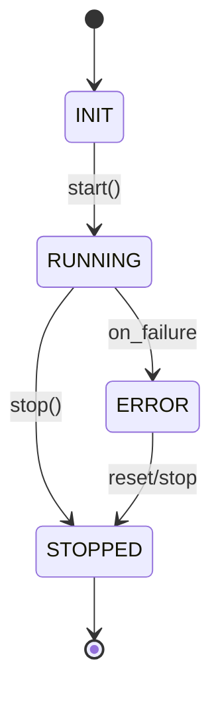
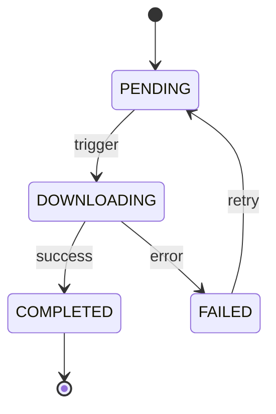

# Data Model: Core Engine (Component A)

**Feature**: Core Engine & Download Manager
**Spec**: [spec.md](spec.md)

## Core Entities

### EngineConfig

The root configuration object parsed from YAML.

- **`version`**: string (e.g., "1.0")
- **`engine_settings`**: object
  - **`log_level`**: enum (DEBUG, INFO, WARNING, ERROR)
  - **`max_parallel_downloads`**: integer (default: 5)
- **`components`**: list[ComponentConfig]
  - **`name`**: string
  - **`enabled`**: boolean
  - **`settings`**: object (component-specific YAML data)

### Component (Interface/Base)

The base class for all dynamically registered components.

- **`name`**: string (identifier)
- **`state`**: enum (INIT, RUNNING, STOPPED, ERROR)
- **`settings`**: Pydantic model (parsed from config)

### DownloadTask

Represents a single fetch request managed by the Download Manager.

- **`task_id`**: UUID (unique identifier)
- **`source_url`**: string (URL to fetch)
- **`status`**: enum (PENDING, DOWNLOADING, COMPLETED, FAILED)
- **`progress`**: float (0.0 to 100.0)
- **`error_message`**: string (optional)

### Event

The internal message structure for the Pub/Sub system.

- **`event_type`**: string (e.g., "download_started", "component_state_changed")
- **`payload`**: object (event-specific data)
- **`timestamp`**: datetime (UTC)

## State Transitions

### Engine Lifecycle

### Download Task Lifecycle

## Validation Rules

1. **`max_parallel_downloads`** must be >= 1.
2. **`source_url`** must be a valid absolute URI.
3. **Component names** must be unique within a single engine instance.
